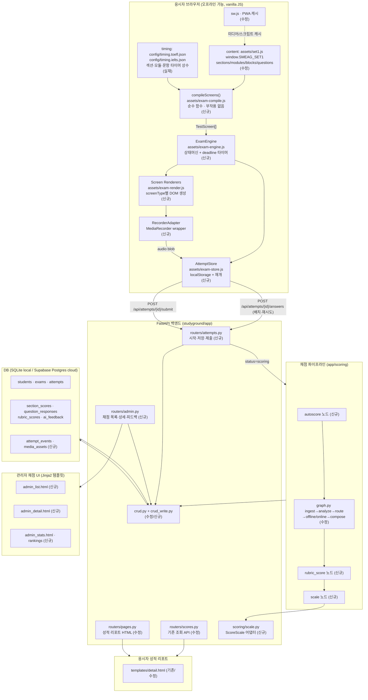
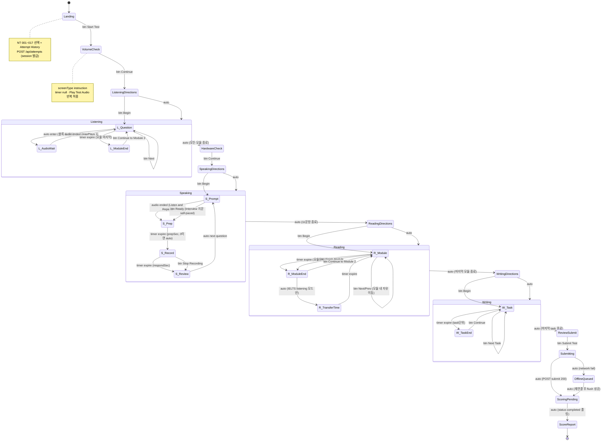
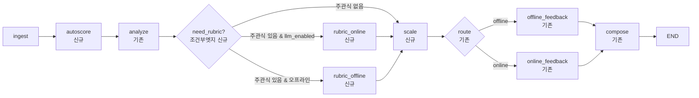

# SMEAG StudyGround — TOEFL/IELTS 모의고사 런타임 & 채점 아키텍처

> BMAD Architect 산출물 · 대상 저장소: `/Users/kwangseobpark/smeag-TOFEL 자료`
> 기준 문서: 화면녹화 분석 명세(57분53초), recon 에이전트 코드 인벤토리
> 표기 규칙: **확정** = 녹화 관찰 또는 소스코드 실측으로 확인된 사실 / **⚠️ 가설(검증필요)** = 추정값·설계 제안

---

## 0. 아키텍처 원칙 (제약 재확인)

| # | 원칙 | 근거 |
|---|------|------|
| P1 | 프론트엔드는 빌드 없는 vanilla JS 정적 사이트를 유지한다. 프레임워크·번들러·CDN 도입 금지. | 전역 제약(사용자 규칙), `studyground/sg2/` 현황 |
| P2 | 오프라인 구동이 가능해야 한다. 네트워크 없이도 시험을 끝까지 응시하고 로컬에 답안이 남아야 한다. | 전역 제약, `sw.js`/`README-OFFLINE.md` 존재 |
| P3 | UI 기본 언어는 영어. 한국어는 토글. | 전역 제약, `app.css`의 `[data-ko]{display:none}` 메커니즘 |
| P4 | 백엔드는 기존 FastAPI + SQLAlchemy 2.x + Pydantic v2 + Jinja2를 그대로 확장한다. | `studyground/app/` 실측 |
| P5 | 채점은 기존 `app/scoring/` LangGraph 그래프를 **교체하지 않고 노드 추가로** 확장한다. `_SequentialGraph` 폴백은 계속 동작해야 한다. | `app/scoring/graph.py` 실측 |
| P6 | 타이밍 값은 코드가 아니라 `studyground/sg2/config/timing.toefl.json`(및 `timing.ielts.json`)에 둔다. 가설값을 실측값으로 바꿀 때 코드 수정이 없어야 한다. | 명세 7절 |
| P7 | TOEFL과 IELTS는 **같은 런타임 코드경로**를 쓰고 config/어댑터로만 갈린다. | 명세 6절 |

---

## 1. High Level Architecture

### 1.1 컴포넌트 다이어그램



### 1.2 컴포넌트 책임 경계

| 컴포넌트 | 책임 | 하지 않는 일 |
|---|---|---|
| `set1.js` (콘텐츠) | 문항 텍스트·선택지·정답·미디어 경로 | 타이밍, 화면 순서, 채점 |
| `config/timing.{exam}.json` | 섹션/모듈/문항/응답 초 단위 상수 | 문항 내용 |
| `compileScreens()` | 콘텐츠+타이밍 → `TestScreen[]` 순수 변환 | DOM, 타이머, 저장 |
| `ExamEngine` | 상태머신, deadline 관리, 전이 트리거 | DOM 렌더링 |
| `Screen Renderers` | `screenType`별 DOM, 입력 수집 | 다음 화면 결정 |
| `AttemptStore` | localStorage 스냅샷, 서버 동기화 큐 | 채점 |
| `attempts.py` | 답안 수신/영속화, 자동채점 킥오프 | 피드백 문장 생성 |
| `scoring/` | 원점수 → 스케일 → 루브릭 → 피드백 | HTTP |
| `admin.py` + 템플릿 | 교사 피드백 입력, 진행률/통계 | 응시 로직 |

---

## 2. 시험 런타임 상태머신

명세 5-1의 흐름 전체. 각 전이 라벨은 **트리거**를 명시한다: `btn:` 버튼 클릭 / `timer:` 타이머 만료 / `audio:` 오디오·영상 ended / `auto:` 즉시 자동.



### 2.1 전이 트리거 요약표

| From → To | 트리거 | 조건 | 확정도 |
|---|---|---|---|
| VolumeCheck → Directions | `btn Continue` | 없음(self-paced) | **확정** (녹화 02:30) |
| L_Question → L_Question | `timer expire` | `timer.scope="question"` | **확정** (녹화 36:00 상단 빨간 00:20) |
| L_AudioWait → L_Question | `audio ended` | `audio.maxPlays=1` 소진 | **확정** (녹화 03:00~) |
| Speaking S_Prompt → S_Prep | `audio ended` | Listen and Repeat | **확정** (녹화 22:30) |
| S_Prep → S_Record | `timer expire` | `prepSec>0`; `prepSec=0`이면 `auto` | **확정**(set1.js `prepSec:3`) |
| S_Record → S_Review | `timer expire` | `respondSec` (S1 20s / S2 45s) | **확정** (set1.js) |
| R_Module → R_ModuleEnd | `timer expire` | `timer.scope="module"` | **확정** (녹화 48:30 "End of Module 1") |
| R_ModuleEnd → R_Module | `btn Continue to Module 2` | 명세는 "자동 전환" 표현 — 버튼과 상한 타임아웃 병행 | ⚠️ 가설(검증필요) |
| R_ModuleEnd → R_TransferTime | `auto` | `screen.transfer.enabled=true` (IELTS) | ⚠️ 가설(검증필요) — IELTS 이식용 신규 |
| W_Task → W_TaskEnd | `timer expire` | `timer.scope="task"` | ⚠️ 가설(검증필요) — 녹화에 Writing 타이머 미관찰, set1.js W1/W2/W3 `timeLimitSec:600`은 실측 |

> **섹션 순서 주의(확정된 불일치)**: 녹화 관찰 순서는 Listening → Speaking → Reading → Writing이다. 그러나 `set1.js`의 `sections[]` 배열 순서는 `[reading, listening, writing, speaking]`이다. 상태머신은 **`set1.js` 배열 순서를 따르지 않고** `timing.config.json`의 `sectionOrder`를 따른다. 이것이 컴파일러가 config를 필요로 하는 첫 번째 이유다.

---

## 3. 화면 계약 (Screen Contract)

### 3.1 확정 인터페이스

명세 원안을 아래와 같이 확정·보강한다. (JSDoc 주석 형태로 `assets/exam-types.js`에 문서화하고, 런타임에서는 plain object로 다룬다 — 타입스크립트 도입 없음, P1.)

```js
/**
 * @typedef {"instruction"|"question"|"speaking"|"moduleEnd"|"hardwareCheck"|"review"} ScreenType
 * @typedef {"listening"|"speaking"|"reading"|"writing"} SectionId
 *
 * @typedef {Object} TimerSpec
 * @property {"countdown"|"response"|"prep"|"none"} mode
 * @property {"section"|"module"|"task"|"question"|"screen"} scope   // ★보강
 * @property {number} seconds
 * @property {"MM:SS"|"HH:MM:SS"} format
 * @property {"autoAdvance"|"stopRecord"|"startRecord"|null} onExpire
 * @property {boolean} [visible]        // ★보강: hardwareCheck 등 숨김 상한 타이머
 * @property {boolean} [sharedDeadline] // ★보강: 같은 scope의 화면들이 하나의 deadline을 공유
 *
 * @typedef {Object} MediaSpec
 * @property {string} src
 * @property {number} maxPlays          // 1 = 재생 1회 (확정)
 * @property {boolean} [autoplay]
 * @property {"audio"|"video"|"image"} [kind]
 *
 * @typedef {Object} SpeakingPhase        // ★보강
 * @property {"prompt"|"listen"|"read"|"prep"|"record"} name
 * @property {number} seconds             // 0 = 스킵(즉시 다음 phase)
 * @property {boolean} [selfPaced]        // true면 seconds 무시, 버튼으로만 진행
 * @property {MediaSpec} [media]
 *
 * @typedef {Object} TestScreen
 * @property {string}    id               // ★보강: 안정적 스크린 키 (복구용)
 * @property {ScreenType} screenType
 * @property {SectionId} section
 * @property {number}    [module]
 * @property {string}    [moduleId]       // ★보강: 'R1' 'L2' 등 set1.js 원본 id
 * @property {string}    [blockKind]      // ★보강: 원본 block.kind (렌더러 분기용)
 * @property {{first:number,last:number,total:number,style:"single"|"range",index:number}} [progress]
 *                                       // ★2026-08-07: 서브바 좌측 표기. Listening/Speaking 은
 *                                       // "Question 25 of 32"(single), Reading 은 "Questions 1-10 of 35"(range).
 *                                       // total = 섹션 전체 문항 수. index 는 구 렌더러 호환(=first).
 * @property {string[]}  [questionIds]    // ★보강: 이 화면이 담는 문항 id들 (복수 가능)
 * @property {TimerSpec|null} timer
 * @property {"manual"|"auto"} advance
 * @property {MediaSpec} [audio]
 * @property {MediaSpec} [image]
 * @property {SpeakingPhase[]} [phases]   // screenType==="speaking"
 * @property {boolean}   [allowBack]      // ★보강: 모듈 내 문항 되돌아가기 허용
 * @property {Object}    [transfer]       // ★보강: moduleEnd의 transfer time
 * @property {Object}    [copy]           // {titleEn,titleKo,bodyEn,bodyKo,ctaEn,ctaKo}
 */
```

### 3.2 명세 원안 대비 보강 항목과 근거

| 보강 | 원안 | 확정안 | 근거 |
|---|---|---|---|
| `id` 추가 | 없음 | 필수 | 새로고침 복구 시 인덱스가 아니라 안정 키로 복원해야 한다(5장). 컴파일러가 결정적이므로 재컴파일해도 같은 id가 나온다. |
| `timer.scope` 확장 | `"module"`만 | `section \| module \| task \| question \| screen` | **확정 관찰 충돌**: Listening은 문항단위 카운트다운(녹화 36:00, 00:20)인데 Reading은 모듈단위(녹화 48:30 End of Module). 또 `set1.js`에서 `reading.timeLimitSec=2100`(섹션단위)와 `W1/W2/W3.timeLimitSec=600`(task단위)이 **동시에 실측**된다. 하나의 scope로는 네 가지를 표현할 수 없다. |
| `timer.sharedDeadline` | 없음 | 추가 | Reading 모듈은 여러 화면(문항 여러 개)이 **하나의** 모듈 deadline을 공유한다. 화면마다 타이머를 새로 시작하면 시간이 늘어난다. |
| `timer.mode:"prep"` | `countdown\|response` | `+prep`, `+none` | Speaking 준비시간(TOEFL `prepSec:3`, IELTS Part2 60s)은 카운트다운이지만 화면 전환이 아니라 **녹음 시작**을 트리거한다(`onExpire:"startRecord"`). |
| `phases[]` 구조화 | `["prompt/listen(1회)","record"]` 문자열 배열 | 객체 배열 | 아래 3.3 참조. |
| `screenType:"hardwareCheck"` | 없음 | 추가 | 녹화 21:30에서 마이크/스피커 점검은 **장치 권한 획득**이라는 부작용이 있어 순수 instruction과 코드경로가 다르다(getUserMedia 호출). |
| `screenType:"review"` | 없음 | 추가 | 제출 전 확인 화면. 명세 5-1의 `[Submit]` 앞 단계. |
| `transfer` | 없음 | 추가 | 아래 3.4 참조. |
| `allowBack` | 없음 | 추가 | Reading 모듈은 시간 내 문항 이동이 자연스럽고, Listening 문항단위는 되돌아갈 수 없다. ⚠️ 가설(검증필요) — 녹화로 Reading 내 뒤로가기 조작은 관찰되지 않음. |

### 3.3 Speaking `phases` — IELTS Part 2의 `prep`을 어떻게 넣는가

**설계 결정: prep을 예외 처리하지 않고, TOEFL도 항상 prep phase를 갖게 한다. TOEFL SET 1은 `prepSec:3`(실측), IELTS Part 1/3은 `seconds:0`, IELTS Part 2는 `seconds:60`.** `seconds:0`인 phase는 엔진이 즉시 통과시키므로 **분기 없는 동일 코드경로**가 된다.

```js
// TOEFL S1 (Listen and Repeat) — set1.js 실측: prepSec 3, respondSec 20
phases: [
  { name:"listen", seconds:0, media:{src:".../SPEAKING/1.mp3", maxPlays:1}, },  // audio ended로 종료
  { name:"prep",   seconds:3 },                                                // onExpire startRecord
  { name:"record", seconds:20 }                                                // onExpire stopRecord
]

// TOEFL S2 (Interview) — set1.js 실측: prepSec 3, respondSec 45
phases: [
  { name:"read",   seconds:0, selfPaced:true },   // 녹화 30:00 "Please answer the interviewer's questions"
  { name:"listen", seconds:0, media:{src:".../SPEAKING/Interview 1.mp3", maxPlays:1} },
  { name:"prep",   seconds:3 },
  { name:"record", seconds:45 }
]

// IELTS Speaking Part 2 (cue card) — ⚠️ 가설(검증필요): 이식 설계
phases: [
  { name:"read",   seconds:0, selfPaced:false, media:{kind:"image", src:"cue-card.png"} },
  { name:"prep",   seconds:60 },   // ★ 여기만 값이 다름. 코드 변경 없음
  { name:"record", seconds:120 }
]
```

phase 전이 규칙 (엔진 단일 루프):

| phase 상태 | 종료 조건 |
|---|---|
| `selfPaced:true` | 버튼 클릭만 |
| `media` 있고 `seconds:0` | `audio/video ended` |
| `seconds > 0` | deadline 도달 |
| `seconds === 0` && media 없음 && `selfPaced` 아님 | 즉시 통과 (0-length) |

`record` phase 진입 시 `RecorderAdapter.start(questionId)`, 종료 시 `.stop()` → Blob을 `AttemptStore`에 넣는다. 이 훅은 phase 이름이 `record`인지만 보므로 TOEFL/IELTS 공통이다.

### 3.4 `moduleEnd`가 IELTS Listening transfer time을 겸하는 방법

**설계 결정: transfer time은 새 screenType이 아니라 `moduleEnd`의 옵션 필드다.** 두 화면의 구조가 동일하기 때문이다 — 둘 다 (a) 문항 화면이 아니고 (b) 다음 구간으로 넘어가는 게이트이며 (c) 상한 시간이 있고 (d) 답안은 계속 편집 가능하거나 불가능하다는 플래그 하나로 갈린다.

```js
// TOEFL: End of Module 1 (녹화 48:30 — 확정)
{
  id:"reading.moduleEnd.R1", screenType:"moduleEnd", section:"reading", module:1,
  timer:{ mode:"countdown", scope:"screen", seconds:30, format:"MM:SS",
          onExpire:"autoAdvance", visible:false },   // ⚠️ 가설(검증필요): 상한 30초
  advance:"manual",
  copy:{ titleEn:"End of Module 1",
         bodyEn:"Your time for Module 1 has ended. Continue to Module 2.",
         ctaEn:"Continue" }
}

// IELTS Listening transfer time — ⚠️ 가설(검증필요): 이식 설계
{
  id:"listening.moduleEnd.transfer", screenType:"moduleEnd", section:"listening", module:4,
  timer:{ mode:"countdown", scope:"screen", seconds:600, format:"MM:SS",
          onExpire:"autoAdvance", visible:true },
  advance:"auto",
  transfer:{ enabled:true, editable:true, targetScreenIds:["listening.q.L1-1", "..."] },
  copy:{ titleEn:"Transfer your answers",
         bodyEn:"You now have 10 minutes to transfer your answers to the answer sheet.",
         ctaEn:"Finish transfer" }
}
```

| 필드 | TOEFL moduleEnd | IELTS transfer |
|---|---|---|
| `timer.visible` | `false` (녹화상 카운트다운 미표시) | `true` (10분 표시) |
| `advance` | `"manual"` (Continue 버튼) | `"auto"` (만료 시 자동) |
| `transfer.editable` | 없음 → 답안 잠금 | `true` → 이전 문항 답안 편집 허용 |
| `transfer.targetScreenIds` | 없음 | 편집 가능한 화면 목록 |

렌더러는 `transfer.editable`이 true일 때만 이전 문항 요약 편집 패널을 붙인다. `moduleEnd` 렌더러 하나에 조건 분기 1개가 추가될 뿐이다.

### 3.5 `timer.scope` 4종이 필요한 이유 (근거 정리)

| scope | 적용 대상 | deadline 생성 시점 | 근거 |
|---|---|---|---|
| `"question"` | Listening **답변 화면**(오디오 재생 화면 제외) | 답변 화면 진입 시 매번 | **확정(관찰 2026-08-07)**: 서브바 우측 카운트다운 시작값 **00:30** — 프레임 실측 884s→00:29, 888→00:25, 892→00:21, 896→00:17, 900→00:13, 904→00:09. 오디오 재생 화면(700s)에는 타이머가 없다 |
| `"module"` | Reading Module 1/2, Listening Module 1/2 | 모듈 첫 화면 진입 시 1회 (`sharedDeadline:true`) | **확정(관찰 2026-08-07)**: Reading R1=**1200s**(2730s→19:22, 2745s→19:08), R2=**540s**(2930s→08:43 … 3030s→07:04). Listening 모듈 상한은 여전히 ⚠️가설 |
| `"task"` | Writing W1/W2/W3 | task 첫 화면 진입 시 1회 | **확정(코드)**: `set1.js` W1/W2/W3 각 `timeLimitSec:600`. IELTS Task1 20분/Task2 40분도 동일 scope |
| `"section"` | Reading 전체(IELTS 3지문 60분 단일) | 섹션 첫 화면 진입 시 1회 | TOEFL 은 **1740s**(실측 모듈 합계 1200+540)이고 module 시계가 있어 `visible:false` 인 2차 deadline 이다. IELTS Reading 은 3600초 단일 카운트다운(명세 6절) |
| `"screen"` | hardwareCheck 상한 | 화면 진입 시 | 설계상 필요. **moduleEnd 는 제외** — 2910s `End of Module 1` 프레임에 타이머가 없다(관찰). `directions[id=moduleEnd.*].maxSec` 은 `null` 이고 화면 `timer` 는 `null` 이다 |

우선순위 규칙: **좁은 scope가 이긴다.** 한 화면에 `question`과 `module` deadline이 둘 다 걸려 있으면 **서브바 우측 타이머**에는 `question`을 표시하고, `module` deadline 만료는 `moduleEnd`로의 강제 전이로 처리한다. 두 deadline은 엔진의 `clocks` 맵에 **공존**한다.

> ⚠️ **표시 위치 정정(2026-08-07)** — 이전 판이 말하던 "화면 상단 중앙 빨간 알약(pill)" 은
> SMEAG **관리자 미리보기**(`…/admin/test_listening.php`) 의 UI 다. 우리가 구현하는
> 응시자용 **StudyGround**(`studyground.ai/en/test-nt/…`) 는 서브바 **우측**에 등폭 `MM:SS` +
> `Hide Time` 토글로 표시한다. 빨간 중앙 pill 은 제거 대상이다. 두 UI 대조표는
> `timing-spec.md` §7, 프레임 실측 절차는 §8.

---

## 4. 스크린 컴파일러

### 4.1 계약

```js
/**
 * 순수 함수. 네트워크·DOM·Date.now() 접근 없음. 같은 입력이면 항상 같은 출력.
 * @param {Object} set      window.SMEAG_SET1 형태의 콘텐츠 팩
 * @param {Object} timing   config/timing.{exam}.json 파싱 결과
 * @param {Object} [opts]   { profile:"toefl"|"ielts", lang:"en"|"ko" }
 * @returns {{screens: TestScreen[], index: Object, warnings: string[]}}
 */
function compileScreens(set, timing, opts) { /* ... */ }
```

| 항목 | 계약 |
|---|---|
| 결정성 | `Math.random()` 금지. `set1.js`의 `build()`가 tiles를 셔플하지만 그건 **콘텐츠 로드 시점**이지 컴파일 시점이 아니다. 컴파일러는 이미 셔플된 배열을 그대로 읽는다. |
| 부작용 | 없음. 입력 객체를 mutate하지 않는다(얕은 복사 후 필드 추가). |
| 섹션 순서 | `timing.sectionOrder` (기본 `["listening","speaking","reading","writing"]` — 녹화 확정 순서). `set.sections[]` 배열 순서 무시. |
| 미디어 경로 | 컴파일러는 원본 경로를 그대로 담고, **경로 리매핑은 렌더러 직전 `resolveMedia()`** 가 담당한다. `set1.js`의 `AUDIO`/`PICS`/`SPK` 상수는 실제 `sg2/media/` 구조와 불일치하므로(인벤토리 명시) 매핑 테이블 1곳에 격리한다. |
| id 규칙 | `"{section}.{kind}.{moduleId}.{seq}"`. 예: `listening.q.L1.03`, `reading.moduleEnd.R1`, `speaking.q.S1.02`. 문항 화면은 원본 question id도 `questionIds[]`에 보존. |
| warnings | 타이밍 config에 없는 module/task, 미디어 없는 audio-set 등을 문자열로 수집(throw 금지 — 오프라인에서 시험이 멈추면 안 됨). |

### 4.2 `block.kind` → `screenType` 매핑표 (7종 전부)

| `block.kind` | 섹션 | 산출 `screenType` | 화면 분할 단위 | `timer.scope` | `advance` | 비고 |
|---|---|---|---|---|---|---|
| `cloze` | reading | `question` | **블록 1개 = 화면 1개** (10 blank을 한 template에 렌더) | `module` (`sharedDeadline:true`) | `manual` | 녹화 45:30 "Fill in the missing letters" — 한 화면에 지문 전체. `questionIds` = 10개 |
| `passage` | reading | `question` | **블록 1개 = 화면 1개** (지문 + 문항 전부) | `module` (shared) | `manual` | `insert` 문항 포함 시 `{{A}}~{{D}}` 마커를 클릭 타깃으로 렌더 |
| `chat` | reading | `question` | 블록 1개 = 화면 1개 | `module` (shared) | `manual` | `messages[]` 말풍선 렌더 |
| `audio-set` (`perQuestionAudio:true`) | listening | `question` | **문항 1개 = 오디오 화면 1개 + 답변 화면 1개** | 오디오 화면 `null` / 답변 화면 `question` | `auto` | 오디오 화면 `blockKind:"audio-play"`(`audio{maxPlays:1}` + `image`, `questionIds` 없음), 답변 화면 `blockKind:"audio-set"`(`image` + 선택지) |
| `audio-set` (블록 audio) | listening | `question` | **블록 1개 = 오디오 화면 1개 + 답변 화면 N개** | 오디오 화면 `null` / 답변 화면 `question` + `module`(shared) | `auto` | 블록 오디오는 맨 앞 `audio-play` 화면 1개에만 붙는다(1회 재생). 후속 답변 화면은 `image` 만 유지 |

> **오디오 화면 분리 근거(관찰 2026-08-07)** — `docs/reference/screens/listening-audio-700s.png`(Q25)는 제목 `Listen to an academic talk.` + 화자 사진만 있고 **선택지도 타이머도 없다**. `listening-question-900s.png`(Q29)는 같은 서브바에 선택지 4개 + 타이머 `00:13` 이 있다. 컴파일러는 `secCfg.timerScope === "question"` 인 섹션에서만 분리한다 — IELTS Listening(`timerScope:"section"`, 들으면서 답하기)은 분리하지 않는다.
| `build-set` | writing | `question` | **문항 1개 = 화면 1개** (10화면) | `task` (W1, shared) | `manual` | 녹화 51:00 "Make an appropriate sentence" 드래그 배열 + 문항 그리드 네비 |
| `free-write` | writing | `question` | 블록 1개 = 화면 1개 | `task` (W2/W3 각각 600s) | `manual` | `email`/`discussion` 서브렌더러. `minWords` 카운터 표시 |
| `record-set` | speaking | **`instruction` 1개 + `speaking` N개** | `introAudio` → 별도 instruction 화면 / 문항마다 speaking 화면 | `record` phase는 `response` mode, scope `screen` | `auto` | S1 → instruction + 7화면, S2 → instruction + 4화면 |

**추가로 컴파일러가 합성하는 화면(원본 block에 대응 없음, 전부 신규):**

| 합성 화면 | 삽입 위치 | screenType | 근거 |
|---|---|---|---|
| `intro.volume` | 시험 최초 1회 | `instruction` | 녹화 02:30 Adjusting the Volume (확정) |
| `{section}.directions` | 각 섹션 시작 전 | `instruction` | 녹화 22:00 Speaking Section 안내 표 (확정) |
| `speaking.hardware` | speaking directions 직전 | `hardwareCheck` | 녹화 21:30 (확정) |
| `{section}.moduleEnd.{moduleId}` | 각 모듈 마지막 문항 뒤 (마지막 모듈 제외 여부는 config) | `moduleEnd` | 녹화 48:30 (확정) |
| `review.submit` | 전체 종료 후 | `review` | 명세 5-1 `[Submit]` |

### 4.3 출력 개수 검산 (SET 1 기준)

| 섹션 | 화면 수 산식 | 계 |
|---|---|---|
| listening | directions 1 + (L1 답변 18 + L2 답변 15) + moduleEnd 2 + **audio-play 19**(L1 12 = perQ 7 + 블록 5, L2 7 = perQ 3 + 블록 4) | 55 |
| speaking | hardware 1 + directions 1 + (S1 intro 1 + 7) + (S2 intro 1 + 4) | 15 |
| reading | directions 1 + (R1 블록 4 → 4화면) + moduleEnd 1 + (R2 블록 2 → 2화면) + moduleEnd 1 | 9 |
| writing | directions 1 + (W1 10) + taskEnd 1 + (W2 1) + taskEnd 1 + (W3 1) + taskEnd 1 | 16 |
| 공통 | intro.volume 1 + review.submit 1 | 2 |
| **합계** | | **97 화면 / 91 문항** |

문항 91개(R35+L33+W12+S11)는 인벤토리 실측과 일치한다. reading의 cloze/passage/chat은 화면당 다문항이라 화면 수를 줄이고, listening의 `audio-play` 화면은 문항을 담지 않아(=`questionIds` 없음) 화면 수만 늘린다.

> 78 → 97 (2026-08-07): 오디오 화면 분리로 listening 이 36 → 55 가 되었다. 산술 유도와 근거는
> `studyground/tests/test_compile_screens.js` [1] 주석. SET 9 는 95 → 122(listening audio-play 27).

### 4.4 타이밍 config 스키마 (실재 파일)

**정본 파일**: `studyground/sg2/config/timing.toefl.json` · `studyground/sg2/config/timing.ielts.json`
**스키마 레퍼런스**: `docs/bmad/timing-spec.md` (필드 정의·provenance·변경절차). 아래는 TOEFL 파일의 요약 발췌이며, 필드 전체 목록은 timing-spec.md 1절이 정본이다.

```json
{
  "schemaVersion": "1.0.0",
  "exam": { "id": "toefl-nt", "scoreScale": "toefl120",
            "scale": { "sectionMax": 30, "totalMax": 120, "step": 1, "bandLabel": "CEFR" } },
  "sectionOrder": ["listening", "speaking", "reading", "writing"],
  "defaults": { "timerScope": "module", "timerFormat": "MM:SS", "onExpire": "autoAdvance",
                "advance": "manual", "audioMaxPlays": 1, "instructionMaxSec": null,
                "graceSec": 0, "warnAtSec": 60 },
  "sections": {
    "listening": { "timerScope": "question", "fallbackPerQuestionSec": 30,
                   "audio": { "maxPlays": 1, "autoPlay": true, "replayAllowed": false },
                   "modules": [ { "id": "L1", "perQuestionSec": 30, "allocatedSec": 1080,
                                  "moduleEndScreen": "moduleEnd.listening" },
                                { "id": "L2", "perQuestionSec": 30, "allocatedSec": 900,
                                  "moduleEndScreen": "moduleEnd.listening" } ] },
    "speaking":  { "timerScope": "screen",
                   "modules":   [ { "id": "S1", "taskType": "listenAndRepeat" },
                                  { "id": "S2", "taskType": "interview" } ],
                   "taskTypes": { "listenAndRepeat": { "prepSec": 3, "responseSec": 20,
                                                       "listenReplays": 1, "onExpire": "stopRecord" },
                                  "interview":       { "prepSec": 3, "responseSec": 45,
                                                       "promptSelfPaced": true, "mediaType": "video" } } },
    "reading":   { "timerScope": "module", "sectionSec": 1740,
                   "modules": [ { "id": "R1", "allocatedSec": 1200, "moduleEndScreen": "moduleEnd.reading" },
                                { "id": "R2", "allocatedSec":  540, "moduleEndScreen": "moduleEnd.reading" } ] },
    "writing":   { "timerScope": "task",
                   "tasks": [ { "id": "W1", "perTaskSec": 600, "moduleEndScreen": "taskEnd.writing" },
                              { "id": "W2", "perTaskSec": 600, "minWords":  80, "moduleEndScreen": "taskEnd.writing" },
                              { "id": "W3", "perTaskSec": 600, "minWords": 100, "moduleEndScreen": "taskEnd.writing" } ] }
  },
  "directions": [ /* adjustVolume, listeningDirections, moduleEnd.listening, hardwareCheck,
                     speakingDirections, readingDirections, moduleEnd.reading, writingDirections,
                     taskEnd.writing, submitConfirm — 각 원소는 {id,label,screenType,insertAt,maxSec,advance,controls}
                     moduleEnd/taskEnd 3종의 maxSec 은 모두 null(관찰: End of Module 화면에 타이머 없음) */ ],
  "provenance": { "levels": { }, "entries": [ { "path": "...", "level": "observed|official|content|assumed",
                                                "source": "...", "verify": "..." } ] }
}
```

**문항 수는 config에 넣지 않는다** — `questionCountSource: "content"`. 화면 수·문항 수는 항상 `set1.js`에서 유도한다(4.3 검산 참조).

| 값 | 출처 |
|---|---|
| `speaking.defaults.prepSec 3`, `S1 respondSec 20`, `S2 respondSec 45` | **확정(코드)** `set1.js` |
| `writing W1/W2/W3 taskSec 600` | **확정(코드)** `set1.js` `module.timeLimitSec` |
| `listening perQuestionSec 30` | **확정(관찰 2026-08-07)** 프레임 실측 884s→00:29 … 904s→00:09 → 시작값 00:30. 구 가설값 20 폐기 |
| `reading R1 1200 / R2 540` (합 1740) | **확정(관찰 2026-08-07)** R1: 2730s→19:22, 2745s→19:08. R2: 2930s→08:43, 2960s→08:13, 3000s→07:33, 3030s→07:04. 구 가설값 1080/1020 폐기 |
| `moduleEnd maxSec null` (`advance:"manual"`) | **확정(관찰 2026-08-07)** 2910s `End of Module 1` 프레임에 타이머 미표시. 구 가설값 30초 폐기 |
| Listening 오디오 화면 / 답변 화면 분리 | **확정(관찰 2026-08-07)** 700s 프레임(제목+화자사진, 선택지·타이머 없음) vs 900s 프레임(선택지 4개+타이머 00:13). 컴파일러가 `blockKind:"audio-play"` 화면을 앞세운다 |

---

## 5. 상태 지속성

### 5.1 sessionId

```
session = "{examCode}-{yyyymmdd}-{studentNo}-{rand4}"   // 예: SET1-20260806-S1042-7fa3
```

- 발급 주체: **서버**(`POST /api/attempts`)가 정본. 오프라인이면 클라이언트가 `offline-{uuidv4}` 형태로 임시 발급하고, 최초 동기화 시 서버 session으로 **치환**(로컬 키는 `serverSession` 필드로 매핑 보존).
- 관리자 화면의 `SESSION` 컬럼(녹화 35:30, 확정)과 같은 값이다.

### 5.2 localStorage 키 네이밍

접두어는 기존 `sg2_lang`과 동일한 `sg2_` 계열을 따른다(P1, 기존 스타일 유지).

| 키 | 값 | 크기 관리 |
|---|---|---|
| `sg2_attempt_active` | 진행 중 sessionId 문자열 1개 | 상수 |
| `sg2_attempt::{session}::meta` | `{session, examCode, studentNo, startedAt, profile, contentHash, timingHash, screenCount, submittedAt}` | 상수 |
| `sg2_attempt::{session}::cursor` | `{screenId, screenIndex, phaseIndex, updatedAt}` | 상수 |
| `sg2_attempt::{session}::clocks` | `{ "module:R1": 1770000000000, "question:listening.q.L1.03": ..., "task:W2": ... }` — **key → epoch ms deadline** | scope 수만큼 |
| `sg2_attempt::{session}::answers` | `{ "R1-1": {v:"brain", t:1770...}, "L1-3": {v:2,...}, "W-EMAIL": {v:"...", words:93}, "S-1": {media:"idb:S-1"} }` | 문항 수(91) |
| `sg2_attempt::{session}::events` | 링버퍼 최대 500개 `{ts, type, screenId, detail}` | 상한 고정 |
| `sg2_attempt::{session}::outbox` | 서버로 못 보낸 배치 큐 `[{seq, kind, payload}]` | flush 시 삭제 |

- **오디오 Blob은 localStorage에 넣지 않는다.** IndexedDB(`sg2-media` DB, `recordings` store, key = `{session}/{questionId}`)에 저장하고 answers에는 `"idb:{questionId}"` 참조만 둔다. localStorage 5MB 한도로 Speaking 11개 녹음을 감당할 수 없기 때문이다.
- `contentHash`/`timingHash`: `set1.js`와 timing config의 간단한 문자열 해시. 재개 시 불일치하면 **복구를 거부하고 새 시도로 시작**(문항 순서가 바뀐 상태로 이어붙이는 사고 방지).

### 5.3 저장 시점

| 트리거 | 저장 대상 | 비고 |
|---|---|---|
| 화면 진입 | `cursor`, 새 `clocks` 항목 | deadline 생성은 **최초 1회만**. 이미 키가 있으면 덮어쓰지 않는다(재개 시 시간 리셋 방지) |
| 답안 입력 | `answers` — 200ms debounce | 텍스트 입력 폭주 방지 |
| 문항/화면 이탈 | `answers` 즉시 flush | debounce 우회 |
| phase 전이(speaking) | `cursor.phaseIndex` | |
| 녹음 종료 | IndexedDB put → `answers` 참조 | |
| `visibilitychange` → hidden | `cursor` + `answers` 즉시 | 탭 전환/앱 종료 대비 |
| `beforeunload` | 동기 저장(동기 API만 사용) | |
| 60초 주기 | `outbox` flush 시도 | 온라인일 때만 |
| 섹션 종료 | 서버 `POST /answers` 배치 전송 | 실패해도 진행은 계속(P2) |
| 제출 | 전체 전송 + `submittedAt` 기록 | |

### 5.4 새로고침 복구 규칙

```
1) sg2_attempt_active 읽기 → 없으면 Landing
2) meta 읽기 → contentHash/timingHash 불일치면 "이 시험은 이어서 볼 수 없습니다" 안내 후 새 시도
3) meta.submittedAt 있으면 → ScoringPending / ScoreReport 로 직행
4) compileScreens()를 다시 실행 (결정적이므로 동일 배열)
5) cursor.screenId 로 screens 에서 인덱스 재탐색 (인덱스 숫자 신뢰 금지)
6) clocks 의 각 deadline 을 Date.now() 와 비교
   - 이미 만료된 deadline 이 있으면 해당 scope 의 onExpire 를 "조용히" 적용:
       question 만료 → 다음 문항으로 커서 이동(답안 유지)
       module/task/section 만료 → 해당 moduleEnd 화면으로 이동
   - 여러 개가 만료됐으면 좁은 scope 부터 순서대로 적용 후, 가장 넓은 scope 의 결과 화면에 안착
7) screenType==="speaking" 이고 phase==="record" 중 새로고침이면
   → 그 문항은 phase 를 record 끝으로 확정하고 "녹음이 중단되었습니다" 배지 + 부분 녹음 보존
     (재녹음 허용 여부는 timing.config.allowRerecord, 기본 false)
8) answers 를 DOM 에 복원 → 렌더
```

### 5.5 타이머 시계 신뢰 — wall-clock deadline

**규칙: 남은 초를 저장하지 않는다. 오직 절대 deadline(epoch ms)만 저장한다.**

```js
// 잘못된 방식(금지): setInterval 로 remaining-- 하고 remaining 을 저장
// 확정 방식:
function armClock(key, seconds){
  var m = store.clocks();
  if (m[key] != null) return m[key];        // 이미 있으면 재사용 = 재개해도 늘어나지 않음
  m[key] = Date.now() + seconds * 1000;
  store.saveClocks(m);
  return m[key];
}
function remainingSec(key){
  var d = store.clocks()[key];
  return d == null ? null : Math.max(0, Math.ceil((d - Date.now()) / 1000));
}
```

| 문제 상황 | 이 설계에서의 결과 |
|---|---|
| 탭 비활성 → 브라우저가 `setInterval` throttle | 표시만 늦게 갱신될 뿐 `remainingSec()`는 정확. 복귀 즉시 정확한 값 |
| 새로고침 / 브라우저 크래시 | deadline이 그대로라 흘러간 시간이 정확히 반영됨 |
| 사용자가 시스템 시계를 되돌림 | ⚠️ 방어 필요: 서버에서 받은 `serverNowOffset`(`POST /api/attempts` 응답의 `server_time`과 로컬 시각 차)을 meta에 저장하고 `Date.now()+offset` 사용. 오프라인이면 방어 불가 — `events` 로그에 시계 역행을 기록해 관리자가 확인 |
| 렌더 루프 | `requestAnimationFrame` 대신 `setInterval(tick, 250)` + 매 tick마다 deadline 재계산. 250ms면 MM:SS 표시에 충분하고 배터리 부담 낮음 |
| `onExpire` 중복 발화 | 각 clock key에 `fired` 플래그를 메모리에만 두고, tick에서 `remaining===0 && !fired`일 때 1회만 실행 |

---

## 6. 데이터 모델 델타

### 6.1 기존 테이블 대비 변경 요약

| 테이블 | 상태 | 변경 |
|---|---|---|
| `students` | 유지 | `campus` 컬럼 추가 |
| `exams` | 유지 | 변경 없음 |
| `attempts` | **변경** | `session`, `campus`, `exam_date`, `submitted_count`, `feedback_progress`, `status` 값 확장, `profile`, `scale`, `band_score` |
| `section_scores` | 유지 | `module` 컬럼 추가(모듈별 소계 필요 시) |
| `question_responses` | **변경** | `qtype`, `feedback`, `auto_score`, `max_score`, `module`, `audio_ref`, `question_key`, `graded_by`, `graded_at` |
| `rubric_scores` | 유지 | `band` 컬럼 추가(IELTS 0.5 단위) |
| `ai_feedback` | 유지 | 변경 없음 |
| `attempt_events` | **신규** | 응시 이벤트 로그(타이머 만료, 새로고침, 시계 역행) |
| `media_assets` | **신규** | Speaking 녹음 파일 메타 |

### 6.2 DDL — Postgres (`schema.sql` 갱신분)

```sql
-- === 6.2.1 students: campus 추가 ===
ALTER TABLE students ADD COLUMN IF NOT EXISTS campus VARCHAR(64) NOT NULL DEFAULT '';

-- === 6.2.2 attempts: 관리자 목록 화면(녹화 35:30 확정 컬럼) 정합 ===
ALTER TABLE attempts ADD COLUMN IF NOT EXISTS session          VARCHAR(64);
ALTER TABLE attempts ADD COLUMN IF NOT EXISTS campus           VARCHAR(64) NOT NULL DEFAULT '';
ALTER TABLE attempts ADD COLUMN IF NOT EXISTS exam_date        DATE;
ALTER TABLE attempts ADD COLUMN IF NOT EXISTS submitted_count  INTEGER NOT NULL DEFAULT 0;
ALTER TABLE attempts ADD COLUMN IF NOT EXISTS total_questions  INTEGER NOT NULL DEFAULT 0;
ALTER TABLE attempts ADD COLUMN IF NOT EXISTS feedback_progress INTEGER NOT NULL DEFAULT 0;  -- 0..100
ALTER TABLE attempts ADD COLUMN IF NOT EXISTS profile          VARCHAR(16) NOT NULL DEFAULT 'toefl';
ALTER TABLE attempts ADD COLUMN IF NOT EXISTS scale            VARCHAR(16) NOT NULL DEFAULT 'toefl120';
ALTER TABLE attempts ADD COLUMN IF NOT EXISTS band_score       NUMERIC(2,1);   -- IELTS 0.0..9.0, TOEFL은 NULL
ALTER TABLE attempts ADD COLUMN IF NOT EXISTS started_at       TIMESTAMPTZ;
ALTER TABLE attempts ADD COLUMN IF NOT EXISTS submitted_at     TIMESTAMPTZ;
ALTER TABLE attempts ADD COLUMN IF NOT EXISTS content_hash     VARCHAR(32) NOT NULL DEFAULT '';

CREATE UNIQUE INDEX IF NOT EXISTS uq_attempts_session ON attempts(session) WHERE session IS NOT NULL;
CREATE INDEX IF NOT EXISTS ix_attempts_exam_date ON attempts(exam_date);
CREATE INDEX IF NOT EXISTS ix_attempts_campus    ON attempts(campus);

-- status: 기존 'scored|pending|reviewing' → 신규 'in_progress|scoring|completed' 로 통합.
-- 애플리케이션 레벨 CHECK (Postgres에서만 제약을 건다; SQLite는 파이썬 Enum 검증)
ALTER TABLE attempts DROP CONSTRAINT IF EXISTS ck_attempts_status;
ALTER TABLE attempts ADD CONSTRAINT ck_attempts_status
  CHECK (status IN ('in_progress','scoring','completed'));

-- === 6.2.3 question_responses ===
ALTER TABLE question_responses ADD COLUMN IF NOT EXISTS question_key VARCHAR(32) NOT NULL DEFAULT '';  -- set1.js id: 'R1-1','S-8'
ALTER TABLE question_responses ADD COLUMN IF NOT EXISTS qtype        VARCHAR(24) NOT NULL DEFAULT 'MCQ';
ALTER TABLE question_responses ADD COLUMN IF NOT EXISTS module       VARCHAR(8)  NOT NULL DEFAULT '';   -- 'R1','L2','W1','S2'
ALTER TABLE question_responses ADD COLUMN IF NOT EXISTS auto_score   REAL;        -- NULL = 자동채점 불가(주관식)
ALTER TABLE question_responses ADD COLUMN IF NOT EXISTS max_score    REAL NOT NULL DEFAULT 1;
ALTER TABLE question_responses ADD COLUMN IF NOT EXISTS feedback     TEXT NOT NULL DEFAULT '';
ALTER TABLE question_responses ADD COLUMN IF NOT EXISTS audio_ref    VARCHAR(255) NOT NULL DEFAULT '';
ALTER TABLE question_responses ADD COLUMN IF NOT EXISTS graded_by    VARCHAR(64) NOT NULL DEFAULT '';
ALTER TABLE question_responses ADD COLUMN IF NOT EXISTS graded_at    TIMESTAMPTZ;

ALTER TABLE question_responses DROP CONSTRAINT IF EXISTS ck_qr_qtype;
ALTER TABLE question_responses ADD CONSTRAINT ck_qr_qtype
  CHECK (qtype IN ('WORD_FILLING','MCQ','CLOZE','INSERT','BUILD_SENTENCE','WRITING','SPEAKING'));

CREATE UNIQUE INDEX IF NOT EXISTS uq_qr_attempt_key
  ON question_responses(attempt_id, question_key) WHERE question_key <> '';

-- === 6.2.4 section_scores / rubric_scores ===
ALTER TABLE section_scores ADD COLUMN IF NOT EXISTS module VARCHAR(8) NOT NULL DEFAULT '';
ALTER TABLE rubric_scores  ADD COLUMN IF NOT EXISTS band   NUMERIC(2,1);  -- IELTS 전용, 0.5 단위

-- === 6.2.5 신규 테이블 ===
CREATE TABLE IF NOT EXISTS attempt_events (
  id          BIGSERIAL PRIMARY KEY,
  attempt_id  INTEGER NOT NULL REFERENCES attempts(id) ON DELETE CASCADE,
  ts          TIMESTAMPTZ NOT NULL DEFAULT now(),
  type        VARCHAR(32) NOT NULL,      -- screen_enter|timer_expire|reload|clock_skew|record_start|record_stop|submit
  screen_id   VARCHAR(64) NOT NULL DEFAULT '',
  detail      TEXT NOT NULL DEFAULT ''   -- JSON 문자열
);
CREATE INDEX IF NOT EXISTS ix_events_attempt ON attempt_events(attempt_id, ts);

CREATE TABLE IF NOT EXISTS media_assets (
  id           BIGSERIAL PRIMARY KEY,
  attempt_id   INTEGER NOT NULL REFERENCES attempts(id) ON DELETE CASCADE,
  question_key VARCHAR(32) NOT NULL,
  kind         VARCHAR(16) NOT NULL DEFAULT 'audio',
  storage      VARCHAR(16) NOT NULL DEFAULT 'file',   -- file|inline|object
  uri          VARCHAR(512) NOT NULL DEFAULT '',      -- file/object 경로 또는 URL
  inline_b64   TEXT,                                   -- storage='inline' 일 때만
  mime         VARCHAR(64) NOT NULL DEFAULT 'audio/webm',
  bytes        INTEGER NOT NULL DEFAULT 0,
  duration_ms  INTEGER NOT NULL DEFAULT 0,
  sha256       VARCHAR(64) NOT NULL DEFAULT '',
  created_at   TIMESTAMPTZ NOT NULL DEFAULT now(),
  UNIQUE (attempt_id, question_key, kind)
);
```

### 6.3 SQLite 대응

SQLite는 `ADD COLUMN IF NOT EXISTS`, `DROP CONSTRAINT`, `CHECK 추가`를 지원하지 않는다. 마이그레이션 러너에서 방언 분기한다.

```python
# app/migrations.py (신규) — Alembic 도입 없이 최소 러너 (P1/P4: 신규 의존성 금지)
STEPS = [
    ("0002_attempt_admin_fields", {
        "postgresql": ["ALTER TABLE attempts ADD COLUMN IF NOT EXISTS session VARCHAR(64)", ...],
        "sqlite":     ["ALTER TABLE attempts ADD COLUMN session VARCHAR(64)", ...],  # 존재 여부는 PRAGMA로 사전 확인
    }),
]
```

| 항목 | SQLite | Postgres |
|---|---|---|
| 컬럼 존재 확인 | `PRAGMA table_info(attempts)` 조회 후 없을 때만 ADD | `IF NOT EXISTS` |
| CHECK 제약 | 걸지 않음. `models.py`의 파이썬 `Enum`/validator로 강제 | `ALTER TABLE ... ADD CONSTRAINT` |
| 부분 유니크 인덱스 | `CREATE UNIQUE INDEX ... WHERE` 지원됨(3.8+) → 동일 SQL | 동일 |
| `TIMESTAMPTZ` | `DATETIME`으로 매핑(SQLAlchemy `DateTime(timezone=True)`가 흡수) | 네이티브 |
| `BIGSERIAL` | `INTEGER PRIMARY KEY AUTOINCREMENT` | 네이티브 |
| 실행 시점 | `create_app()` 부팅 시 `run_migrations(engine)` 1회. `schema_migrations(version TEXT PK, applied_at)` 테이블로 멱등 보장 | 동일 |

**기존 seed 데이터 보존 전략**

1. 모든 신규 컬럼은 `NOT NULL DEFAULT`를 갖거나 nullable이다 → 기존 행이 깨지지 않는다.
2. `status` 값 마이그레이션: `UPDATE attempts SET status='completed' WHERE status='scored'; UPDATE attempts SET status='scoring' WHERE status IN ('pending','reviewing');` — CHECK 제약을 **UPDATE 후에** 건다.
3. `session` 백필: `UPDATE attempts SET session = 'legacy-' || id WHERE session IS NULL;`
4. `exam_date` 백필: `UPDATE attempts SET exam_date = CAST(taken_at AS DATE) WHERE exam_date IS NULL;`
5. `question_responses.question_key` 백필: 기존 행은 `skill || '-' || no` 로 채운다(예: `reading-1`). 신규 응시분만 실제 `R1-1` 형식이 들어간다 — 부분 유니크 인덱스의 `WHERE question_key <> ''` 조건이 이 혼재를 허용한다.
6. `total_questions`/`submitted_count` 백필: `question_responses` 카운트로 UPDATE.
7. `app/seed.py`는 신규 컬럼을 채우도록 수정하되, **기존 시드 레코드를 지우지 않는다**(`SEED_ON_START`가 이미 멱등하도록 되어 있다는 전제 — 아니라면 `INSERT ... ON CONFLICT DO NOTHING` 패턴으로 변경).

### 6.4 Speaking 응답 오디오 저장 전략

| 전략 | 장점 | 단점 | 권고 |
|---|---|---|---|
| **A. 파일경로** (`storage='file'`, 서버 로컬 디스크 `data/media/{session}/{qkey}.webm`) | 구현 단순, DB 부담 0, 로컬 오프라인 모드와 자연스럽게 맞음, 백업이 파일 복사 | Vercel serverless는 `/tmp`만 쓰기 가능하고 요청 간 유실 → **클라우드 모드에서 사용 불가** | **로컬(`APP_MODE=local`) 기본값** |
| **B. base64 인라인** (`storage='inline'`, `media_assets.inline_b64`) | 스토리지 인프라 0개, 트랜잭션 일관성, Supabase 하나로 끝 | 20초 webm/opus ≈ 40KB → base64 ≈ 54KB, 11문항 ≈ 600KB/응시. 학생 1000명 = 600MB. Postgres row 크기·백업·쿼리 성능 악화. `SELECT *`가 위험해짐 | **비권장.** 단, 오프라인→온라인 동기화 시 **전송 포맷**으로는 base64를 쓴다(multipart 불필요) |
| **C. 외부 오브젝트 스토리지** (`storage='object'`, Supabase Storage 버킷 `speaking/{session}/{qkey}.webm`, DB엔 URI만) | 무제한 확장, CDN 서빙, DB 경량, 서명 URL로 접근 제어 | 의존성 1개 추가(Supabase Storage — 단 이미 Supabase를 쓰므로 **신규 벤더는 아님**), 오프라인 모드에선 무의미 | **클라우드(`APP_MODE=cloud`) 기본값** |

**권고: A/C 이중 모드 + 단일 인터페이스.**

```python
# app/media.py (신규)
class MediaStore(Protocol):
    def put(self, attempt_id: int, question_key: str, data: bytes, mime: str) -> MediaRef: ...
    def get_url(self, ref: MediaRef) -> str: ...

def get_media_store():           # config.get_settings().is_cloud 로 분기
    return ObjectMediaStore() if settings.is_cloud else FileMediaStore()
```

- `media_assets.storage` 컬럼이 어떤 백엔드로 저장됐는지 기록하므로 **혼재 가능**(로컬에서 응시 → 나중에 클라우드로 업로드해도 기존 행이 유효).
- 인코딩은 브라우저 기본 `audio/webm;codecs=opus`. Safari 폴백은 `audio/mp4`. `media_assets.mime`에 기록해 재생 시 그대로 사용.
- `sha256`은 중복 업로드 감지와 무결성 확인용.
- ⚠️ 가설(검증필요): 20초 녹음 40KB 추정치. 실측 후 `bytes` 통계로 재산정.

---

## 7. API 계약

기존: `GET /api/health`, `/api/students`, `/api/exams`, `/api/attempts`, `/api/attempts/{id}`, `POST /api/attempts/{id}/rescore`. 아래는 **신규/변경**만.

### 7.1 응시자 런타임 API (`app/routers/attempts.py` 신규)

| Method | Path | Request Body | Response | 에러 |
|---|---|---|---|---|
| `POST` | `/api/attempts` | `{student_no, exam_code, profile:"toefl"\|"ielts", campus?, content_hash, timing_hash}` | `201 {attempt_id, session, server_time, resume:false}` | `404` student/exam 없음 · `409` 동일 student+exam의 `in_progress` 존재 시 기존 attempt 반환(`resume:true`, 200) |
| `GET` | `/api/attempts/{id}/state` | — | `200 {session, status, cursor, clocks, answered_count}` | `404` |
| `PUT` | `/api/attempts/{id}/state` | `{cursor:{screen_id,screen_index,phase_index}, clocks:{key:epoch_ms}}` | `204` | `404` · `409` status≠in_progress |
| `POST` | `/api/attempts/{id}/answers` | `{items:[{question_key, skill, module, qtype, no, answer, elapsed_ms}], client_seq}` | `200 {accepted, rejected:[{question_key,reason}], submitted_count}` | `404` · `409` 제출됨 · `422` 스키마 |
| `POST` | `/api/attempts/{id}/media` | `{question_key, mime, duration_ms, data_b64}` (또는 `multipart/form-data`) | `201 {audio_ref, bytes, sha256}` | `404` · `409` 제출됨 · `413` 크기 초과(기본 5MB) |
| `POST` | `/api/attempts/{id}/events` | `{events:[{ts,type,screen_id,detail}]}` | `204` | `404` |
| `POST` | `/api/attempts/{id}/submit` | `{client_finished_at, answered_count}` | `202 {status:"scoring", submitted_count, total_questions}` | `404` · `409` 이미 제출됨(멱등: 기존 결과 반환 200) |
| `GET` | `/api/attempts/{id}/result` | — | `200 AttemptDetail` (status가 `scoring`이면 `{status:"scoring", ready:false}`) | `404` |

**멱등성 규칙**: `POST /answers`는 `(attempt_id, question_key)` upsert이므로 재전송 안전. `client_seq`는 순서 역전 감지용(작은 seq가 나중에 도착하면 해당 항목 무시하고 `rejected`에 `stale`로 담음). 오프라인 outbox flush가 중복 전송해도 안전하다는 뜻이다(P2).

### 7.2 관리자 채점 API (`app/routers/admin.py` 신규)

녹화 35:30 / 52:30의 `subject_answer.php` · `subject_answer_detail.php` 구조를 그대로 계약화한다.

| Method | Path | Request | Response | 에러 |
|---|---|---|---|---|
| `GET` | `/api/admin/attempts` | query: `session, student, campus, exam_code, date_from, date_to, status, page=1, size=50` | `200 {total, page, size, rows:[{attempt_id, session, exam_name, student, student_no, campus, exam_date, submitted_count, total_questions, feedback_progress, status}]}` | `422` 잘못된 날짜 |
| `GET` | `/api/admin/attempts/{id}` | query: `skill=reading\|listening\|writing\|speaking` (미지정 시 전부) | `200 {header:{session, year, campus, student, exam_date}, tabs:{reading:[QRow], listening:[...], writing:[...], speaking:[...]}}` — `QRow = {id, no, question_key, qtype, module, prompt, student_answer, correct_answer, is_correct, auto_score, max_score, feedback, audio_url}` | `404` |
| `PUT` | `/api/admin/responses/{response_id}/feedback` | `{feedback, score?, graded_by}` | `200 {response_id, feedback, score, feedback_progress}` | `404` · `422` score > max_score |
| `PUT` | `/api/admin/responses/bulk-feedback` | `{items:[{response_id, feedback, score?}], graded_by}` | `200 {updated, feedback_progress}` | `404` |
| `POST` | `/api/admin/attempts/{id}/recalc` | `{recalc:["progress","sections","total"]}` | `200 {feedback_progress, sections:{skill:scaled}, total_score, band_score, grade, status}` | `404` |
| `POST` | `/api/admin/attempts/{id}/finalize` | `{}` | `200 {status:"completed"}` | `409` 미채점 주관식 존재 시 `{detail:"N ungraded productive responses"}` |
| `GET` | `/api/admin/stats` | query: `exam_code, date_from, date_to, campus` | `200 {count, avg_total, avg_by_skill:{...}, distribution:[{band, n}], completion_rate}` | — |
| `GET` | `/api/admin/rankings` | query: `exam_code, grade?, campus?, limit=100` | `200 {rows:[{rank, student, campus, total_score, band_score, grade, taken_at}]}` | — |
| `GET` | `/api/admin/media/{asset_id}` | — | `200` audio 스트림 또는 `302` 서명 URL 리다이렉트 | `404` |

**`feedback_progress` 정의(확정 계약)**

```
denominator = 교사 피드백이 필요한 문항 수 = question_responses 중 qtype IN ('WRITING','SPEAKING') 인 행 수
numerator   = 그 중 feedback <> '' 인 행 수
feedback_progress = round(numerator / denominator * 100)   # denominator=0 이면 100
```
SET 1 기준 분모 = 2(free-write) + 11(speaking) = **13**. 관리자 목록의 "33 ITEMS" 같은 `SUBMITTED QUESTIONS` 값은 `submitted_count`(답을 제출한 문항 수)로 별개다.

### 7.3 기존 API 변경

| 대상 | 변경 |
|---|---|
| `GET /api/attempts` | 응답 `AttemptSummary`에 `session, campus, exam_date, submitted_count, feedback_progress, band_score` 추가 (하위호환: 추가만, 제거 없음) |
| `GET /api/attempts/{id}` | `AttemptDetail.question_responses[]`에 `qtype, module, feedback, auto_score, max_score, audio_url` 추가 |
| `POST /api/attempts/{id}/rescore` | `mode`에 기존 `auto\|offline\|online` 유지 + `stages` 파라미터 추가(`"autoscore,rubric,feedback,scale"` 중 부분 실행) |

---

## 8. 채점 파이프라인 확장

### 8.1 현재 그래프 (변경 없이 보존되는 부분)

```
ingest → analyze → route ─┬→ offline_feedback ─┐
                          └→ online_feedback  ─┴→ compose → END
```

### 8.2 확장 후 그래프



### 8.3 신규 노드 계약

```python
# app/scoring/nodes.py 에 추가 (기존 함수는 시그니처 불변)

class ScoringState(TypedDict, total=False):
    # 기존
    detail: AttemptDetail; lang: str; requested_mode: str; mode: str
    analysis: dict; items: list[FeedbackItem]; fell_back: bool; note: str
    # 신규 (전부 total=False 이므로 기존 호출자가 깨지지 않음)
    responses: list[dict]        # autoscore 산출: question_key별 auto_score
    rubrics: list[dict]          # rubric_* 산출: {skill, criterion, score, max_score, band, comment}
    scale: str                   # 'toefl120' | 'ielts9'
    scaled: dict                 # scale 산출: {sections:{skill:int}, total:int, band:float|None, grade:str}
    stages: list[str]            # 부분 실행 지정
```

| 노드 | 입력 | 출력 | 실패 시 |
|---|---|---|---|
| `autoscore(state)` | `detail.question_responses` | `responses` — `qtype ∈ {MCQ, CLOZE, WORD_FILLING, INSERT, BUILD_SENTENCE}` 에 대해 `auto_score` 계산. 문자열 정답은 `strip().lower()` 비교(`set1.js` answers가 전부 소문자 — 실측), MCQ는 int 인덱스 비교, BUILD_SENTENCE는 `answerTokens[]` 순서 완전일치 | 예외 없이 `auto_score=None` 유지하고 `note`에 누적. **결정적·오프라인·네트워크 없음** |
| `rubric_offline(state)` | 주관식 응답 텍스트 | `rubrics` — 규칙기반 초안(단어 수, `minWords` 충족, 문장 수, 어휘 다양성 type-token ratio). 점수는 **보수적 중앙값**으로 두고 `comment`에 "교사 검수 필요" | 항상 성공 (`rules.py` 스타일) |
| `rubric_online(state)` | 응답 텍스트 + 루브릭 md + JSON schema | `rubrics` — `smeag-local-ai/scoring/rubrics/*.md`를 system prompt로, `schemas/*.schema.json`을 출력 계약으로 사용. Anthropic 호출 | **어떤 예외든 `rubric_offline`으로 폴백**, `fell_back=True`, `note` 기록 (기존 `online_feedback`과 동일 패턴) |
| `scale(state)` | `responses` + `rubrics` + `state["scale"]` | `scaled` — 9장의 ScoreScale 어댑터 호출 | 스케일 미상이면 `toefl120` 기본값 |

**조건부 엣지 `need_rubric`**

```python
def need_rubric(state: ScoringState) -> str:
    has_productive = any(
        r.get("qtype") in ("WRITING", "SPEAKING")
        for r in (state.get("responses") or [])
    )
    if not has_productive:
        return "scale"
    if state.get("requested_mode") == "offline":
        return "rubric_offline"
    return "rubric_online" if get_settings().llm_enabled else "rubric_offline"
```

### 8.4 `_SequentialGraph` 폴백을 깨뜨리지 않는 방법

현재 `graph.py`는 langgraph 미설치/빌드실패 시 `_SequentialGraph.invoke`가 `ingest→analyze→route→branch→compose`를 **하드코딩된 순서**로 실행한다. 노드를 추가하면 이 하드코딩이 어긋난다.

**해결: 그래프 구조를 한 곳에 선언하고 두 백엔드가 같은 선언을 읽게 한다.**

```python
# app/scoring/graph_spec.py (신규) — 단일 진실 소스, 의존성 없음
NODES = {
    "ingest": nodes.ingest, "autoscore": nodes.autoscore, "analyze": nodes.analyze,
    "rubric_offline": nodes.rubric_offline, "rubric_online": nodes.rubric_online,
    "scale": nodes.scale,
    "offline_feedback": nodes.offline_feedback, "online_feedback": nodes.online_feedback,
    "compose": nodes.compose,
}
ENTRY = "ingest"
# (from, to) 고정 엣지
EDGES = [
    ("ingest", "autoscore"), ("autoscore", "analyze"),
    ("rubric_offline", "scale"), ("rubric_online", "scale"),
    ("offline_feedback", "compose"), ("online_feedback", "compose"),
    ("compose", "__end__"),
]
# from → (분기함수, {반환값: to})
CONDITIONAL = {
    "analyze": (nodes.need_rubric, {
        "rubric_online": "rubric_online", "rubric_offline": "rubric_offline", "scale": "scale"}),
    "scale":   (nodes.route, {
        "offline_feedback": "offline_feedback", "online_feedback": "online_feedback"}),
}
```

- `graph.py`의 langgraph 빌더는 `NODES/EDGES/CONDITIONAL`을 순회해 `add_node`/`add_edge`/`add_conditional_edges`를 호출한다.
- `_SequentialGraph.invoke`는 **하드코딩을 버리고** `ENTRY`에서 시작해 `CONDITIONAL`/`EDGES`를 따라가는 **일반 워크리스트 루프**로 바꾼다(`__end__`까지, 최대 스텝 수 상한 32로 무한루프 방지).
- 결과: 노드를 추가할 때 `graph_spec.py` 한 파일만 고치면 두 백엔드가 동시에 따라온다. `backend()`/`uses_langgraph()`/`run()`의 **공개 시그니처는 불변**이므로 `scores.py`의 기존 호출부는 손대지 않는다.
- 기존 회귀 방지: `run(detail, lang, mode)` 결과 `FeedbackBundle`의 `items` 순서는 `compose`가 `SCOPE_ORDER`로 재정렬하므로 노드 추가와 무관하게 동일하다.

**확정(코드 실측 2026-08-06)**: `_SequentialGraph.invoke`는 `try/except`가 **전혀 없다**. `ingest → analyze → route → getattr(nodes, branch) → compose`를 순차 실행하며 노드 예외는 그대로 호출자에게 전파된다. 예외 격리는 노드 내부(`online_feedback`의 폴백)에만 존재한다. 워크리스트 루프로 일반화할 때 **이 "예외를 삼키지 않는다"는 성질을 그대로 유지**하고, 새 노드(`autoscore`/`rubric_*`/`scale`)는 각자 내부에서 예외를 흡수한다(B7).

---

## 9. 스코어 스케일 어댑터

### 9.1 인터페이스 (`app/scoring/scale.py` 신규)

```python
class ScoreScale(Protocol):
    key: str                  # 'toefl120' | 'ielts9'
    section_max: float
    total_max: float

    def section_score(self, raw_correct: float, raw_total: float) -> float: ...
    def combine(self, sections: dict[str, float]) -> float: ...
    def grade(self, total: float) -> str: ...          # CEFR 또는 Band 라벨
    def display(self, value: float) -> str: ...        # "24/30" 또는 "6.5"
    def rubric_to_section(self, rubrics: list[dict]) -> float: ...

def get_scale(key: str) -> ScoreScale: ...
```

### 9.2 `Toefl120Scale`

| 항목 | 규칙 | 근거 |
|---|---|---|
| `section_max` | 30 | `models.SECTION_MAX=30` 실측 |
| `total_max` | 120 | `models.TOTAL_MAX=120` 실측 |
| `section_score` | `round(raw_correct / raw_total * 30)` — 정수 반올림 | 기존 `section_scores.scaled: Integer` |
| `combine` | `sum(sections.values())` | 기존 `crud.recalc_totals` |
| `grade` | `models.cefr_for(total)` — `_CEFR_BANDS` 그대로 | 실측 |
| `rubric_to_section` | `round(sum(score)/sum(max_score) * 30)` | ⚠️ 가설(검증필요) — 실제 TOEFL 환산표와 다름 |
| `band_score` | `None` | |

### 9.3 `Ielts9Scale`

| 항목 | 규칙 |
|---|---|
| `section_max` / `total_max` | 9.0 / 9.0 (섹션도 총점도 Band) |
| `section_score` | Reading/Listening: raw→band 변환표(`ielts_band_table.json`, ⚠️ 가설(검증필요) — 공식 표 확보 필요) 후 `round_half_up_to_half()` |
| `rubric_to_section` | 4개 criterion band의 **산술평균** 후 `round_half_up_to_half()` — `rubrics/ielts_writing_task2.md` 하드룰 |
| `combine` | 4섹션 band의 산술평균 후 `round_half_up_to_half()` |
| `grade` | `"Band 6.5"` 형태 라벨 |
| `display` | `"6.5"` (항상 소수 1자리) |

### 9.4 반올림 규칙 (확정)

IELTS 루브릭 md의 하드룰: **"평균을 가장 가까운 0.5로 반올림하되 .25와 .75는 올림"**.

```python
from decimal import Decimal, ROUND_HALF_UP

def round_half_up_to_half(x: float) -> float:
    """0.5 단위 반올림. .25 -> .5, .75 -> 1.0 (즉 경계는 항상 위로)."""
    d = Decimal(str(x)) * 2
    return float(d.quantize(Decimal("1"), rounding=ROUND_HALF_UP) / 2)
```

| 입력 | 출력 | 확인 |
|---|---|---|
| 6.25 | 6.5 | ✅ 하드룰 "round UP" |
| 6.75 | 7.0 | ✅ |
| 6.24 | 6.0 | (6.24×2=12.48 → 12 → 6.0) |
| 6.26 | 6.5 | |
| 6.5 | 6.5 | 항등 |
| 6.125 | 6.0 | (12.25 → 12) — ⚠️ 가설(검증필요): 0.125 단위는 IELTS에서 발생하지 않음(4개 평균은 0.125 배수가 가능하므로 실무 확인 필요) |

**부동소수 주의**: `round()` 파이썬 내장은 banker's rounding(6.25→6.2)이라 하드룰과 **어긋난다**. 반드시 `Decimal` + `ROUND_HALF_UP`을 쓸 것. 이 함수는 단위 테스트 필수 항목이다.

### 9.5 저장 컬럼 매핑

| 스케일 | `attempts.total_score` | `attempts.band_score` | `attempts.grade` | `section_scores.scaled` | `rubric_scores.score` / `.band` |
|---|---|---|---|---|---|
| `toefl120` | 0..120 정수 | `NULL` | CEFR | 0..30 정수 | `score` 사용, `band` NULL |
| `ielts9` | `round(band*10)` (0..90, 정렬/정수컬럼 재사용) | 0.0..9.0 | `"Band 6.5"` | `round(band*10)` | `band` 사용, `score`는 `band` 복사 |

`total_score`가 정수 컬럼이라 IELTS는 ×10 저장한다. 표시·비교는 항상 `ScoreScale.display()`를 거치므로 UI에 정수가 새어나가지 않는다.

---

## 10. 소스 트리

```
/Users/kwangseobpark/smeag-TOFEL 자료/
├── docs/bmad/
│   ├── README.md                                (신규) 읽는 순서 + FR→Story 추적 매트릭스
│   ├── prd.md                                   (신규) 요구사항(FR/NFR) 정본
│   ├── architecture.md                          (신규) 본 문서 — 구조·계약 정본
│   ├── timing-spec.md                           (신규) 타이밍 config 스키마 레퍼런스
│   ├── epics-and-stories.md                     (신규) 실행 백로그
│   └── open-questions.md                        (신규) 미결 사항 대장
│
├── studyground/sg2/                             ← 응시자 런타임 (vanilla JS, 빌드 없음)
│   ├── exam.html                                (수정) 연습지 렌더 → 상태머신 셸로 교체
│   ├── exam-runtime.html                        (신규) 전체화면 시험 셸(상단바/타이머 pill/스크린 마운트)
│   ├── result.html                              (신규) 제출 후 성적 리포트(오프라인 요약 + 서버 상세 링크)
│   ├── assets/
│   │   ├── app.css                              (수정) 시험 전용 클래스 추가 import
│   │   ├── exam.css                             (신규) .qcard .timer-pill .response-box .tile .choice .grid-nav 등
│   │   ├── app.js                               (수정) 변경 최소화(언어 토글·SG_TTS 유지)
│   │   ├── set1.js                              (수정) 데이터 불변, `profile`/`qtype` 메타만 보강
│   │   ├── exam-timing.js                       (신규) config 로더 + SG_TIMING_FALLBACK 인라인 기본값
│   │   ├── exam-types.js                        (신규) JSDoc typedef 모음(런타임 no-op)
│   │   ├── exam-compile.js                      (신규) compileScreens() 순수 함수
│   │   ├── exam-media.js                        (신규) resolveMedia() 경로 리매핑 단일 지점
│   │   ├── exam-clock.js                        (신규) armClock/remainingSec/tick 루프
│   │   ├── exam-store.js                        (신규) localStorage + IndexedDB + outbox
│   │   ├── exam-recorder.js                     (신규) MediaRecorder 래퍼 + 권한/폴백
│   │   ├── exam-engine.js                       (신규) 상태머신·전이·이벤트 로그
│   │   ├── exam-render.js                       (신규) screenType 디스패처
│   │   ├── exam-render-reading.js               (신규) cloze/passage/chat/insert
│   │   ├── exam-render-listening.js             (신규) audio-set(2종)
│   │   ├── exam-render-writing.js               (신규) build-set 드래그 / free-write
│   │   ├── exam-render-speaking.js              (신규) phases 렌더 + RESPONSE TIME 박스
│   │   └── exam-sync.js                         (신규) API 클라이언트 + 재시도/백오프
│   ├── config/
│   │   ├── timing.toefl.json                    (실재) 4.4절 · timing-spec.md
│   │   └── timing.ielts.json                    (실재) IELTS 프로파일
│   ├── sw.js                                    (수정) 시험 자산·미디어·config 프리캐시 목록 확장
│   └── manifest.webmanifest                     (수정) 시험 셸 start_url 추가
│
├── studyground/
│   ├── schema.sql                               (수정) 6.2절 DDL 반영
│   ├── app/
│   │   ├── main.py                              (수정) attempts/admin 라우터 등록, run_migrations 호출
│   │   ├── config.py                            (수정) media_root, max_media_bytes, default_profile 추가
│   │   ├── models.py                            (수정) 6.1절 컬럼 + AttemptEvent, MediaAsset 모델
│   │   ├── schemas.py                           (수정) AttemptSummary/Detail 필드 추가 + 신규 요청/응답 모델
│   │   ├── crud.py                              (수정) to_summary/to_detail 신규 필드 반영
│   │   ├── crud_write.py                        (신규) attempt 생성/answer upsert/media/feedback/recalc
│   │   ├── migrations.py                        (신규) 방언 분기 최소 러너 + schema_migrations
│   │   ├── media.py                             (신규) MediaStore Protocol / File / Object 구현
│   │   ├── seed.py                              (수정) 신규 컬럼 백필, 멱등 시드
│   │   ├── i18n.py                              (수정) 시험/관리자 화면 키 추가
│   │   ├── routers/
│   │   │   ├── scores.py                        (수정) 응답 필드 확장, rescore stages
│   │   │   ├── pages.py                         (수정) 관리자 페이지 라우트 분리
│   │   │   ├── attempts.py                      (신규) 7.1절
│   │   │   └── admin.py                         (신규) 7.2절
│   │   ├── templates/
│   │   │   ├── base.html                        (수정) 관리자 좌측 내비 블록 추가
│   │   │   ├── detail.html                      (수정) qtype/feedback/audio 표시
│   │   │   ├── admin_list.html                  (신규) 3-Subject Answer Management 목록
│   │   │   ├── admin_detail.html                (신규) 탭형 문항 상세 + 피드백 입력
│   │   │   ├── admin_stats.html                 (신규) Exam Statistics
│   │   │   └── admin_rankings.html              (신규) Rankings by Grade
│   │   └── scoring/
│   │       ├── graph.py                         (수정) graph_spec 기반 빌더 + 일반화된 _SequentialGraph
│   │       ├── graph_spec.py                    (신규) 8.4절 단일 진실 소스
│   │       ├── nodes.py                         (수정) autoscore/rubric_*/scale/need_rubric 추가
│   │       ├── rules.py                         (수정) 변경 최소 — 기존 analyze/build_items 보존
│   │       ├── llm.py                           (수정) rubric 프롬프트 경로 추가
│   │       ├── autoscore.py                     (신규) qtype별 채점 함수 모음(순수)
│   │       ├── rubric.py                        (신규) 오프라인 루브릭 휴리스틱
│   │       ├── scale.py                         (신규) 9절 ScoreScale
│   │       └── ielts_band_table.json            (신규) raw→band 변환표 ⚠️ 가설(검증필요)
│   └── tests/                                   (신규 디렉터리)
│       ├── test_compile_screens.js              (신규) node로 실행하는 컴파일러 스냅샷 테스트
│       ├── test_autoscore.py                    (신규)
│       ├── test_scale_rounding.py               (신규) 9.4절 반올림 표 전수 검증
│       └── test_graph_fallback.py               (신규) langgraph 유/무 양쪽에서 동일 결과
│
└── smeag-local-ai/scoring/
    ├── rubrics/ielts_speaking.md                (기존, 참조만)
    ├── rubrics/ielts_writing_task2.md           (기존, 참조만)
    ├── rubrics/toefl_speaking.md                (신규) ⚠️ 현재 TOEFL 루브릭 없음
    └── rubrics/toefl_writing.md                 (신규) ⚠️ 현재 TOEFL 루브릭 없음
```

---

## 11. Coding Standards

이 저장소의 **기존 스타일을 관찰해서** 도출한 규칙이다. 새 코드가 기존 코드와 구분되지 않아야 한다.

### 11.1 프론트엔드 (`studyground/sg2/assets/*.js`)

| # | 규칙 | 근거/예시 |
|---|---|---|
| F1 | **IIFE로 감싸고 전역은 딱 하나만 노출**한다. `window.SMEAG_SET1`, `window.SG_TTS`와 동일 패턴. 신규 모듈은 `window.SG_EXAM`, `window.SG_STORE` 등 `SG_` 접두. | `set1.js`가 IIFE, ES module 아님 |
| F2 | **ES module 금지.** `import`/`export` 사용 금지. 로딩은 `<script src>` 순서 의존. | `set1.js`가 `<script src>`로 로드됨 |
| F3 | **ES5 호환 문법.** `var` 사용(기존 파일이 `var AUDIO = ...`), `function` 선언, 문자열 연결은 `+`. 화살표 함수·template literal·`const/let`·구조분해·`class`·`async/await` 지양. 필요한 비동기는 콜백 또는 Promise(폴리필 없이 브라우저 기본). | `set1.js` 실측 |
| F4 | **의존성 0.** npm 패키지, CDN `<script>`, 외부 폰트/CSS 금지. 필요한 유틸은 직접 20줄로 작성. | P1, 오프라인(P2) |
| F5 | **문자열은 EN/KO 이중 작성.** `data-en` / `data-ko` 속성 방식을 그대로 사용. JS에서 문자열을 만들 때도 `{en:"...", ko:"..."}` 객체로 두고 `html[lang]`을 읽어 선택. 한국어 하드코딩 금지 — `set1.js`의 `prompt:'오디오를 듣고…'`는 **기존 부채이며 신규 코드에서 반복하지 않는다**. | P3, `app.css` i18n 메커니즘 |
| F6 | **CSS 변수만 사용.** 색상 리터럴 금지. `var(--brand)`, `var(--line)`, `var(--radius)`, `var(--shadow)` 등 25개 토큰 안에서 해결. 새 토큰이 필요하면 `:root`에 추가하고 이유를 주석으로 남긴다. | `app.css` 실측 |
| F7 | **파일 상단 배너 주석**: 파일명 · 한 줄 목적 · 의존 전역 · 노출 전역. `app.css`의 `/* SMEAG · StudyGround 2.0 — shared design system */` 톤을 따른다. |  |
| F8 | **주석 밀도**: 함수마다 1~3줄 목적 주석. "무엇"이 아니라 "왜"를 쓴다. 특히 타이밍·복구 로직은 근거(녹화 시각 또는 config 키)를 주석에 남긴다. |  |
| F9 | **순수 함수와 부작용 분리.** `exam-compile.js`, `exam-clock.js`의 계산부는 `Date.now()`/DOM 접근 없이 인자로 받는다(테스트 가능성). |  |
| F10 | **DOM 생성은 `document.createElement` + `textContent` 우선.** `innerHTML`은 신뢰된 정적 템플릿에만. 지문/문항 텍스트는 반드시 `textContent`(XSS 및 `&` 이스케이프 사고 방지 — `PICS` 경로에 `&`가 들어있음). |  |
| F11 | **매직넘버 금지.** 모든 초 단위 값은 `timing.config.json`에서 온다. 코드에 `20`, `600`을 쓰지 않는다. | P6 |
| F12 | **예외를 던져 시험을 멈추지 않는다.** 렌더/미디어 실패는 `console.warn` + 화면상 폴백(예: 오디오 로드 실패 시 "Audio unavailable" 배지)으로 처리하고 진행은 계속. | P2 |
| F13 | 들여쓰기 2칸, 세미콜론 필수, 작은따옴표 문자열. | 기존 파일 관례 |

### 11.2 백엔드 (`studyground/app/**.py`)

| # | 규칙 | 근거 |
|---|---|---|
| B1 | **SQLAlchemy 2.x DeclarativeBase + `Mapped[]`/`mapped_column`** 스타일 유지. 이식 가능한 타입만 사용(SQLite/Postgres 양립). `JSONB`/`ARRAY` 등 PG 전용 타입 금지 — `JSON` 사용. | `models.py` 실측 |
| B2 | **Pydantic v2**, `ORMModel(from_attributes=True)` 상속. 응답 모델에 필드는 **추가만**, 제거·개명 금지(하위호환). | `schemas.py` 실측 |
| B3 | **crud 계층을 우회하지 않는다.** 라우터에서 직접 `db.query()` 금지. 읽기는 `crud.py`, 쓰기는 `crud_write.py`. | 기존 분리 구조 |
| B4 | **신규 파이썬 의존성 금지.** Alembic·celery·boto3 등 도입하지 않는다. 마이그레이션은 `migrations.py` 자작 러너, 백그라운드 작업은 FastAPI `BackgroundTasks`. | P1 확장 해석 |
| B5 | **설정은 `config.get_settings()`만** 통해 읽는다. `os.environ` 직접 접근 금지(`_load_dotenv` 제외). | `config.py` 실측 |
| B6 | **`scoring/` 는 HTTP를 모른다.** `AttemptDetail` in, `FeedbackBundle` out. FastAPI import 금지. | 현 구조 |
| B7 | **온라인 경로는 항상 오프라인 폴백을 갖는다.** LLM 예외 발생 시 `fell_back=True` + `note`를 채우고 규칙기반 결과를 반환. 예외를 사용자에게 전파하지 않는다. | `nodes.online_feedback` 기존 패턴 |
| B8 | **타입힌트 전면 사용**, `from __future__ import annotations` 관례 유지. |  |
| B9 | **에러 응답은 `HTTPException(status, detail="문장.")`** — 마침표 포함 영문 문장. 기존 `"Attempt not found."` 톤. |  |
| B10 | **템플릿 컨텍스트는 `templating.render()`로만** 만든다. `t()`/`fmt_date`/`lang` 주입에 의존. 새 문자열은 `i18n.py`에 EN/KO 동시 등록. | `templating.py` 실측, P3 |
| B11 | 시각은 전부 aware UTC(`models.utcnow`). naive datetime 금지. |  |

### 11.3 공통

| # | 규칙 |
|---|---|
| C1 | 코드 식별자·DB 컬럼·화면 문구는 **영어**. 주석과 문서는 한국어 허용. |
| C2 | 확정값과 가설값을 코드에서도 구분한다: `timing.config.json`의 가설값 옆에 `"_note"` 키로 `"HYPOTHESIS: verify against real exam"`을 남긴다. |
| C3 | 미디어 경로 리매핑은 **`exam-media.js` 한 곳**에서만. `set1.js`의 `AUDIO`(더블 스페이스 포함) / `PICS` / `SPK` 리터럴을 다른 파일에서 재선언 금지. |
| C4 | 파일당 400줄을 넘으면 분할한다(`exam-render-*.js`가 그 결과). |
| C5 | 커밋 단위는 "화면 하나" 또는 "노드 하나". 스키마 변경은 `migrations.py` 스텝과 같은 커밋에 넣는다. |

---

## 12. 미해결 항목 (⚠️ 가설 목록 — 실측으로 대체할 것)

| # | 항목 | 현재 가설값 | 검증 방법 |
|---|---|---|---|
| V1 | ~~Reading 모듈별 배정 시간~~ **해소(2026-08-07)** | R1 **1200s** / R2 **540s** (합 1740s) | 프레임 실측 완료 — timing-spec.md §8-1 |
| V2 | Listening 문항당 시간이 전 문항 동일한가 | 20s 균일 | 녹화 재확인(00:20은 1개 문항에서만 관찰) |
| V3 | Listening 모듈 상위 타이머 존재 여부 | 모듈 타이머 없음(문항단위만) | 동일 |
| V4 | `moduleEnd` 상한 타임아웃 | 30s, 비표시 | 동일 |
| V5 | Writing 태스크 시간 | 각 600s (`set1.js` 실측이지만 실제 시험 반영인지 불명) | 운영팀 확인 |
| V6 | Reading 모듈 내 문항 되돌아가기 허용 여부 | 허용(`allowBack:true`) | 녹화 재확인 |
| V7 | IELTS raw→band 변환표 | 미확보 | 공식 자료 확보 |
| V8 | Speaking 녹음 파일 크기 | 20s ≈ 40KB | 실측 후 `media_assets.bytes` 통계 |
| V9 | ~~`_SequentialGraph` 예외 처리 동작~~ | **해소(2026-08-06)** — try/except 없음, 예외 그대로 전파. 8.4절 반영 | — |
| V10 | 응시자 화면의 섹션 순서가 시험지마다 고정인가 | 고정(`sectionOrder`) | 다른 NT 세트 확인 |
```
