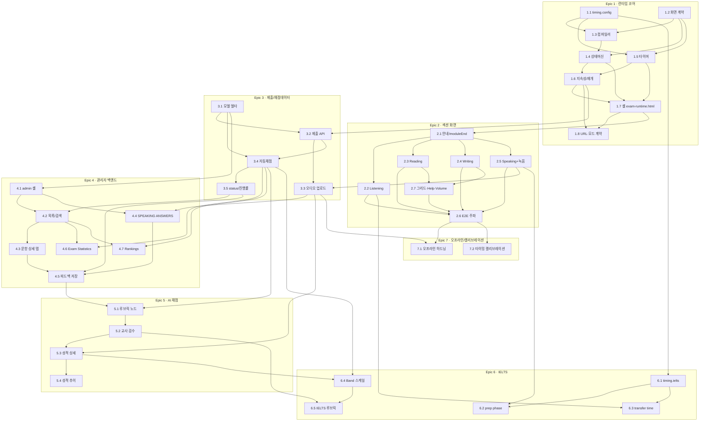

# SMEAG New TOEFL — Epics & Stories (BMAD / Scrum Master)

> **문서 목적** — 화면녹화(57분53초) 분석 명세와 실측 코드베이스 인벤토리를 근거로, 구현 가능한 단위까지 쪼갠 에픽·스토리 백로그.
> **저장소 루트** — `/Users/kwangseobpark/smeag-TOFEL 자료`
> **경로 표기** — 이 문서의 모든 `Files` 항목은 저장소 루트 기준 상대경로이며, `(신규)` / `(수정)` 를 반드시 표기한다. **파일 경로·모듈명·DB 컬럼명의 정본은 `architecture.md` 10절 소스트리와 6절 데이터 모델**이다.
> **표기 규칙** — 관찰로 확정된 사실은 그대로 서술. 검증이 필요한 값은 **⚠️ 가설(검증필요)** 태그를 붙인다.
> **전역 제약** — UI 기본 언어는 영어(한국어는 토글). `studyground/sg2`는 빌드 없는 vanilla JS 정적 사이트이며 프레임워크·CDN 도입 금지, 오프라인 구동 필수.

---

## 0. 배경 요약 (이 백로그가 전제하는 사실)

| 구분 | 내용 | 신뢰도 |
|---|---|---|
| 화면유형 **6종** (architecture.md 3.1 정본) | `instruction`(타이머 없음·수동) / `question`(상단 빨간 pill `MM:SS`) / `speaking`(중앙하단 보라색 RESPONSE TIME `HH:MM:SS` + 🎤) / `moduleEnd` / `hardwareCheck`(getUserMedia 부작용) / `review`(제출 확인) | 녹화 관찰 3종 확정 + 구조 결정 3종 |
| 모듈 구조 | Reading은 Module 1 → `End of Module 1` 전환화면 → Module 2 자동 전환 | 확정 |
| Speaking | 11문항 · 2유형 (Listen and Repeat / Take an Interview) | 확정 |
| Listening | "Question n of 32" 표기, 오디오 1회 재생 | 확정 (단, `set1.js` 실측은 L1 18 + L2 15 = **33문항**) |
| 관리자 백엔드 | `subject_answer.php` 목록 + `subject_answer_detail.php?attempt_id=..` 상세, READING/LISTENING/WRITING 탭 + 별도 SPEAKING ANSWERS 메뉴 | 확정 |
| 모듈별 배정 분, Speaking 응답 초, Writing 태스크 시간 | 명세 2-4의 값 | **⚠️ 가설(검증필요)** — `config/timing.toefl.json` 으로 분리해 값만 교체 |
| 현재 `exam.html` | 전 문항 1페이지 렌더 "연습지". 타이머·상태머신·모듈전환·녹음 **없음** | 확정(실측) |
| 현재 백엔드 | 조회/피드백 전용. `crud.py`에 Student/Exam/Attempt **생성 헬퍼 없음** = 제출 write path 부재 | 확정(실측) |
| 데이터 불일치 | `set1.js`의 `PICS`/`SPK` 경로 문자열이 실제 `sg2/media/**` 와 다름 → 렌더러가 리맵 필요 | 확정(실측) |

### 문항 수 실측 (set1.js)

| 섹션 | 모듈 | 문항 | 자동채점 |
|---|---|---|---|
| Reading | R1(20) + R2(15) | 35 | 전부 자동 |
| Listening | L1(18) + L2(15) | 33 | 전부 자동 |
| Writing | W1(10 build) + W2(1 email) + W3(1 discussion) | 12 | build 10만 자동 |
| Speaking | S1(7 repeat) + S2(4 interview) | 11 | 자동 없음 |
| **합계** | | **91** | 78 자동 / 13 인간·AI |

---

## Epic 1 — 시험 런타임 코어

**목표** — 화면 계약(TestScreen), 문항 데이터 → 화면 시퀀스 컴파일러, 상태머신, 타이머, 지속성/재개를 만든다. 이 에픽은 화면을 "그리지" 않는다. 화면을 **정의하고 진행시키는 엔진**만 만든다.
**완료 정의** — `set1.js` 를 입력하면 91문항이 결정된 화면 시퀀스로 컴파일되고, 상태머신이 타이머 만료·수동 진행 두 경로로 시퀀스를 끝까지 주파하며, 새로고침 후 정확히 같은 지점에서 재개된다.

---

### Story 1.1: 타이밍 상수 외부화 (config/timing.*.json 로더)

**As a** 시험 운영 담당자 **I want** 모든 시간 값이 코드가 아닌 단일 설정 파일에 있기를 **so that** 실제 TOEFL 규격이 확인되면 코드 수정 없이 값만 교체할 수 있다.

**Acceptance Criteria**
1. 설정 파일은 이미 존재하는 `studyground/sg2/config/timing.toefl.json` / `timing.ielts.json` 이며, **스키마 정본은 `docs/bmad/timing-spec.md`** 다. 최상위 키는 정확히 `schemaVersion, exam, sectionOrder, defaults, sections, directions, provenance` 7개다.
2. 값의 근거는 값 옆이 아니라 파일 끝 `provenance.entries[]`에 `{path, level, source, verify}` 로 병렬 표기된다. `level` 은 `observed | official | content | assumed` 이며, 명세 2-4의 가설값은 전부 `assumed` 다.
3. 로더 `SG_TIMING.load(profile, cb)` 가 `assets/exam-timing.js`(신규)에 있고, 로딩 우선순위는 timing-spec.md 6절 그대로다: `window.SG_TIMING_OVERRIDE` → `fetch('config/timing.<exam>.json')` → 내장 폴백 `SG_TIMING_FALLBACK`.
4. 조회 `SG_TIMING.get(cfg, 'sections.reading.modules[id=R1].allocatedSec')` 는 **없는 키에 throw 하지 않고** `null` 을 반환하며 `console.warn` 1회를 남긴다(architecture.md F12 — 예외로 시험을 멈추지 않는다). 오타를 잡는 책임은 로드 직후의 검증 체크(timing-spec 6절 표)와 `exam-selftest.html` 이 진다.
5. `file://` 로 열어 `fetch` 가 실패해도 내장 폴백으로 **오프라인에서 동작**하며, 화면 하단에 `config: builtin` 배지와 `console.warn` 1회를 남긴다.
6. `set1.js` 의 `reading.timeLimitSec=2100`, `W1/W2/W3.timeLimitSec=600`, `prepSec/respondSec` 은 **config 가 단일 소스**이며 런타임은 `set1.js` 값을 읽지 않는다(architecture.md P6/F11). 이 우선순위가 `exam-timing.js` 배너 주석에 명시된다.
7. 세션 시작 시 1회 로드해 메모리에 고정하고, 세션 도중 재로딩하지 않는다.

**Files**
- `studyground/sg2/config/timing.toefl.json` (실재 — 값 교체만)
- `studyground/sg2/config/timing.ielts.json` (실재)
- `studyground/sg2/assets/exam-timing.js` (신규 — 로더 + 검증 + 인라인 폴백)

**Depends on** — 없음

**Verification**
1. `file://` 로 `exam-runtime.html` 을 연 뒤 콘솔에서 `SG_TIMING.get(cfg,'sections.speaking.taskTypes.listenAndRepeat.responseSec')` → `20` + 폴백 warn 확인.
2. `SG_TIMING.get(cfg,'sections.reading.nonexistent')` → `null` + warn 1회(throw 아님) 확인.
3. `sections.reading.modules[id=R1].allocatedSec` 를 60으로 바꾸고 새로고침 → 타이머 시작값이 01:00 인지 확인.
4. `node -e "JSON.parse(require('fs').readFileSync('studyground/sg2/config/timing.toefl.json'))"` 로 두 파일 파싱 검증.

---

### Story 1.2: TestScreen 화면 계약 정의

**As a** 런타임 개발자 **I want** 모든 화면이 하나의 타입으로 기술되기를 **so that** 렌더러·상태머신·타이머가 화면 종류를 하드코딩하지 않고 동일한 계약만 소비한다.

**Acceptance Criteria**
1. `exam-types.js` 가 `ScreenType` 을 정확히 **6개** 값으로 고정한다(architecture.md 3.1 정본): `"instruction" | "question" | "speaking" | "moduleEnd" | "hardwareCheck" | "review"`.
2. `makeScreen(spec)` 팩토리가 architecture.md 3.1 `TestScreen` 의 모든 필드를 받아 **동결된(Object.freeze)** 객체를 반환한다: `id`(필수·안정 키), `screenType`, `section`, `module?`, `moduleId?`, `blockKind?`, `progress?`, `questionIds?`, `timer?`, `advance`, `audio?`, `image?`, `phases?`, `allowBack?`, `transfer?`, `copy?`.
2-1. `TimerSpec` 은 `{mode, scope, seconds, format, onExpire, visible?, sharedDeadline?}` 이고 `scope` 는 `section|module|task|question|screen` 5종이다.
3. `makeScreen` 은 다음 규칙 위반 시 **개발 모드에서 throw / 운영 모드에서 `console.warn` 후 안전 기본값** 으로 degrade 한다(F12): (a) `screenType==="instruction"` 인데 `timer!==null`, (b) `screenType==="question"` 인데 `timer.mode!=="countdown"`, (c) `screenType==="speaking"` 인데 `timer.mode!=="response"` 인 phase 가 있음, (d) `advance` 가 `"manual"|"auto"` 이외 값, (e) `id` 누락. `moduleEnd`/`hardwareCheck` 는 `timer.scope==="screen"` 이고 `timer.visible` 이 `false` 일 수 있다.
4. `timer.format` 은 `question` 에서 `"MM:SS"`, `speaking` 의 `record` phase 에서 `"HH:MM:SS"` 만 허용된다(관찰값과 일치).
5. `audio.maxPlays` 의 기본값은 `1` 이다(Listening 오디오 1회 재생 관찰값).
6. 계약 위반 케이스 8종(위 (a)~(e) + scope/format 위반)을 검증하는 순수 JS 어서션 하니스 `assets/exam-selftest.html` 이 모두 통과한다(빌드·테스트러너 없이 브라우저에서 열면 결과가 표시됨).

**Files**
- `studyground/sg2/assets/exam-types.js` (신규)
- `studyground/sg2/assets/exam-selftest.html` (신규)

**Depends on** — 없음

**Verification**
1. `sg2/assets/exam-selftest.html` 을 브라우저로 열어 "PASS 8/8" 표시 확인.
2. 콘솔에서 `makeScreen({screenType:'instruction', section:'listening', timer:{mode:'countdown'}, advance:'manual'})` → throw 확인.

---

### Story 1.3: 스크린 컴파일러 (set1.js → TestScreen[])

**As a** 런타임 개발자 **I want** `window.SMEAG_SET1` 을 화면 시퀀스로 컴파일하는 순수 함수를 **so that** 콘텐츠 데이터를 건드리지 않고도 시험 흐름을 생성·검증할 수 있다.

**Acceptance Criteria**
1. `compile(SMEAG_SET1, timingConfig)` 가 `TestScreen[]` 을 반환한다. 입력을 **변형하지 않는다**(`set1.js` 는 read-only).
2. 섹션 순서는 `timing.sectionOrder` 를 따르고 `set.sections[]` 배열 순서(R→L→W→S)는 **무시**한다(architecture.md 4.1). TOEFL 기본 시퀀스: `intro.volume` → `listening.directions` → L1 → `moduleEnd` → L2 → `moduleEnd` → `speaking.hardware` → `speaking.directions` → S1(intro+7) → S2(intro+4) → `reading.directions` → R1 → `moduleEnd` → R2 → `moduleEnd` → `writing.directions` → W1(10) → taskEnd → W2 → taskEnd → W3 → taskEnd → `review.submit`.
3. 합성 화면은 architecture.md 4.2 표대로다: `intro.volume`(1) + `{section}.directions`(4 — listening/speaking/reading/writing) + `speaking.hardware`(`screenType:"hardwareCheck"`, 1) + `review.submit`(`screenType:"review"`, 1). 각 화면 id 는 `"{section}.{kind}.{moduleId}.{seq}"` 규칙을 따른다.
4. `moduleEnd` 화면은 모듈/태스크 경계마다 생성되며 총 **7개**다: listening 2(L1, L2) + reading 2(R1, R2) + writing taskEnd 3(W1, W2, W3). 삽입 대상은 config 의 `modules[].moduleEndScreen` / `tasks[].moduleEndScreen` 이 지정한 `directions[].id` 다. 문구는 `copy.bodyEn` = `"Your time for {label} has ended."` 형식이다.
5. `question` 화면의 `progress` 는 섹션 단위 누적이다: Listening 첫 화면은 `{index:1, total:33}`, Reading 첫 화면은 `{index:1, total:35}`.
6. `audio-set` 블록 중 `perQuestionAudio:true` 인 블록은 문항마다 `audio.src` 를 갖고, 그렇지 않은 블록은 블록 첫 화면에만 `audio.src` 를 갖는다(블록 오디오 1회 재생 후 해당 블록의 모든 문항 풀이).
7. `record-set` 블록의 `introAudio` 는 **별도 `instruction` 화면 1개**로 컴파일된다(architecture.md 4.2 — S1 → instruction + 7화면, S2 → instruction + 4화면). 각 speaking 화면은 `phases[]`(`listen`/`read` → `prep` → `record`)를 갖고, `prep.seconds` 와 `record.seconds` 는 **config 의 `taskTypes.<type>.prepSec / responseSec`** 에서 온다(`set1.js` 값이 아니라 config가 단일 소스 — Story 1.1 AC6). `seconds:0` 인 phase 는 엔진이 즉시 통과시킨다.
8. 미디어 경로 리맵은 **`assets/exam-media.js` 의 `resolveMedia()` 한 곳에서만** 수행된다(architecture.md C3): `'TOEFL MOCK TEST  SET 1/SET 1 AUDIO/'`(TEST 뒤 **공백 2칸**) → `'media/audio/'`, `'app/assets/speaking/'` → `'media/speaking/'`, `'TOEFL LISTENING & WRITING PICTURES/'` → `'media/pictures/'`. 컴파일러는 원본 경로를 그대로 담고, 리맵 누락은 `warnings[]` 로 보고한다(throw 금지 — 오프라인에서 시험이 멈추면 안 됨).
9. 컴파일 결과의 `question`+`speaking` 화면의 `questionIds[]` 합집합이 `SMEAG_SET1.allQuestions().map(x=>x.q.id)` 와 **완전히 일치**한다(91개, 누락·중복 0). *`allQuestions()` 는 `{q, block, module, section}` 래퍼 배열을 반환한다 — 실측.*
10. 총 화면 수는 **78** 이다(architecture.md 4.3 검산: listening 36 + speaking 15 + reading 9 + writing 16 + 공통 2). 화면 수 < 문항 수인 이유는 reading 의 cloze/passage/chat 이 화면당 다문항이기 때문이다.
11. 컴파일러는 순수 함수이며 `Math.random()`/`Date.now()`/DOM 을 쓰지 않고, 타이밍 config 에 없는 module/task 는 throw 대신 `warnings[]` 에 담는다.

**Files**
- `studyground/sg2/assets/exam-compile.js` (신규)
- `studyground/sg2/assets/exam-selftest.html` (수정 — 컴파일 검증 케이스 추가)

**Depends on** — 1.1, 1.2

**Verification**
1. `exam-selftest.html` 에서 "compile: 91 questions, 0 missing, 0 duplicate" 및 "screens: 78 (instruction 6 / hardwareCheck 1 / moduleEnd 7 / review 1)" 출력 확인.
2. 콘솔에서 `compile(...).filter(s=>s.audio).every(s=>s.audio.src.startsWith('media/'))` → `true` 확인.
3. `set1.js` 의 `paths.audio` 상수를 임시로 다른 문자열로 바꾸면 리맵 누락이 `warnings[]` 와 `exam-selftest.html` FAIL 로 드러나는지 확인.

---

### Story 1.4: 시험 상태머신

**As a** 응시자 **I want** 화면이 정해진 순서로만 진행되기를 **so that** 뒤로가기·중복 제출·건너뛰기로 시험 무결성이 깨지지 않는다.

**Acceptance Criteria**
1. `ExamMachine.create(screens)` 가 `{ current(), next(reason), answer(qid, value), snapshot(), status() }` 를 노출한다.
2. `next(reason)` 은 `reason` 이 `"manual"` 또는 `"expire"` 일 때만 진행한다. `advance:"manual"` 화면에서 `reason:"expire"` 호출은 무시되고 `false` 를 반환한다.
3. **역방향 이동 API가 존재하지 않는다.** 브라우저 뒤로가기는 `history.pushState` + `popstate` 핸들러로 흡수되어 현재 화면이 유지된다.
4. `status()` 는 `"not_started" | "in_progress" | "submitting" | "submitted"` 중 하나를 반환하며, 마지막 화면에서 `next()` 호출 시 `"submitting"` 으로 전이한다.
5. 각 전이마다 `onTransition({from, to, reason, at})` 콜백이 정확히 1회 발화한다(중복 발화 0).
6. `answer(qid, value)` 는 현재 화면에 속하지 않는 `qid` 에 대해 throw 한다.
7. 이미 `"submitted"` 상태에서 `next()`/`answer()` 호출은 no-op이며 `false` 를 반환한다(중복 제출 방지).

**Files**
- `studyground/sg2/assets/exam-engine.js` (신규)
- `studyground/sg2/assets/exam-selftest.html` (수정)

**Depends on** — 1.2, 1.3

**Verification**
1. `exam-selftest.html` 에서 전이 시나리오 케이스(정상 주파 / 만료 무시 / 중복 제출) 전부 PASS 확인.
2. 실제 페이지에서 시험 시작 후 브라우저 뒤로가기 3회 → 화면이 바뀌지 않고 URL만 유지되는지 확인.

---

### Story 1.5: 타이머 엔진 (countdown / response)

**As a** 응시자 **I want** 화면 상단의 카운트다운이 실제 경과시간과 어긋나지 않기를 **so that** 탭 전환이나 렌더 지연으로 시간이 늘거나 줄지 않는다.

**Acceptance Criteria**
1. 타이머는 남은 초를 저장하지 않고 **절대 deadline(epoch ms)** 만 저장·비교한다(architecture.md 5.5 정본: `armClock(key, seconds)` / `remainingSec(key)`). 렌더 루프는 `setInterval(tick, 250)` 이며 매 tick 마다 deadline 을 재계산한다. 탭을 60초간 백그라운드로 두었다가 복귀하면 잔여시간이 60초 줄어 있다(오차 ±1초).
2. `mode:"countdown"` 은 `MM:SS`, `mode:"response"` 는 `HH:MM:SS` 로 포맷된다.
3. 잔여 00:00 도달 시 `onExpire` 가 **정확히 1회** 발화한다(각 clock key 의 메모리 전용 `fired` 플래그로 보장). 이후 해당 key 의 tick 은 발생하지 않는다.
4. `onExpire:"autoAdvance"` 인 화면에서 만료 후 **사용자 입력 없이 300ms 이내**에 다음 화면(또는 `End of Module` 화면)이 표시된다.
5. `onExpire:"stopRecord"` 인 speaking 화면에서 만료 시 녹음이 중지되고 화면은 자동 전환되지 않는다(응시자가 Next 를 눌러 진행).
6. 남은 시간이 60초 이하가 되면 타이머 요소에 `.is-warning` 클래스가 붙는다(시각 경고).
7. 여러 scope 의 deadline 이 **동시에 공존**한다(architecture.md 3.5): 예를 들어 Listening 화면에는 `question:{screenId}` 와 `module:L1` 두 clock 이 함께 살아 있다. 상단 pill 에는 **좁은 scope**(question)를 표시하고, 넓은 scope 만료는 `moduleEnd` 로의 강제 전이로 처리한다.
8. `armClock` 은 같은 key 가 이미 있으면 **덮어쓰지 않는다**(재개 시 시간이 늘어나지 않음). `instruction` 화면 진입 시 진행 중인 module/task 타이머는 정지하지 않으며, `moduleEnd` 화면 진입 시 해당 scope 의 clock 은 만료 처리된다.

**Files**
- `studyground/sg2/assets/exam-clock.js` (신규)
- `studyground/sg2/assets/exam-selftest.html` (수정)

**Depends on** — 1.1, 1.2

**Verification**
1. 카운트다운 5초짜리 테스트 화면을 띄우고 탭을 10초 숨겼다 복귀 → 즉시 만료 + `onExpire` 1회 로그 확인.
2. 콘솔에서 `onExpire` 호출 횟수 카운터가 1인지 확인.
3. 만료 시각과 다음 화면 DOM 삽입 시각의 차이를 `performance.mark` 로 측정해 300ms 이내인지 확인.

---

### Story 1.6: 지속성 및 재개 (localStorage)

**As a** 응시자 **I want** 브라우저가 새로고침되거나 꺼져도 시험이 이어지기를 **so that** 사고로 응시 기회를 잃지 않는다.

**Acceptance Criteria**
1. 상태는 architecture.md 5.2 의 키 네이밍을 따른다: `sg2_attempt_active`(진행 중 sessionId) + `sg2_attempt::{session}::meta | ::cursor | ::clocks | ::answers | ::events | ::outbox`. `meta` 는 `{session, examCode, studentNo, startedAt, profile, contentHash, timingHash, screenCount, submittedAt}` 이고, `cursor` 는 `{screenId, screenIndex, phaseIndex, updatedAt}`, `clocks` 는 `{"module:R1": <epochMs>, ...}` 다.
2. 저장은 (a) 모든 화면 전이 시, (b) 모든 `answer()` 호출 시, (c) 10초 주기 자동저장, 세 시점에 일어난다.
3. 새로고침 후 페이지 로드 시 저장된 상태가 있으면 **재개 확인 화면**이 뜨고, `Resume` 선택 시 architecture.md 5.4 복구 절차대로 복원된다: `compileScreens()` 재실행 → `cursor.screenId` 로 인덱스 **재탐색**(저장된 인덱스 숫자를 신뢰하지 않는다) → clocks 비교 → 답안 DOM 복원.
4. 타이머 복원은 저장된 `endsAtEpochMs` 와 `Date.now()` 차이로 계산되며, 브라우저가 꺼져 있던 시간도 **소모된 것으로 간주**한다. 이미 만료된 모듈은 재개 즉시 다음 모듈로 전이된다.
5. `meta.contentHash` / `meta.timingHash` 가 현재 `set1.js`·config 해시와 다르면 복구를 **거부**하고 "이 시험은 이어서 볼 수 없습니다" 안내 후 새 시도로 시작한다(문항 순서가 바뀐 채 이어붙는 사고 방지).
6. Speaking 녹음 오디오는 localStorage 용량 한계 때문에 저장하지 않고 **IndexedDB**(DB `sg2-media`, store `recordings`, key `{session}/{questionId}`)에 Blob 으로 저장하며, `answers` 에는 `"idb:{questionId}"` 참조만 둔다. 재개 시 이미 녹음된 문항은 "recorded" 로 표시되고 재녹음은 `timing` 의 `allowRerecord`(기본 false)를 따른다.
7. `status:"submitted"` 로 저장된 상태는 재개 대상이 아니며, 로드 시 결과 안내 화면으로 이동한다.

**Files**
- `studyground/sg2/assets/exam-store.js` (신규)
- `studyground/sg2/assets/exam-engine.js` (수정 — snapshot/restore 훅)

**Depends on** — 1.4, 1.5

**Verification**
1. 시험을 3화면 진행하고 답을 2개 입력한 뒤 새로고침 → 재개 확인 화면 → Resume → 동일 화면·동일 답 복원 확인.
2. DevTools > Application > Local Storage 에서 `sg2_attempt::{session}::meta|cursor|clocks|answers` 키 구조가 AC1 과 일치하는지 확인.
3. 모듈 타이머 잔여 30초 상태에서 탭을 닫고 2분 뒤 재접속 → 재개 즉시 `End of Module` 로 넘어가는지 확인.

---

### Story 1.7: 런타임 셸 페이지 (exam-runtime.html)

**As a** 응시자 **I want** 실제 TOEFL 과 같은 상단바·타이머·진행표시가 있는 단일 시험 화면을 **so that** 시험 환경이 실제와 동일하게 느껴진다.

**Acceptance Criteria**
1. 신규 `studyground/sg2/exam-runtime.html` 이 만들어진다. 기존 `exam.html`(연습지)은 **삭제하지 않고 그대로 둔다**(연습 용도 유지).
2. 상단바 좌측에 `StudyGround SET 1` 형태의 코드 라벨(보조 라인 `2026 (Module {n})`), 우측에 `Exit Test`, `Volume`, `Help`, 진행 버튼(`Continue` / `Begin` / `Next`)이 배치된다.
3. 상단 중앙에 빨간 pill 타이머 슬롯이 있으며, `question` 화면에서만 렌더된다. `instruction`/`speaking`/`moduleEnd`/`hardwareCheck`/`review` 에서는 **DOM에서 제거**된다(숨김이 아니라 미렌더).
4. 하단 우측에 언어 토글이 있고 기본값은 `EN` 이다. 토글 시 `html[lang]` 이 바뀌고 `localStorage('sg2_lang')` 에 저장된다(기존 `app.js` 메커니즘 재사용).
5. `Exit Test` 클릭 시 확인 모달이 뜨고, 확정 시 상태를 저장한 뒤 `dashboard.html` 로 이동한다(진행상황은 재개 가능하게 남는다).
6. 페이지가 로드하는 스크립트는 로컬 파일뿐이며, 외부 도메인 요청이 **0건**이다(DevTools Network 필터로 확인 가능).
7. 신규 CSS는 `studyground/sg2/assets/exam.css` 에 분리하고, 기존 `app.css` 의 CSS 변수(`--brand`, `--line`, `--muted`, `--radius`, `--shadow` 등)를 재사용한다. `app.css` 는 수정하지 않는다.

**Files**
- `studyground/sg2/exam-runtime.html` (신규)
- `studyground/sg2/assets/exam.css` (신규)
- `studyground/sg2/assets/exam-render.js (셸·상단바 바인딩 포함)` (신규 — 상단바·모달·언어토글 바인딩)
- `studyground/sg2/sw.js` (수정 — 신규 자산 프리캐시 목록 추가)

**Depends on** — 1.4, 1.5, 1.6

**Verification**
1. `exam-runtime.html` 을 열어 상단바/타이머/언어토글 렌더 확인, DevTools Network 에서 외부 요청 0건 확인.
2. `instruction` 화면에서 타이머 요소가 DOM에 없는지 Elements 탭으로 확인.
3. `Exit Test` → 확인 → dashboard 이동 후 다시 `exam-runtime.html` 진입 시 재개 확인 화면이 뜨는지 확인.

---

### Story 1.8: URL·모드 계약 (sessionId / practice·exam)

**As a** 응시자 **I want** 링크 하나로 특정 시험·세션·모드에 정확히 진입하기를 **so that** 연습과 실전이 섞이지 않고, 중단된 세션을 URL 로 다시 열 수 있다. *(PRD FR32, FR33)*

**Acceptance Criteria**
1. 진입 URL 계약은 `exam-runtime.html?testId=SET1&sessionId=..&mode=practice|exam&exam=toefl|ielts#screen={screenId}` 다. 관찰된 레퍼런스 `/en/test-nt/{section}?testId=..&sessionId=..&mode=..&section=..` 를 **정적 사이트에서 표현 가능한 형태로 매핑**한 것이며, 매핑 규칙이 파일 배너 주석에 남는다.
2. `sessionId` 미지정 시 서버 `POST /api/attempts` 로 발급받고, 오프라인이면 `offline-{uuidv4}` 로 임시 발급한 뒤 최초 동기화 때 서버 session 으로 치환한다(`meta.serverSession` 에 매핑 보존 — architecture.md 5.1).
3. `mode=exam`(기본): 전 제약 적용 — 타이머 강제, 오디오 1회, 즉시 채점 UI **비활성**, 정답 미표시.
4. `mode=practice`: 타이머 완화(만료 시 자동전환 대신 경고 배지), 오디오 재생 제한 유지, 섹션 종료 시 즉시 채점 허용.
5. 모드는 `meta.mode` 에 저장되어 **세션 도중 변경할 수 없다**(URL 로 바꿔도 저장된 값이 이긴다).
6. 화면 전이마다 `history.replaceState` 로 `#screen={screenId}` 를 갱신하되, 뒤로가기는 Story 1.4 AC3 대로 흡수한다.
7. 알 수 없는 `exam` 프로파일은 `toefl` 로 폴백하고 `console.warn` 을 남긴다.

**Files**
- `studyground/sg2/exam-runtime.html` (수정)
- `studyground/sg2/assets/exam-engine.js` (수정 — URL 파싱·모드 게이트)
- `studyground/sg2/assets/exam-store.js` (수정 — `meta.mode`, `meta.serverSession`)

**Depends on** — 1.6, 1.7

**Verification**
1. `?mode=exam` 진입 후 섹션 종료 시 즉시채점 버튼이 없는지 확인, `?mode=practice` 에서는 있는지 확인.
2. 진행 중 URL 의 `mode` 를 바꿔 새로고침 → 저장된 모드가 유지되는지 확인.
3. `?exam=nonsense` → toefl 폴백 + warn 확인.

---

## Epic 2 — 섹션별 화면 구현

**목표** — Epic 1 엔진 위에 실제 화면 렌더러를 붙인다. 렌더러는 화면당 하나의 순수 함수(`render(screen, state) → DOM`)이며 상태머신을 직접 조작하지 않는다.
**완료 정의** — 91문항 전체를 사람이 처음부터 끝까지 실제로 응시할 수 있고, Speaking 11문항의 오디오가 모두 저장된다.

---

### Story 2.1: 안내화면 렌더러 (instruction / moduleEnd / hardwareCheck / review)

**As a** 응시자 **I want** 각 섹션 시작 전 지시사항을 내 속도로 읽기를 **so that** 준비되지 않은 상태로 타이머가 시작되지 않는다.

**Acceptance Criteria**
1. 안내 계열 화면 8종이 모두 렌더된다: `instruction` 5종(`Adjusting the Volume`, `Listening Section Directions`, `Speaking Section Directions`, `Reading Section Directions`, `Writing Section Directions`) + `hardwareCheck` 1종(`Hardware Check`) + `moduleEnd`/taskEnd + `review`(`Submit Test`). id 와 삽입 위치는 `config/timing.toefl.json` 의 `directions[]` 가 정본이다.
2. 모든 `instruction` 화면에 카운트다운이 표시되지 않으며, 진행은 `Continue`/`Begin` 버튼 클릭으로만 일어난다(self-paced).
3. `Adjusting the Volume` 화면에 볼륨 슬라이더와 `Play Test Audio` 버튼이 있고, 재생 버튼은 **횟수 제한 없이** 반복 재생 가능하다. 슬라이더 값은 이후 모든 오디오 요소의 `volume` 에 적용되고 `localStorage('sg2_volume')` 에 저장된다.
4. `Hardware Check` 화면에서 `getUserMedia` 로 마이크 권한을 요청하고, 입력 레벨 미터가 실시간으로 움직인다. 권한 거부 시 재시도 버튼과 안내 문구가 표시되며 `Begin` 버튼은 **비활성**된다.
5. `Speaking Section Directions` 화면에 11문항·2유형 표(유형명 / 문항 수 / 응답시간)가 렌더된다. 표의 응답시간 값은 `sections.speaking.taskTypes.<type>.responseSec` 에서 읽는다.
6. `moduleEnd` 화면은 `"End of Module {n}"` 제목과 `"Your time for Module {n} … has ended."` 본문, `Continue to Module {n+1}` 버튼을 표시한다. `advance:"manual"` 이 기본이고 `directions[].maxSec`(현재 30초, **⚠️ 가설(검증필요)**)는 **비표시 상한 타임아웃**으로만 동작한다(architecture.md 3.4).
7. 모든 안내 문구는 `data-en` / `data-ko` 이중 표기로 작성되어 기존 언어토글 메커니즘에 그대로 얹힌다.

**Files**
- `studyground/sg2/assets/exam-render.js` (신규)
- `studyground/sg2/assets/exam-render.js  ← 동일 파일(instruction/moduleEnd/hardwareCheck/review 디스패처)` (신규)
- `studyground/sg2/assets/exam.css` (수정)

**Depends on** — 1.7

**Verification**
1. 시험을 시작해 5개 안내화면을 순서대로 통과하며 각 화면에 타이머가 없는지 육안 확인.
2. Hardware Check 에서 마이크 권한을 브라우저 설정으로 거부 → `Begin` 비활성 + 재시도 버튼 확인.
3. 볼륨 슬라이더를 50%로 두고 Listening 진입 → 오디오 볼륨이 실제로 50%인지 `audio.volume` 콘솔 확인.

---

### Story 2.2: Listening 화면 렌더러

**As a** 응시자 **I want** 오디오가 1회만 재생되고 문항이 순서대로 제시되기를 **so that** 실제 TOEFL Listening 과 동일한 조건에서 응시한다.

**Acceptance Criteria**
1. 블록 오디오(`audio-set` 중 `perQuestionAudio` 없는 블록)는 블록 첫 화면에서 자동 재생되며, 재생 중에는 선택지가 **비활성**이고 재생 종료 후 활성화된다.
2. 오디오는 **1회만** 재생 가능하다. 재생 완료 후 재생 컨트롤이 DOM에서 제거되고, `audio.currentTime` 조작으로도 재생되지 않는다.
3. 블록 오디오 재생 중 화자 이미지(`block.image`)가 표시된다. `perQuestionAudio` 블록은 문항별 이미지(`question.image`, `SPEAKER_CYCLE` 순환)를 표시한다.
4. 진행 표시가 `"Question n of 33"` 형식으로 상단에 표시되며, `total` 은 `questionCountSource:"content"` 규칙대로 콘텐츠에서 산출한다(config 에 문항 수를 넣지 않는다). **⚠️ 가설(검증필요)**: 녹화에서는 "of 32" 로 관찰되었으나 `set1.js` 실측은 33 → total 값은 컴파일러가 데이터에서 산출하며 하드코딩하지 않는다.
5. `perQuestionAudio` 블록의 짧은 응답 문항은 `layout:'short-response'` 를 감지해 이미지 상단 + 선택지 4개 세로 배치로 렌더된다.
6. 문항의 하드코딩된 한국어 프롬프트(`'오디오를 듣고 가장 알맞은 응답을 고르세요.'`)는 렌더 시 `data-ko` 로 취급되고, `data-en` 기본 문구 `"Choose the best response."` 가 EN 모드에서 표시된다. **`set1.js` 는 수정하지 않는다.**
7. 선택지 선택 시 `machine.answer(qid, index)` 가 호출되고, 선택 상태가 시각적으로 표시되며 재선택이 가능하다.
8. 모듈 카운트다운이 00:00 이 되면 미응답 문항이 있어도 `End of Module` 화면으로 전이된다.

**Files**
- `studyground/sg2/assets/exam-render-listening.js` (신규)
- `studyground/sg2/assets/exam-media.js` (신규 — 1회 재생 보장 래퍼)
- `studyground/sg2/assets/exam.css` (수정)

**Depends on** — 1.7, 2.1

**Verification**
1. Listening Module 1 을 끝까지 응시하며 18문항이 모두 나오는지, 오디오가 각 1회만 재생되는지 확인.
2. 오디오 재생 후 콘솔에서 `document.querySelector('audio').play()` 호출 → 재생되지 않음 확인.
3. 모듈 타이머를 `config/timing.toefl.json` 에서 30초로 낮추고 재실행 → 30초 뒤 자동으로 End of Module 표시 확인.

---

### Story 2.3: Reading 화면 렌더러 (cloze / passage / chat / insert)

**As a** 응시자 **I want** 4가지 Reading 문항 유형이 모두 실제 형식대로 표시되기를 **so that** 문항 유형에 따른 혼란 없이 답할 수 있다.

**Acceptance Criteria**
1. `cloze` 블록: `template` 의 `{{1}}`..`{{10}}` 이 인라인 입력 필드로 치환되고, 각 필드에 `question.hint`(선행 글자)가 placeholder 로 표시된다. 헤딩은 `"Fill in the missing letters."` 다.
2. `passage` 블록: `title` + `paragraphs[]` 가 좌측 스크롤 영역에, 문항이 우측에 2단 배치된다. 화면폭 940px 미만에서는 1단으로 접힌다.
3. `chat` 블록: `messages[]` 가 `side` 값에 따라 좌/우 말풍선으로 렌더되고 `name`·`time` 이 표시된다.
4. `insert` 문항(R1-20): 지문 3번째 문단의 `{{A}}`~`{{D}}` 마커가 클릭 가능한 삽입 위치 버튼으로 치환되고, 선택 시 `sentence` 텍스트가 해당 위치에 미리보기로 삽입된다. 선택지 라디오(`Position A`~`D`)와 마커 클릭은 **양방향 동기화**된다.
5. Reading 은 모듈 단위 카운트다운(`sections.reading.timerScope:"module"`, `sharedDeadline:true`)을 쓴다. 값은 `sections.reading.modules[id=R1|R2].allocatedSec` = **1080 / 1020초**(합 2100 = `set1.js reading.timeLimitSec`)이며 **⚠️ 가설(검증필요)** 다.
6. R1 완료 → `End of Module 1` → R2 로 전이된다.
7. 모든 입력값은 입력 즉시 `machine.answer()` 로 반영되어 새로고침 후 복원된다.

**Files**
- `studyground/sg2/assets/exam-render-reading.js` (신규)
- `studyground/sg2/assets/exam.css` (수정)

**Depends on** — 1.7, 2.1

**Verification**
1. R1 의 4개 블록(cloze/passage/chat/passage+insert)을 모두 통과하며 각 유형이 의도대로 렌더되는지 육안 확인.
2. R1-20 에서 마커 B 클릭 → 라디오 `Position B` 가 선택되는지, 반대 방향도 동작하는지 확인.
3. cloze 3개 입력 후 새로고침·Resume → 입력값 3개 복원 확인.
4. 브라우저 폭을 900px 로 줄여 passage 2단이 1단으로 접히는지 확인.

---

### Story 2.4: Writing 화면 렌더러 (build / email / discussion)

**As a** 응시자 **I want** 드래그 배열 문제와 자유 작문 문제를 각각의 형식으로 풀기를 **so that** 문항 의도대로 답안을 작성할 수 있다.

**Acceptance Criteria**
1. `build` 문항(W-1..W-10): `slots[]` 중 `t:'f'` 는 고정 텍스트로, `t:'b'` 는 빈 드롭존으로 렌더되고, `tiles[]` 가 하단 타일 팔레트에 표시된다.
2. 타일은 **드래그앤드롭과 클릭(탭)** 두 방식 모두로 배치할 수 있다(터치 기기 대응). 배치된 타일을 다시 클릭하면 팔레트로 되돌아간다.
3. 드롭존이 모두 채워지면 완성 문장이 한 줄로 표시된다. 답안은 `answerTokens` 와 같은 순서의 문자열 배열로 `machine.answer()` 에 전달된다.
4. `email` 문항(W-EMAIL): `to`, `subject`, `SITUATION` 박스, `YOUR EMAIL SHOULD` 불릿 3개가 표시되고, 본문 textarea 하단에 실시간 단어 수 카운터가 있다. `minWords:80` 미만이면 카운터가 `--warn` 색으로 표시된다(제출은 차단하지 않는다).
5. `discussion` 문항(W-DISC): `professor` 프롬프트 + `posts[]`(Lena, Omar) 2개가 카드로 표시되고, textarea + `minWords:100` 카운터가 있다.
6. Writing 각 태스크는 독립 카운트다운(`timerScope:"task"`)을 가진다. 값은 `sections.writing.tasks[id=W1|W2|W3].perTaskSec` = 600초이며 **config 가 단일 소스**다(`set1.js` 값은 읽지 않는다). **⚠️ 가설(검증필요)** — 실제 규격 확인 필요.
7. textarea 입력은 500ms 디바운스로 저장되며, 새로고침 후 커서 위치를 제외한 전문이 복원된다.

**Files**
- `studyground/sg2/assets/exam-render-writing.js` (신규)
- `studyground/sg2/assets/exam-render-writing.js (드래그/탭 배치 포함)` (신규 — 드래그/탭 겸용 타일 배치)
- `studyground/sg2/assets/exam.css` (수정)

**Depends on** — 1.7, 2.1

**Verification**
1. W1 10문항을 드래그로 5개, 클릭으로 5개 완성 → 모두 정상 배치되는지 확인.
2. W2 에 79단어 입력 → 카운터 경고색, 80단어 → 정상색 확인.
3. W3 작성 중 새로고침·Resume → 전문 복원 확인.
4. 모바일 사이즈(560px) 에뮬레이션에서 타일 탭 배치가 동작하는지 확인.

---

### Story 2.5: Speaking 화면 렌더러 + RESPONSE TIME 녹음

**As a** 응시자 **I want** 프롬프트 청취 후 즉시 녹음이 시작되고 정해진 시간에 자동 종료되기를 **so that** 실제 시험과 동일한 압박 조건에서 말하기를 수행한다.

**Acceptance Criteria**
1. Speaking 화면은 `prompt/listen` → `prep` → `record` 3 phase 로 진행된다. 각 phase 전환은 자동이며 사용자 입력이 필요 없다.
2. `prompt/listen` phase: `question.audio` 가 **1회만** 재생되고 `question.image` 일러스트가 표시된다. 재생 중 녹음 UI는 표시되지 않는다.
3. `prep` phase: `sections.speaking.taskTypes.<type>.prepSec`(현재 3초) 동안 `"Get ready"` 표시. **⚠️ 가설(검증필요)** — 녹화에서는 Listen and Repeat 의 준비시간이 관찰되지 않았음(prep 0 가능성). `seconds:0` 이면 엔진이 **즉시 통과**시키므로 분기 없는 동일 코드경로다(architecture.md 3.3).
4. `record` phase: 화면 중앙 하단에 **보라색 RESPONSE TIME 박스**가 나타나고 `HH:MM:SS` 카운트다운 + 🎤 아이콘이 표시된다. 카운트다운 값은 `taskTypes.listenAndRepeat.responseSec` 20초 / `taskTypes.interview.responseSec` 45초.
5. `MediaRecorder` 로 녹음이 phase 시작과 동시에 자동 시작되고, 카운트다운 00:00:00 도달 시 자동 정지된다. 정지 시 Blob 이 IndexedDB `sg2-media` / store `recordings` 에 key `{session}/{questionId}`, 값 `{questionKey, blob, mime, durationMs, recordedAt}` 로 저장된다.
6. 녹음 종료 후 재생 미리듣기가 제공되지만 **재녹음은 불가**하며, `Next` 버튼만 활성화된다.
7. S2(`interview`) 는 `introAudio` 재생 후 `"Please answer the interviewer's questions"` 프롬프트 화면(self-paced)을 거친 뒤 인터뷰 오디오 → 녹음으로 진행한다.
8. 마이크 권한이 없거나 `MediaRecorder` 미지원 시, 화면에 명시적 오류 배너를 띄우고 해당 문항을 `"NOT SUBMIT"` 로 마킹한 뒤 다음으로 진행한다(시험 전체가 멈추지 않는다).
9. 11개 문항 녹음 완료 후 IndexedDB 에 정확히 11개 레코드(또는 실패분 제외 개수)가 존재한다.
10. Safari 대응으로 mimeType 협상 폴백(`audio/webm;codecs=opus` → `audio/mp4`)을 구현하고 실제 사용된 mime 을 레코드에 기록한다(NFR12).

**Files**
- `studyground/sg2/assets/exam-render-speaking.js` (신규)
- `studyground/sg2/assets/exam-recorder.js` (신규 — MediaRecorder 래퍼 + IndexedDB 저장)
- `studyground/sg2/assets/exam.css` (수정)

**Depends on** — 1.7, 2.1

**Verification**
1. S1 7문항 + S2 4문항을 실제로 녹음 완료 후, DevTools > Application > IndexedDB > `sg2-media` / `recordings` 에 11개 레코드 확인.
2. 녹음 중 RESPONSE TIME 박스가 보라색·`HH:MM:SS`·🎤 로 표시되는지 육안 확인.
3. 마이크를 시스템에서 차단한 상태로 S1-1 진입 → 오류 배너 + 다음 진행 가능 확인.
4. 임의 문항 Blob 을 꺼내 재생 → 실제 음성이 들리는지 확인.

---

### Story 2.6: 섹션 순서 확정 및 전체 주파(E2E) 통과

**As a** QA 담당자 **I want** 91문항 전체를 한 세션으로 완주할 수 있기를 **so that** 개별 렌더러가 아니라 시험 전체가 동작함을 보장한다.

**Acceptance Criteria**
1. 관찰된 섹션 순서(Listening → Speaking → Reading → Writing)는 **`config/timing.toefl.json` 의 `sectionOrder`** 한 곳에만 있다(컴파일러 상수 아님 — architecture.md 4.1). `set1.js` 의 `sections[]` 배열 순서(reading/listening/writing/speaking)는 무시된다. **⚠️ 가설(검증필요)** — PRD OQ-1.
2. 한 세션에서 91문항 모두를 통과할 수 있으며, 중간에 JS 예외가 **0건** 발생한다(콘솔 error 0).
3. 각 섹션 전환 시 상단바의 섹션명 라벨이 올바르게 바뀐다.
4. 모든 오디오·이미지 자산이 200 으로 로드된다(404 0건). 리맵 규칙이 실제 `media/**` 파일과 일치함을 증명한다.
5. 마지막 Writing 태스크 완료 후 `Submit` 화면이 표시되고, 상태머신이 `"submitting"` 으로 전이한다.
6. `config/timing.fast.json`(모든 시간 값 5초)으로 전체 주파가 5분 이내에 가능하다(QA 반복 실행 가능). 프로파일 선택은 `?exam=fast` 로 한다.

**Files**
- `studyground/sg2/assets/exam-compile.js` (수정 — `sectionOrder` 소비 검증)
- `studyground/sg2/config/timing.fast.json` (신규 — QA 고속 프로파일)
- `docs/bmad/qa-walkthrough.md` (신규 — 주파 체크리스트)

**Depends on** — 2.1, 2.2, 2.3, 2.4, 2.5, 2.7

**Verification**
1. 고속 프로파일로 전체 1회 주파 후 콘솔 error 0건, Network 404 0건 확인.
2. 정상 프로파일로 최소 1회 실제 완주(약 60분) 후 체크리스트 서명.

---

### Story 2.7: 문항 그리드 네비게이션 · Help 오버레이 · Volume 컨트롤

**As a** 응시자 **I want** 남은 문항을 한눈에 보고 조작법을 언제든 확인하기를 **so that** 시간 배분을 스스로 관리하고 낯선 화면에서 헤매지 않는다. *(PRD FR22, FR25, FR26)*

**Acceptance Criteria**
1. Reading / Writing module 하단(또는 접이식 패널)에 **문항 번호 격자**가 렌더된다. 상태 4종: `answered`(채워짐) / `unanswered`(외곽선) / `current`(브랜드 강조) / `flagged`(북마크 — 선택). 색만이 아니라 아이콘·굵기로도 구분한다(NFR9).
2. 그리드 버튼 클릭 시 같은 module 안에서만 이동하며, `screen.allowBack !== true` 인 섹션(Listening / Speaking)에서는 그리드가 **읽기 전용 진행 표시기**로만 동작한다(FR23).
3. 그리드는 키보드로 순회 가능하고(화살표 이동 + Enter 선택), 각 버튼에 `aria-label="Question {n}, answered|not answered"` 가 붙는다.
4. 상단바 `Help` 버튼은 **현재 `screenType` 에 맞는 조작 안내**를 오버레이(dialog)로 띄운다. 오버레이가 열려 있어도 **카운트다운은 계속 진행**되며 이 사실이 오버레이에 명시된다(FR25).
5. Help 오버레이는 `Esc` 로 닫히고, 닫힐 때 포커스가 열기 전 요소로 복귀한다.
6. 상단바 `Volume` 컨트롤은 슬라이더를 띄우고, 값이 이후 모든 `<audio>`/`<video>` 요소의 `volume` 에 적용되며 `localStorage('sg2_volume')` 에 세션 간 유지된다(FR26).
7. 모든 신규 문자열은 `data-en` / `data-ko` 이중 표기다.

**Files**
- `studyground/sg2/assets/exam-render.js` (수정 — 그리드·Help·Volume 오버레이)
- `studyground/sg2/assets/exam.css` (수정 — `.qgrid`, `.help-overlay`)

**Depends on** — 2.3, 2.4

**Verification**
1. R1 에서 3문항 답한 뒤 그리드에 3개가 `answered` 로 표시되는지, 클릭 이동이 되는지 확인.
2. Listening 화면에서 그리드 버튼 클릭이 무시되는지 확인.
3. Help 를 60초 열어둔 뒤 닫아 카운트다운이 60초 줄었는지 확인.
4. 볼륨 50% 설정 후 새로고침 → 값이 유지되는지 확인.

---

## Epic 3 — 제출과 채점 데이터

**목표** — 프런트 응시 결과를 백엔드에 적재하고, 자동채점 가능한 78문항을 채점하며, `attempts.status` 를 전이시킨다.
**완료 정의** — 완주한 세션이 `attempts` 행 1개 + `section_scores` 4행 + `question_responses` 78행 + 녹음 11개로 저장되고, 성적 상세 페이지에서 조회된다.

---

### Story 3.1: 데이터 모델 델타

**As a** 백엔드 개발자 **I want** 제출·녹음·모듈 정보를 담을 컬럼과 테이블이 있기를 **so that** 관리자 채점 화면이 필요한 데이터를 조회할 수 있다.

**Acceptance Criteria**
1. `attempts` 에 architecture.md 6.2.2 의 컬럼이 추가된다: `session String(64)`(부분 unique index), `campus String(64) default ""`, `exam_date Date`, `submitted_count Integer default 0`, `total_questions Integer default 0`, `feedback_progress Integer default 0`(0–100), `profile String(16) default "toefl"`, `scale String(16) default "toefl120"`, `band_score Numeric(2,1) nullable`, `started_at`, `submitted_at`, `content_hash String(32) default ""`. `students` 에는 `campus String(64) default ""` 를 추가한다(OQ-13 해소).
2. `attempts.status` 값 집합을 **`in_progress|scoring|completed` 로 통합**한다(architecture.md 6.2.2 / 6.3 정본, PRD OQ-7 해소). 기존 행은 `scored→completed`, `pending|reviewing→scoring` 으로 UPDATE 한 **뒤에** CHECK 제약을 건다(Postgres만; SQLite 는 파이썬 Enum 검증).
3. `question_responses` 에 다음 컬럼이 추가된다: `question_key String(32) default ""`(예 `R1-20`, `S-8`), `qtype String(24) default "MCQ"`(`WORD_FILLING|MCQ|CLOZE|INSERT|BUILD_SENTENCE|WRITING|SPEAKING`), `module String(8) default ""`(`R1`/`L2`/`W1`/`S2`), `feedback Text default ""`, `auto_score Float nullable`, `max_score Float default 1`, `audio_ref String(255) default ""`, `graded_by String(64) default ""`, `graded_at nullable`. 부분 유니크 인덱스 `(attempt_id, question_key) WHERE question_key <> ''` 를 만든다. `section_scores.module String(8)`, `rubric_scores.band Numeric(2,1)` 도 추가한다.
4. 신규 테이블 **2개**가 추가된다(architecture.md 6.2.5): `attempt_events(id, attempt_id FK CASCADE, ts, type, screen_id, detail)` 와 `media_assets(id, attempt_id FK CASCADE, question_key, kind, storage, uri, inline_b64, mime, bytes, duration_ms, sha256, created_at, UNIQUE(attempt_id, question_key, kind))`. Speaking 녹음 메타는 `media_assets` 하나로 다루며 별도 `speaking_*` 테이블은 만들지 않는다.
5. 마이그레이션은 `studyground/app/migrations.py`(신규) 의 방언 분기 최소 러너로 수행하고 `schema_migrations(version, applied_at)` 로 멱등을 보장한다(Alembic 도입 금지 — B4). `studyground/schema.sql` 도 1:1 로 갱신한다.
5-1. 기존 seed 데이터 보존 절차는 architecture.md 6.3 의 7단계(백필 포함)를 그대로 따른다.
6. 기존 `SKILLS`, `SECTION_MAX=30`, `TOTAL_MAX=120`, `RECEPTIVE`, `PRODUCTIVE`, `cefr_for()` 는 **변경하지 않는다**.
7. 기존 seed 데이터로 앱을 기동했을 때 예외 없이 시작하고, `/api/health` 가 200 을 반환한다.

**Files**
- `studyground/app/models.py` (수정)
- `studyground/app/migrations.py` (신규 — 방언 분기 러너 + `schema_migrations`)
- `studyground/app/main.py` (수정 — 부팅 시 `run_migrations(engine)` 1회)
- `studyground/schema.sql` (수정)
- `studyground/app/seed.py` (수정 — 신규 컬럼 백필, 멱등 시드)

**Depends on** — 없음

**Verification**
1. 로컬 SQLite 삭제 후 앱 기동 → 테이블 생성 성공, `/api/health` 200 확인.
2. `sqlite3 data/studyground.db ".schema attempts"` 로 신규 컬럼 전체 존재 확인, `.tables` 로 `attempt_events` / `media_assets` 확인.
3. `schema.sql` 을 Supabase SQL Editor 에서 **2회 연속** 실행해도 오류가 없는지 확인.

---

### Story 3.2: 제출 API (POST /api/attempts)

**As a** 응시자 **I want** 시험 종료 시 내 답안이 서버에 저장되기를 **so that** 교사가 채점할 수 있다.

**Acceptance Criteria**
1. architecture.md 7.1 의 응시자 런타임 API 가 `app/routers/attempts.py`(신규)에 구현된다: `POST /api/attempts`(생성) · `GET|PUT /api/attempts/{id}/state` · `POST /api/attempts/{id}/answers` · `POST /api/attempts/{id}/media` · `POST /api/attempts/{id}/events` · `POST /api/attempts/{id}/submit` · `GET /api/attempts/{id}/result`. 답안 항목 스키마는 `{question_key, skill, module, qtype, no, answer, elapsed_ms}` 다.
2. `student_no` 가 존재하지 않으면 `students` 행을 생성하고, 존재하면 재사용한다. `exam_code` 가 없으면 400 을 반환한다(시험은 사전 등록 필수).
3. `POST /api/attempts` 응답은 `201 {attempt_id, session, server_time, resume:false}` 다. `server_time` 은 클라이언트가 `serverNowOffset` 을 계산해 시계 역행을 방어하는 데 쓴다(architecture.md 5.5).
4. 쓰기 헬퍼는 **`app/crud_write.py`(신규)** 에 둔다(읽기 `crud.py` / 쓰기 `crud_write.py` 분리 — B3): `get_or_create_student`, `create_attempt`, `upsert_answers`, `upsert_section_score`, `set_status`, `recalc_progress`. 기존 조회 헬퍼 시그니처는 변경하지 않는다.
5. 동일 student+exam 의 `in_progress` attempt 가 있으면 새로 만들지 않고 **200 `{resume:true}`** 로 기존 attempt 를 반환한다. `POST /answers` 는 `(attempt_id, question_key)` **upsert** 이므로 재전송이 안전하고, `POST /submit` 은 멱등이다(이미 제출됐으면 기존 결과 200 반환). `client_seq` 로 순서 역전을 감지해 오래된 항목은 `rejected:[{question_key, reason:"stale"}]` 로 돌려준다.
6. 저장 직후 `attempts.status = "scoring"`, `submitted_count = len(answers)` 가 설정된다.
7. 프런트는 제출 성공 시 `localStorage` 상태를 `status:"submitted"` 로 갱신하고 답안 본문을 삭제한다. 실패 시 로컬 상태를 **유지**하고 재시도 버튼을 표시한다.
8. 오프라인 모드에서 제출 실패 시, 답안 JSON 파일을 다운로드할 수 있는 `Export answers (.json)` 버튼이 제공된다.

**Files**
- `studyground/app/routers/attempts.py` (신규)
- `studyground/app/schemas.py` (수정 — `AttemptSubmitIn`, `AttemptSubmitOut`)
- `studyground/app/crud_write.py` (신규 — 쓰기 헬퍼)
- `studyground/app/main.py` (수정 — 라우터 등록)
- `studyground/sg2/assets/exam-sync.js` (신규)

**Depends on** — 3.1, 1.6

**Verification**
1. `curl -X POST .../api/attempts -d @sample.json` → 201 + attempt_id 확인.
2. 동일 본문 재전송 → 200 `{resume:true}` + 동일 attempt_id 확인, `POST /answers` 2회 전송 후 중복 행이 없는지 확인.
3. `/attempts/{id}` HTML 페이지에서 제출한 학생/시험이 보이는지 확인.
4. 백엔드를 내린 채 프런트에서 제출 → 재시도 버튼 + Export 버튼 노출 확인.

---

### Story 3.3: Speaking 오디오 업로드

**As a** 응시자 **I want** 녹음 파일이 답안과 함께 서버로 전송되기를 **so that** 교사가 SPEAKING ANSWERS 화면에서 들을 수 있다.

**Acceptance Criteria**
1. `POST /api/attempts/{attempt_id}/media` 가 `{question_key, mime, duration_ms, data_b64}` (또는 `multipart/form-data`)를 받는다(architecture.md 7.1).
2. 저장은 `app/media.py`(신규)의 `MediaStore` 인터페이스로 추상화한다: `APP_MODE=local` → `FileMediaStore`(`studyground/data/media/{session}/{question_key}.webm`, `storage='file'`), `cloud` → `ObjectMediaStore`(Supabase Storage, `storage='object'`). `media_assets` 행에 `uri`, `mime`, `bytes`, `duration_ms`, `sha256` 가 기록된다. Vercel serverless 는 파일 쓰기가 유실되므로 클라우드에서 `FileMediaStore` 를 쓰지 않는다.
3. 파일 크기 상한 10MB, 허용 MIME `audio/webm`, `audio/ogg`, `audio/mp4` 외에는 415 를 반환한다.
4. 11개 파일이 **순차 업로드**되며, 개별 실패는 최대 3회 지수 백오프 재시도한다(`exam-sync.js` outbox). 3회 실패한 문항은 `media_assets` 행을 만들지 않고 `question_responses.audio_ref=""` 로 남겨 상세화면에서 `"NOT SUBMIT"` 로 표시된다.
5. 업로드 진행률이 제출 화면에 `n / 11 uploaded` 로 표시된다.
6. 오디오 서빙은 `GET /api/admin/media/{asset_id}`(스트림 또는 서명 URL 302)로만 한다. 공개 StaticFiles 마운트는 두지 않는다(NFR11 접근 권한).
7. 모든 업로드 완료 후에만 `attempts.status` 가 `"scoring"` 으로 확정된다(그 전까지는 `"in_progress"`).

**Files**
- `studyground/app/routers/attempts.py` (수정)
- `studyground/app/media.py` (신규 — MediaStore Protocol / File / Object)
- `studyground/sg2/assets/exam-sync.js` (수정)
- `studyground/.gitignore` (수정 — `data/media/` 제외)

**Depends on** — 3.2, 2.5

**Verification**
1. 완주 후 `studyground/data/media/{session}/` 에 11개 파일 + `media_assets` 11행 생성 확인.
2. `GET /api/admin/media/{asset_id}` 로 재생 확인.
3. 20MB 더미 파일 업로드 → 415 또는 413 확인.
4. 업로드 중 서버를 끊고 재시도 → 재시도 3회 후 NOT SUBMIT 처리 확인.

---

### Story 3.4: 자동채점 엔진

**As a** 교사 **I want** 객관식·빈칸·문장배열이 자동으로 채점되기를 **so that** 78문항을 수기로 채점하지 않아도 된다.

**Acceptance Criteria**
1. 신규 모듈 `studyground/app/scoring/autoscore.py` 가 qtype 별 **순수 채점 함수** 모음을 제공하고, LangGraph 의 `autoscore` 노드(Story 5.1 / architecture 8.3)가 이를 호출한다. 라우터에서 직접 호출하는 진입점은 `crud_write.grade_attempt(db, attempt)` 하나다.
2. 채점 규칙: `MCQ`/`INSERT` 는 정수 인덱스 일치, `WORD_FILLING`/`CLOZE`(blank) 은 **`strip().lower()` 후 문자열 완전 일치**, `BUILD_SENTENCE` 는 토큰 배열이 `answerTokens` 와 순서까지 완전 일치(부분점수 없음 — PRD OQ-8 미결).
3. `question_responses.is_correct` 와 `auto_score`(0.0 또는 1.0)가 78문항 전부에 기록된다. `WRITING`(email/discussion) 과 `SPEAKING` 은 `auto_score = NULL` 로 남는다.
4. 스킬별 `section_scores` 가 생성된다: `raw_correct`, `raw_total`, `scaled = round(raw_correct / raw_total * 30)`. speaking/writing 은 자동채점분이 없으므로 `scaled = 0` 으로 두고 교사 루브릭 입력 후 갱신된다.
5. `crud.recalc_totals()` 를 호출해 `total_score` 와 `grade`(CEFR)가 갱신된다. 기존 함수를 재사용하고 수정하지 않는다.
6. 정답 데이터의 출처는 **서버 측 정답 테이블**이다. 신규 `studyground/app/scoring/answer_key_set1.py` 가 `set1.js` 실측 정답을 `question_key → {qtype, answer, max_score}` 로 담으며(R 35 + L 33 + W build 10 = 78), 프런트가 보낸 정답을 신뢰하지 않는다.
7. 정답 키의 문항 수가 78이 아니면 모듈 임포트 시점에 `AssertionError` 로 실패한다.
8. 자동채점 완료 후 `attempts.status` 는 `"scoring"` 을 유지한다(주관식 채점 대기).

**Files**
- `studyground/app/scoring/autoscore.py` (신규)
- `studyground/app/scoring/answer_key_set1.py` (신규)
- `studyground/app/routers/attempts.py` (수정 — 제출 후 `BackgroundTasks` 로 채점 킥오프)
- `studyground/app/crud_write.py` (수정 — `grade_attempt`)

**Depends on** — 3.1, 3.2

**Verification**
1. 전 문항 정답으로 제출 → reading `scaled=30`, listening `scaled=30` 확인.
2. 전 문항 오답으로 제출 → `scaled=0`, `total_score` 가 writing build 분만 반영되는지 확인.
3. cloze 답을 `"  Brain "` 으로 제출 → 정답 처리(대소문자·공백 정규화) 확인.
4. `answer_key_set1.py` 에서 항목 1개를 지우고 앱 기동 → AssertionError 로 기동 실패 확인.

---

### Story 3.5: status 전이 및 진행률 계산

**As a** 교사 **I want** 각 응시의 채점 상태와 피드백 진행률을 한눈에 보기를 **so that** 어떤 응시를 먼저 처리할지 판단할 수 있다.

**Acceptance Criteria**
1. status 전이 규칙이 `studyground/app/crud_write.py` 한 곳(`set_status()`)에 정의된다: `in_progress`(제출 시작·업로드 미완) → `scoring`(제출 완료·자동채점 완료·주관식 미완) → `completed`(모든 주관식 문항에 feedback 이 있고 productive 루브릭이 채워짐).
2. `feedback_progress` 계약은 architecture.md 7.2 정본이다: 분모 = `question_responses` 중 `qtype IN ('WRITING','SPEAKING')` 인 행 수(SET 1 기준 **13**), 분자 = 그 중 `feedback <> ''` 인 행 수, `round(분자/분모*100)`, 분모 0이면 100. **⚠️ 가설(검증필요, PRD OQ-9)** — 실제 시스템이 전 문항 피드백을 요구할 수도 있으므로 `crud_write.FEEDBACK_SCOPE`(`"productive_only" | "all_questions"`) 상수로 전환 가능하게 둔다. `submitted_count`(답을 남긴 문항 수)와는 **별개 값**이다.
3. 피드백 저장·삭제 시마다 `feedback_progress` 가 재계산되어 `attempts` 에 반영된다.
4. `feedback_progress == 100` 이 되는 순간 status 가 자동으로 `"completed"` 로 전이하고, 100 미만으로 떨어지면 `"scoring"` 으로 되돌아간다.
5. `/api/attempts` 응답의 `AttemptSummary` 에 `session`, `campus`, `exam_date`, `submitted_count`, `feedback_progress`, `band_score` 가 **추가만** 된다(기존 필드 제거·개명 금지 — B2).
6. 상태 전이는 모두 `crud_write.py` 를 경유하며, 라우터에서 `attempt.status = ...` 를 직접 대입하는 코드가 존재하지 않는다(grep 으로 검증 가능).

**Files**
- `studyground/app/crud_write.py` (신규)
- `studyground/app/schemas.py` (수정 — `AttemptSummary` 필드 추가)
- `studyground/app/crud.py` (수정 — `to_summary`/`to_detail` 필드 매핑)

**Depends on** — 3.1, 3.4

**Verification**
1. 제출 직후 `/api/attempts` 에서 `status="scoring"`, `feedback_progress=0` 확인.
2. 13개 피드백을 모두 입력 → `feedback_progress=100`, `status="completed"` 확인.
3. 피드백 1개 삭제 → 92, `status="scoring"` 복귀 확인.
4. `grep -rn "\.status = " studyground/app/routers/` 결과가 0건인지 확인(전이는 `crud_write.set_status()` 단일 경유).

---

## Epic 4 — 관리자 채점 백엔드

**목표** — 관찰된 `subject_answer.php` / `subject_answer_detail.php` 구조를 FastAPI + Jinja2 로 재현한다.
**완료 정의** — 교사가 로그인해 응시 목록을 검색하고, 문항별로 학생답안 vs 정답을 보며 피드백을 저장하고, 통계·랭킹을 확인할 수 있다.

---

### Story 4.1: 관리자 셸과 좌측 내비게이션

**As a** 교사 **I want** 관찰된 백엔드와 동일한 메뉴 구조를 **so that** 기존 운영 흐름을 그대로 옮길 수 있다.

**Acceptance Criteria**
1. 신규 `admin_base.html` 이 좌측 내비를 렌더한다. 항목은 관찰된 10개 그대로다: `Dashboard`, `Exam Management`, `Question Bank`, `Students Management`, `TOEFL Simulation`, `Answer REGISTER`, `TOEFL(2) ANSWERS`, `SPEAKING ANSWERS`, `Exam Statistics`, `Rankings by Grade`.
2. 미구현 메뉴는 클릭 시 `"Coming soon"` 안내 페이지를 표시하며, 링크가 죽어 있지 않다.
3. 관리자 라우트 전체가 `/admin` 프리픽스를 쓰고, `include_in_schema=False` 로 OpenAPI 에서 제외된다.
4. 기존 `base.html`, `list.html`, `detail.html`, `404.html` 은 **수정하지 않는다**. 관리자 템플릿은 `app/templates/admin/` 하위에 신설한다.
5. 관리자 화면도 EN 기본 / KO 토글을 지원하며, 기존 `templating.render()` 의 `lang` 주입 메커니즘을 그대로 사용한다.
6. 관리자 CSS 는 `app/static/assets/css/admin.css`(신규)로 분리되며 기존 `/assets/css/app.css` 는 수정하지 않는다.

**Files**
- `studyground/app/templates/admin/admin_base.html` (신규)
- `studyground/app/templates/admin/coming_soon.html` (신규)
- `studyground/app/routers/admin.py` (신규)
- `studyground/app/main.py` (수정 — admin 라우터 등록)
- `studyground/app/i18n.py` (수정 — admin.* 키 추가)

**Depends on** — 3.1

**Verification**
1. `/admin` 접속 → 좌측 10개 메뉴 렌더 확인.
2. 미구현 메뉴 클릭 → Coming soon 페이지, 404 아님 확인.
3. `/docs` 에 `/admin/*` 이 나타나지 않는지 확인.
4. 언어 토글로 KO 전환 시 메뉴 라벨이 바뀌는지 확인.

---

### Story 4.2: 3-Subject Answer Management 목록 및 검색

**As a** 교사 **I want** 세션·학생·시험일자로 응시를 검색하기를 **so that** 채점할 대상을 빠르게 찾는다.

**Acceptance Criteria**
1. `GET /admin/answers` 가 Attempt List 를 렌더한다. 컬럼은 관찰값 그대로 8개: `SESSION`, `EXAM NAME`, `STUDENT`, `CAMPUS`, `EXAM DATE`, `SUBMITTED QUESTIONS`, `FEEDBACK PROGRESS`, `MANAGE`.
2. `SUBMITTED QUESTIONS` 는 `"91 ITEMS"` 형식으로 표시된다.
3. `FEEDBACK PROGRESS` 는 퍼센트 숫자와 진행바로 표시되며, 0%는 회색, 1–99%는 `--warn`, 100%는 `--ok` 색이다.
4. `MANAGE` 열에 `View` 와 `Write Answer` 두 링크가 있고, 각각 상세 페이지의 읽기 전용/편집 모드로 이동한다.
5. 검색 폼은 관찰값 그대로 4개 입력을 가진다: `Session`, `Student Name/ID`, `Exam Date (From)`, `Exam Date (To)`. 모든 조건은 AND 결합이며 빈 값은 무시된다.
6. `Student Name/ID` 는 `students.name` 부분일치 OR `students.student_no` 부분일치로 검색된다(대소문자 무시).
7. 결과는 `exam_date` 내림차순 정렬, 페이지당 50건 페이지네이션이며 검색 조건이 페이지 이동 시 유지된다.
8. 결과 0건일 때 빈 테이블이 아니라 `"No attempts match your search."` 안내가 표시된다.

**Files**
- `studyground/app/templates/admin/answers_list.html` (신규)
- `studyground/app/routers/admin.py` (수정)
- `studyground/app/crud.py` (수정 — `search_attempts(db, *, session, student_query, date_from, date_to, offset, limit)` — 읽기 전용)
- `studyground/app/static/assets/css/admin.css` (신규)

**Depends on** — 4.1, 3.5

**Verification**
1. seed 데이터로 `/admin/answers` 접속 → 8개 컬럼과 행 렌더 확인.
2. 학생 이름 일부를 입력해 검색 → 해당 학생만 필터되는지 확인.
3. 날짜 From/To 를 좁혀 0건으로 만든 뒤 안내 문구 확인.
4. 2페이지로 이동 후 검색 조건이 URL 쿼리에 유지되는지 확인.

---

### Story 4.3: 문항 상세 탭 (READING / LISTENING / WRITING)

**As a** 교사 **I want** 한 화면에서 탭 전환만으로 세 과목의 답안을 보기를 **so that** 페이지를 오가지 않고 채점할 수 있다.

**Acceptance Criteria**
1. `GET /admin/answers/{attempt_id}` 가 헤더(세션 코드 · 연도 · Campus · Exam Date · 학생명)와 3개 탭(`READING`, `LISTENING`, `WRITING`)을 렌더한다.
2. 탭 전환은 **페이지 새로고침 없이** 클라이언트 JS 로 동작하며, 현재 탭이 URL 해시(`#reading`)에 반영되어 새로고침 시 유지된다.
3. 각 문항은 카드로 렌더되고 다음을 포함한다: 문항유형 태그(예 `WORD FILLING`), 문항번호, 지문/프롬프트, `STUDENT ANSWER`, `CORRECT ANSWER`, `Feedback` 입력란.
4. `STUDENT ANSWER` 가 비어 있으면 `"No answer submitted / NOT SUBMIT"` 을 `--muted` 색으로 표시한다.
5. 자동채점된 문항은 카드 우측 상단에 `Correct` / `Incorrect` 배지가 표시된다. `auto_score` 가 `NULL` 인 문항에는 배지 대신 `Manual` 배지가 표시된다.
6. `Feedback` textarea 의 placeholder 는 관찰 문구 `"Write your comments, model answer, or grading notes…"` 다.
7. `View` 모드로 진입하면 textarea 가 `readonly` 이고, `Write Answer` 모드에서만 편집 가능하다.
8. 문항이 없는 탭은 `"No {skill} responses for this attempt."` 를 표시한다.

**Files**
- `studyground/app/templates/admin/answer_detail.html` (신규)
- `studyground/app/routers/admin.py` (수정)
- `studyground/app/static/assets/js/admin-tabs.js` (신규)
- `studyground/app/static/assets/css/admin.css` (수정)

**Depends on** — 4.2

**Verification**
1. 제출된 attempt 상세 진입 → 3탭 전환 시 새로고침 없이 내용이 바뀌는지 확인.
2. `#listening` 해시로 직접 접근 → Listening 탭이 활성 상태로 로드되는지 확인.
3. 미제출 문항이 `NOT SUBMIT` 으로 표시되는지 확인.
4. `View` 링크로 들어가면 textarea 가 편집 불가인지 확인.

---

### Story 4.4: SPEAKING ANSWERS 화면

**As a** 교사 **I want** 학생 녹음을 재생하며 문항별 피드백을 남기기를 **so that** 말하기 답안을 채점할 수 있다.

**Acceptance Criteria**
1. `GET /admin/speaking` 이 speaking 응답이 있는 attempt 목록을 렌더하고, `GET /admin/speaking/{attempt_id}` 가 11문항 상세를 렌더한다.
2. 각 문항 카드에 `<audio controls>` 플레이어, 문항유형(`Listen and Repeat` / `Interview`), 문항번호, 프롬프트 오디오 링크, 녹음 길이(초)가 표시된다.
3. 녹음이 없는 문항은 플레이어 대신 `"NOT SUBMIT"` 을 표시한다.
4. 재생 속도 `0.75x / 1.0x / 1.25x` 토글이 제공된다.
5. 문항별 `Feedback` textarea 가 있으며 저장 시 `question_responses.feedback` 에 반영된다(`Transcript` 입력은 선택 기능으로 뒤로 미룬다 — OS8).
6. 페이지 상단에 `n / 11 reviewed` 진행 표시가 있다.
7. 오디오는 `GET /api/admin/media/{asset_id}` 로만 서빙되며, 관리자 세션이 아닌 요청에는 403 을 반환한다(공개 StaticFiles 마운트 없음).

**Files**
- `studyground/app/templates/admin/speaking_list.html` (신규)
- `studyground/app/templates/admin/speaking_detail.html` (신규)
- `studyground/app/routers/admin.py` (수정)
- `studyground/app/routers/admin.py` (수정 — media 스트림 라우트 + 접근 가드)

**Depends on** — 4.1, 3.3

**Verification**
1. 녹음이 있는 attempt 로 `/admin/speaking/{id}` 접속 → 11개 플레이어 렌더·재생 확인.
2. 재생 속도 1.25x 토글 → `audio.playbackRate` 가 1.25 인지 콘솔 확인.
3. 비로그인 상태로 `/api/admin/media/{asset_id}` 직접 요청 → 403 확인.

---

### Story 4.5: 문항별 피드백 저장

**As a** 교사 **I want** 피드백이 문항 단위로 즉시 저장되기를 **so that** 긴 채점 작업 중 입력을 잃지 않는다.

**Acceptance Criteria**
1. `POST /admin/answers/{attempt_id}/feedback` 이 `{question_id, feedback}` 을 받아 `question_responses.feedback` 에 저장하고 `{ok, feedback_progress}` 를 반환한다.
2. Speaking 피드백도 **`question_responses.feedback`** 에 저장한다(`qtype="SPEAKING"` 행). `media_assets` 는 파일 메타 전용이며 피드백·transcript 컬럼을 갖지 않는다. transcript 는 `question_responses.prompt` 가 아닌 별도 `feedback` 본문 상단에 기록하거나 이번 범위에서 생략한다.
3. 저장은 textarea `blur` 시 자동 실행되고, 성공 시 카드에 `Saved HH:MM` 표시가 1.5초간 나타난다.
4. 저장 실패 시 카드에 빨간 `Save failed — retry` 배너가 남고, 입력값은 사라지지 않는다.
5. 매 저장 후 `Story 3.5` 의 진행률 재계산이 호출되고, 페이지 상단 진행바가 갱신된다(페이지 새로고침 불필요).
6. 동시 편집 방지: 요청에 `updated_at` 을 함께 보내며 서버 값과 다르면 409 와 함께 서버 최신 내용을 반환하고, 화면에 충돌 안내를 띄운다.
7. 빈 문자열 저장은 피드백 삭제로 처리되어 진행률이 감소한다.

**Files**
- `studyground/app/routers/admin.py` (수정)
- `studyground/app/crud_write.py` (수정 — `save_question_feedback`, `recalc_progress`)
- `studyground/app/static/assets/js/admin-feedback.js` (신규)
- `studyground/app/models.py` (수정 — `question_responses.updated_at`)

**Depends on** — 4.3, 4.4, 3.5

**Verification**
1. 피드백 입력 후 포커스 이동 → `Saved HH:MM` 표시 + 상단 진행바 증가 확인.
2. 네트워크를 끊고 입력 → 실패 배너 + 입력값 유지 확인.
3. 두 브라우저 탭에서 같은 문항을 편집 → 두 번째 저장에서 409 안내 확인.
4. 입력을 지우고 저장 → 진행률 감소 확인.

---

### Story 4.6: Exam Statistics

**As a** 교사 **I want** 시험별 집계 통계를 보기를 **so that** 문항 난이도와 반 평균을 파악할 수 있다.

**Acceptance Criteria**
1. `GET /admin/statistics?exam_id=&campus=&date_from=&date_to=` 가 통계 페이지를 렌더한다.
2. 상단 요약 카드 4개: 응시자 수, 평균 총점(`/120`), 최고점, 최저점.
3. 스킬별 평균 `scaled`(`/30`) 를 막대로 표시한다(기존 `detail.html` 의 `.bar-row` 패턴과 동일한 시각언어).
4. 문항별 정답률 표: `문항 ID | 스킬 | 정답률(%) | 응답 수`. 정답률 오름차순 정렬(어려운 문항이 위)이며 30% 미만 행은 강조된다.
5. CEFR 등급 분포 표(`A1`~`C1` 7개 밴드, `cefr_for()` 의 밴드와 정확히 일치)와 인원 수·비율.
6. 통계는 `status="completed"` 인 attempt 만 기본 집계하며, `include_scoring=1` 쿼리로 `scoring` 상태도 포함할 수 있다.
7. 집계 쿼리는 SQL `GROUP BY` 로 수행되며 파이썬 루프로 전체 행을 로드하지 않는다.
8. 데이터가 0건이면 각 섹션에 `"Not enough data."` 를 표시한다(차트 자리에 빈 박스 금지).

**Files**
- `studyground/app/templates/admin/statistics.html` (신규)
- `studyground/app/routers/admin.py` (수정)
- `studyground/app/crud.py` (수정 — `exam_statistics(db, **filters)` — 읽기 전용)

**Depends on** — 4.2, 3.4

**Verification**
1. seed + 제출 3건 상태에서 `/admin/statistics` 접속 → 요약 4카드 값이 수기 계산과 일치하는지 확인.
2. 문항별 정답률 표 상단 문항이 실제로 가장 낮은 정답률인지 확인.
3. 필터를 0건으로 좁혀 `"Not enough data."` 확인.

---

### Story 4.7: Rankings by Grade

**As a** 교사 **I want** 등급별 순위표를 보기를 **so that** 상담과 반 편성에 활용할 수 있다.

**Acceptance Criteria**
1. `GET /admin/rankings?exam_id=&campus=&grade=` 가 순위표를 렌더한다.
2. 컬럼: `RANK | STUDENT | STUDENT NO | CAMPUS | TOTAL /120 | GRADE | R | L | S | W | EXAM DATE`.
3. 정렬은 `total_score` 내림차순이며, 동점자는 동일 순위를 부여하고 다음 순위를 건너뛴다(1,1,3 방식).
4. `grade` 필터는 `cefr_for()` 밴드 7개(`C1, B2+, B2, B1+, B1, A2, A1`)에서 선택하며, 선택 시 해당 밴드만 표시하되 **순위 번호는 전체 기준을 유지**한다.
5. 상위 3명 행에 시각적 강조가 적용된다.
6. `status="completed"` 인 attempt 만 포함된다.
7. `Export CSV` 버튼이 현재 필터 결과를 UTF-8 BOM CSV 로 다운로드한다(Excel 한글 깨짐 방지).

**Files**
- `studyground/app/templates/admin/rankings.html` (신규)
- `studyground/app/routers/admin.py` (수정)
- `studyground/app/crud.py` (수정 — `rankings(db, **filters)` — 읽기 전용)

**Depends on** — 4.2, 3.4

**Verification**
1. 동점 attempt 2건을 만들고 순위가 1,1,3 으로 나오는지 확인.
2. `grade=B2` 필터 → 해당 밴드만 표시되고 순위 번호가 1부터가 아닌 전체 기준인지 확인.
3. CSV 다운로드 후 Excel 에서 한글이 정상 표시되는지 확인.

---

## Epic 5 — AI 채점 확장

**목표** — 기존 LangGraph 파이프라인(`app/scoring/`)에 주관식 루브릭 초안 생성 노드를 추가하고, 교사 검수 워크플로와 응시자 성적상세 반영을 붙인다.
**완료 정의** — 교사가 버튼 하나로 Writing/Speaking 루브릭 초안을 받아 수정·승인할 수 있고, 승인된 결과만 응시자에게 보인다.

---

### Story 5.1: LangGraph 주관식 루브릭 노드

**As a** 교사 **I want** 주관식 답안의 루브릭 점수 초안을 AI 가 만들어주기를 **so that** 백지에서 시작하지 않는다.

**Acceptance Criteria**
1. `app/scoring/nodes.py` 에 architecture.md 8.2/8.3 의 신규 노드 4개가 추가된다: `autoscore`, `rubric_offline`, `rubric_online`, `scale` (+ 조건부 분기 함수 `need_rubric`). 기존 함수 시그니처와 `SCOPE_ORDER` 는 **변경하지 않는다**.
2. 그래프 구조는 **`app/scoring/graph_spec.py`(신규) 단일 진실 소스**에 선언하고, langgraph 빌더와 `_SequentialGraph` 가 같은 선언을 읽는다(architecture.md 8.4). 확장 후 경로: `ingest → autoscore → analyze → {rubric_online|rubric_offline|scale} → scale → route → {offline|online}_feedback → compose`. `_SequentialGraph.invoke` 는 하드코딩을 버리고 `ENTRY/EDGES/CONDITIONAL` 을 따르는 워크리스트 루프(최대 32스텝)로 바꾸되, **예외를 삼키지 않는 현행 성질을 유지**한다(실측: 현 구현에 try/except 없음).
2-1. `backend()` / `uses_langgraph()` / `run(detail, lang, mode)` 의 **공개 시그니처는 불변**이며 `scores.py` 호출부를 수정하지 않는다.
3. `rubric_online` / `rubric_offline` 은 `question_responses` 중 `qtype in ("WRITING","SPEAKING")` 인 답안 원문을 입력으로 받아 `{skill, criterion, score, max_score, band, comment}` 목록을 산출한다. 주관식이 없으면 `need_rubric` 이 `scale` 로 직행시킨다.
4. 신규 `app/scoring/rubric.py` 가 오프라인 폴백을 제공한다: 단어 수·`minWords` 충족·문장 수·type-token ratio 기반 결정적 규칙으로 각 criterion 에 **보수적 중앙값**을 주고 `comment` 에 "교사 검수 필요"를 남긴다. 네트워크·난수를 쓰지 않는다.
5. 온라인 경로 실패 시 기존 `online_feedback` 과 동일하게 오프라인으로 폴백하고 `fell_back=True`, `note` 를 채운다. **예외가 그래프 밖으로 전파되지 않는다.**
6. 결과는 `rubric_scores` 테이블에 `comment` 필드에 초안 근거를 담아 저장되며, 신규 컬럼 `rubric_scores.source String(16) default "manual"`(`manual|ai_draft|ai_approved`)로 출처가 구분된다.
7. `langgraph` 미설치 환경에서 `_SequentialGraph` 로도 동일 결과가 나온다.
8. TOEFL 루브릭 정의 파일이 신규 작성된다(현재 저장소에는 IELTS 루브릭만 존재): `smeag-local-ai/scoring/rubrics/toefl_writing.md`, `toefl_speaking.md` 와 대응 JSON Schema.

**Files**
- `studyground/app/scoring/nodes.py` (수정)
- `studyground/app/scoring/graph.py` (수정 — graph_spec 기반 빌더 + 일반화된 `_SequentialGraph`)
- `studyground/app/scoring/graph_spec.py` (신규 — NODES/ENTRY/EDGES/CONDITIONAL)
- `studyground/app/scoring/scale.py` (신규 — architecture 9절 ScoreScale; Story 6.4 와 공유)
- `studyground/app/scoring/rubric.py` (신규)
- `studyground/app/scoring/llm.py` (수정 — 루브릭 프롬프트 추가)
- `studyground/app/models.py` (수정 — `rubric_scores.source`)
- `smeag-local-ai/scoring/rubrics/toefl_writing.md` (신규)
- `smeag-local-ai/scoring/rubrics/toefl_speaking.md` (신규)
- `smeag-local-ai/scoring/schemas/toefl_writing.schema.json` (신규)
- `smeag-local-ai/scoring/schemas/toefl_speaking.schema.json` (신규)

**Depends on** — 3.4, 4.5

**Verification**
1. `ANTHROPIC_API_KEY` 없이 rubric 초안 요청 → 오프라인 규칙 결과가 반환되고 `fell_back=True` 확인.
2. 키를 설정하고 요청 → `source="ai_draft"` 행이 `rubric_scores` 에 생성되는지 확인.
3. `pip uninstall langgraph` 후 동일 요청 → `backend()=="sequential"` 이며 결과 스키마가 동일한지 확인.
4. LLM 이 잘못된 JSON 을 반환하도록 모킹 → 예외 전파 없이 폴백되는지 확인.

---

### Story 5.2: 교사 검수 워크플로

**As a** 교사 **I want** AI 초안을 검토·수정·승인하기를 **so that** 최종 점수에 대한 책임을 사람이 진다.

**Acceptance Criteria**
1. 관리자 상세화면에 `Generate AI draft` 버튼이 추가되고, 클릭 시 `POST /admin/answers/{attempt_id}/ai-draft` 를 호출한다.
2. 생성 중에는 버튼이 비활성 + `Generating…` 표시되고, 완료 시 루브릭 입력폼에 초안 값과 코멘트가 채워진다.
3. AI 초안 값은 `source="ai_draft"` 배지와 함께 시각적으로 구분 표시된다(교사 수기 입력과 혼동 불가).
4. 교사가 값을 수정하면 해당 행의 `source` 가 `"manual"` 로 바뀐다.
5. `Approve` 버튼을 눌러야 `source` 가 `"ai_approved"` 또는 `"manual"` 로 확정되고, 이때만 `section_scores.scaled` 가 루브릭 합산으로 갱신되며 `crud.recalc_totals()` 가 호출된다.
6. 승인 전에는 응시자 성적 페이지에 루브릭과 AI 피드백이 **노출되지 않는다**.
7. 승인 이력이 `attempts` 에 `reviewed_by String(120)`, `reviewed_at DateTime nullable` 로 기록된다.
8. 이미 승인된 attempt 에서 `Generate AI draft` 를 다시 누르면 경고 모달로 확인을 받는다.

**Files**
- `studyground/app/routers/admin.py` (수정)
- `studyground/app/templates/admin/answer_detail.html` (수정)
- `studyground/app/templates/admin/speaking_detail.html` (수정)
- `studyground/app/static/assets/js/admin-rubric.js` (신규)
- `studyground/app/models.py` (수정 — `attempts.reviewed_by`, `reviewed_at`)
- `studyground/app/crud.py` (수정 — `approve_attempt`)

**Depends on** — 5.1

**Verification**
1. 초안 생성 → 폼 자동 채움 + `ai_draft` 배지 확인.
2. 값 1개 수정 → 해당 행 배지가 `manual` 로 바뀌는지 확인.
3. 승인 전 응시자 페이지 접속 → 루브릭 미노출 확인. 승인 후 재접속 → 노출 확인.
4. `attempts.reviewed_at` 이 채워졌는지 DB 확인.

---

### Story 5.3: 응시자 성적 상세 반영

**As a** 응시자 **I want** 내 점수·AI 요약·문항 리뷰·루브릭을 한 페이지에서 보기를 **so that** 무엇을 고쳐야 할지 안다.

**Acceptance Criteria**
1. 기존 `detail.html` 의 구조(도넛 스코어, `.bars`, `#feedback-card`, review `details`, `.rubric-grid`)를 **유지한 채 확장**한다. 기존 i18n 키는 제거하지 않는다.
2. review 섹션이 기존 receptive(reading/listening)에 더해, **문항별 교사 피드백** 컬럼을 표시한다. 피드백이 없으면 `—` 를 표시한다.
3. 신규 Speaking 섹션이 추가되어 문항별 녹음 재생 + 교사 피드백 + transcript(있을 때)를 표시한다.
4. `status` 가 `in_progress` / `scoring` 이면 점수 대신 상태 배너(`Scoring in progress — your report will appear here.`)를 표시하고 루브릭·AI 피드백 영역을 숨긴다.
5. `status="completed"` 일 때만 총점 도넛과 CEFR 등급이 표시된다.
6. `rubric_scores.comment` 가 루브릭 항목 아래 작은 글씨로 렌더된다(현재 `detail.html` 은 comment 를 렌더하지 않음 — 신규 추가).
7. EN/KO 토글이 신규 문자열 전부에 적용된다.

**Files**
- `studyground/app/templates/detail.html` (수정)
- `studyground/app/routers/pages.py` (수정 — speaking rows, 문항 피드백 컨텍스트 추가)
- `studyground/app/i18n.py` (수정 — 신규 키)
- `studyground/app/static/assets/css/app.css` (수정 — speaking 카드 스타일)

**Depends on** — 5.2, 3.3

**Verification**
1. `scoring` 상태 attempt → 상태 배너 표시, 점수 미표시 확인.
2. `completed` attempt → 도넛·등급·루브릭·문항 피드백·녹음 재생 모두 표시 확인.
3. KO 토글 시 신규 문구가 번역되는지 확인.
4. 기존 seed attempt 를 열어 회귀(레이아웃 깨짐) 없는지 확인.

---

### Story 5.4: 최근 성적 추이 (동일 학생 시계열)

**As a** 응시자 **I want** 내 지난 응시들과 이번 점수를 함께 보기를 **so that** 실력이 오르고 있는지 판단할 수 있다. *(PRD FR53)*

**Acceptance Criteria**
1. 성적 상세(`GET /attempts/{id}`) 하단에 **같은 학생의 `status="completed"` attempt 시계열**이 렌더된다: x = `exam_date`(없으면 `taken_at`), y = `total_score`(IELTS 프로파일이면 `band_score`).
2. 차트는 외부 라이브러리 없이 **인라인 SVG** 로 그린다(NFR1). 점 hover/focus 시 `{시험명, 날짜, 점수, 등급}` 툴팁을 보여준다.
3. 섹션별 추이는 4개 스킬 토글로 전환하며, 기본은 총점이다.
4. attempt 가 1건뿐이면 차트 대신 `"Take another test to see your progress."` 안내를 표시한다(빈 차트 금지).
5. 데이터는 `crud.attempt_trend(db, student_id, *, scale)` 한 번의 쿼리로 가져오며 N+1 을 만들지 않는다.
6. 색만으로 스킬을 구분하지 않고 범례에 라벨을 병기하며, `prefers-reduced-motion` 에서 애니메이션을 끈다(NFR9).
7. 신규 문자열은 EN/KO 이중 등록(`i18n.py`).

**Files**
- `studyground/app/templates/detail.html` (수정)
- `studyground/app/routers/pages.py` (수정 — trend 컨텍스트)
- `studyground/app/crud.py` (수정 — `attempt_trend`)
- `studyground/app/i18n.py` (수정)

**Depends on** — 5.3

**Verification**
1. 같은 학생의 attempt 3건을 완료 상태로 만들고 상세 진입 → 점 3개 차트 확인.
2. attempt 1건인 학생 → 안내 문구 확인.
3. IELTS 프로파일 attempt → y축이 Band 0–9 로 렌더되는지 확인.

---

## Epic 6 — IELTS 이식

**목표** — TOEFL 런타임을 손대지 않고, 설정과 어댑터 교체만으로 IELTS 시험을 구동한다.
**완료 정의** — `timing.ielts.json` + IELTS 콘텐츠로 시험이 구동되고, 점수가 Band 0–9 로 산출되며, IELTS 루브릭으로 채점된다.

---

### Story 6.1: timing.ielts.json 과 프로파일 전환

**As a** 시험 운영자 **I want** 설정 파일 교체만으로 IELTS 타이밍을 적용하기를 **so that** 런타임 코드를 포크하지 않아도 된다.

**Acceptance Criteria**
1. `studyground/sg2/config/timing.ielts.json` 은 이미 존재하며 `config/timing.toefl.json` 과 **완전히 동일한 키 구조**를 갖는다(`sections.speaking.taskTypes` 의 키 이름만 시험별로 다르고, 나머지 경로는 100% 일치 — 검증 완료).
2. 값: Reading 3지문 단일 카운트다운 3600초, Listening 4파트 1800초 + transfer 600초, Writing Task1 1200초·Task2 2400초, Speaking Part1 4–5분·Part2 준비 60초+발표 120초·Part3 4–5분.
3. 프로파일 선택은 URL 쿼리 `?exam=ielts` 또는 `localStorage('sg2_exam_profile')` 로 이뤄지며 기본값은 `toefl` 이다.
4. `timing.js` 로더가 프로파일에 따라 파일을 선택하고, 두 프로파일 모두 인라인 폴백 상수를 가진다(오프라인 구동 유지).
5. 존재하지 않는 프로파일 지정 시 `toefl` 로 폴백하고 `console.warn` 을 남긴다.
6. 두 프로파일의 키 집합이 다르면 `exam-selftest.html` 이 FAIL 을 표시한다(구조 드리프트 방지).

**Files**
- `studyground/sg2/config/timing.ielts.json` (신규)
- `studyground/sg2/assets/exam-timing.js` (수정)
- `studyground/sg2/assets/exam-selftest.html` (수정)

**Depends on** — 1.1

**Verification**
1. `exam-runtime.html?exam=ielts` 접속 후 콘솔에서 `SG_TIMING.get(cfg,'sections.reading.sectionSec')` → 3600 확인.
2. `?exam=nonsense` → toefl 폴백 + warn 확인.
3. `exam-selftest.html` 의 키 집합 비교 케이스 PASS 확인.

---

### Story 6.2: prep phase 도입 (Speaking Part 2)

**As a** IELTS 응시자 **I want** Part 2 에서 1분 준비 시간을 갖기를 **so that** cue card 를 읽고 메모할 수 있다.

**Acceptance Criteria**
1. `exam-types.js` 의 speaking 화면이 `phases` 배열을 정식 필드로 갖고, 허용값은 `"prompt"`, `"listen"`, `"prep"`, `"record"` 다.
2. `prep` phase 는 별도 타이머(`mode:"countdown"`, `format:"MM:SS"`)를 가지며 만료 시 `record` phase 로 자동 전이한다.
3. `prep` phase 화면에 cue card(주제 + 불릿 3–4개)와 메모 textarea 가 표시된다. 메모는 `record` phase 에서도 계속 보인다.
4. 메모 내용은 답안으로 제출되지 않으며 서버로 전송되지 않는다(로컬 전용).
5. TOEFL 프로파일에서 `prep` 값이 0이면 phase 가 생성되지 않아 기존 동작이 **완전히 동일**하게 유지된다(회귀 없음).
6. `prep` 중 `Start speaking now` 버튼으로 조기 종료할 수 있다.

**Files**
- `studyground/sg2/assets/exam-types.js` (수정)
- `studyground/sg2/assets/exam-render-speaking.js` (수정)
- `studyground/sg2/assets/exam.css` (수정)

**Depends on** — 2.5, 6.1

**Verification**
1. IELTS 프로파일 Part 2 진입 → 60초 prep 타이머 + cue card + 메모창 확인.
2. prep 만료 → 자동으로 녹음 시작 확인.
3. TOEFL 프로파일로 S1 재실행 → 기존 동작과 차이 없는지 확인(회귀 테스트).

---

### Story 6.3: transfer time 화면

**As a** IELTS 응시자 **I want** Listening 종료 후 10분 답안 전사 시간을 갖기를 **so that** 실제 IELTS 절차와 동일하게 응시한다.

**Acceptance Criteria**
1. `moduleEnd` 계열의 신규 변형 화면 `transfer` 가 컴파일러에 의해 Listening 4파트 종료 직후 삽입된다.
2. 화면에 전 40문항의 답안이 편집 가능한 목록으로 표시되고, 상단에 10분 카운트다운이 있다.
3. 카운트다운 만료 시 사용자 입력 없이 300ms 이내에 다음 섹션으로 전이하며, 그 시점의 답안이 최종 확정된다.
4. `Finish early` 버튼으로 조기 종료가 가능하며, 확인 모달을 거친다.
5. TOEFL 프로파일에서는 이 화면이 **생성되지 않는다**(`timing` 에 `transferSec` 이 없으면 스킵).
6. transfer 중 오디오는 재생되지 않는다.

**Files**
- `studyground/sg2/assets/exam-compile.js` (수정)
- `studyground/sg2/assets/exam-render.js (transfer 변형)` (신규)
- `studyground/sg2/assets/exam.css` (수정)

**Depends on** — 6.1, 2.2

**Verification**
1. IELTS 프로파일 Listening 완료 → transfer 화면 + 40문항 목록 + 10분 타이머 확인.
2. 답안 1개를 수정하고 만료 대기 → 수정본이 최종 저장되는지 확인.
3. TOEFL 프로파일 전체 주파 시 transfer 화면이 나타나지 않는지 확인.

---

### Story 6.4: Band 0–9 스케일 어댑터

**As a** IELTS 응시자 **I want** 내 점수가 Band 로 표시되기를 **so that** IELTS 기준으로 결과를 이해한다.

**Acceptance Criteria**
1. `studyground/app/scoring/scale.py`(Story 5.1 에서 생성)가 architecture.md 9절 `ScoreScale` Protocol 을 제공한다: `Toefl120Scale`(섹션 30 / 총점 120, CEFR) 과 `Ielts9Scale`(Band 0–9, 0.5 단위). 선택자는 `get_scale(key)` 이며 key 는 `"toefl120" | "ielts9"` 다.
2. 스케일은 **`attempts.scale`**(`"toefl120"|"ielts9"`)과 `attempts.profile`(`"toefl"|"ielts"`)로 결정된다(Story 3.1 에서 이미 추가됨). `exams` 테이블은 변경하지 않는다.
3. `Ielts9Scale` 은 raw correct → band 변환표를 `studyground/app/scoring/ielts_band_table.json` 에서 읽으며, 표는 Listening/Reading 각각 별도다. **⚠️ 가설(검증필요)** — 공식 변환표는 시험지마다 다르므로 표는 데이터 파일로 분리하고 코드에 상수를 박지 않는다.
4. 반올림 규칙: 4개 밴드 평균을 0.5 단위로 반올림하되 `.25` 와 `.75` 는 **올림**한다. 파이썬 내장 `round()` 는 banker's rounding 이라 하드룰과 어긋나므로 **`Decimal` + `ROUND_HALF_UP`** 을 쓴다(architecture.md 9.4 `round_half_up_to_half()`). 이 함수는 단위 테스트 필수다.
5. `crud.recalc_totals()` 는 스케일에 위임하며, `cefr_for()` 는 TOEFL 스케일에서만 호출된다. 기존 TOEFL 결과값이 **1점도 바뀌지 않는다**.
6. `detail.html` 이 스케일에 따라 도넛 라벨을 `"98/120 · B2"` 또는 `"Band 7.0"` 으로 렌더한다.
7. 변환표에 없는 raw 점수 입력 시 가장 가까운 하위 구간을 적용하고 로그를 남긴다(예외 발생 금지).

**Files**
- `studyground/app/scoring/scale.py` (신규)
- `studyground/app/scoring/ielts_band_table.json` (신규)
- (모델 변경 없음 — `attempts.scale`/`profile` 은 Story 3.1 에서 추가)
- `studyground/app/crud.py` (수정 — `recalc_totals` 위임)
- `studyground/app/templates/detail.html` (수정)

**Depends on** — 3.4, 5.3

**Verification**
1. 기존 TOEFL seed attempt 의 `total_score`/`grade` 가 변경 전후 동일한지 비교 확인(회귀).
2. IELTS 시험으로 raw 30/40 제출 → 변환표 기대 밴드와 일치 확인.
3. 평균 6.25 케이스 → 6.5 로 올림되는지 확인.
4. 변환표 범위 밖 값 입력 → 예외 없이 하위 구간 적용 + 로그 확인.

---

### Story 6.5: IELTS 루브릭 교체

**As a** 교사 **I want** IELTS 시험에는 IELTS 루브릭이 적용되기를 **so that** Band descriptor 에 맞는 채점을 한다.

**Acceptance Criteria**
1. 루브릭 선택이 `exams.scale` 에 따라 자동 전환된다: `toefl` → TOEFL 루브릭(Story 5.1 신규), `ielts` → 기존 `smeag-local-ai/scoring/rubrics/ielts_writing_task2.md`, `ielts_speaking.md`.
2. IELTS Writing 은 criterion 4개(`TR, CC, LR, GRA`), Speaking 은 4개(`FC, LR, GRA, PRO`)가 **이 순서대로** 폼에 렌더된다.
3. 각 criterion 입력은 1.0–9.0 범위 0.5 단위만 허용하며, 다른 값 입력 시 저장이 거부되고 인라인 오류가 표시된다.
4. LLM 출력은 기존 `schemas/ielts_writing_task2.schema.json` / `ielts_speaking.schema.json` 으로 검증되며, 검증 실패 시 오프라인 폴백된다.
5. IELTS Speaking 의 `PRO` 는 rubric 문서의 hard rule 대로 최대 7.0 으로 캡되고, 발음 신호가 없으면 `PRO = FC` 로 채워진다.
6. `rubric_scores.max_score` 가 IELTS 에서는 `9`(밴드는 `rubric_scores.band` 컬럼에 0.5 단위로), TOEFL 에서는 기존 기본값 `5` 로 저장된다.
7. TOEFL attempt 의 루브릭 렌더·저장 동작이 **변경되지 않는다**.

**Files**
- `studyground/app/scoring/rubric.py` (수정 — 스케일별 criterion 세트)
- `studyground/app/scoring/llm.py` (수정 — 루브릭 문서·스키마 선택)
- `studyground/app/templates/admin/answer_detail.html` (수정)
- `studyground/app/templates/admin/speaking_detail.html` (수정)
- `studyground/app/scoring/scale.py` (수정 — `rubric_criteria()` / `rubric_to_section()` 노출)

**Depends on** — 6.4, 5.2

**Verification**
1. IELTS 시험 attempt 상세 → criterion 4개가 지정 순서로 렌더되는지 확인.
2. `6.3` 입력 시 저장 거부 + 오류 메시지 확인, `6.5` 는 저장됨 확인.
3. 발음 신호 없는 Speaking 초안 생성 → `PRO == FC` 확인.
4. TOEFL attempt 를 열어 기존 5점 만점 루브릭이 그대로인지 확인(회귀).

---

---

## Epic 7 — 오프라인 하드닝 · 타이밍 캘리브레이션

**목표** — 네트워크 없이 완주 가능한 상태를 보장하고(PRD E11), 가설 타이밍 값을 실측으로 확정한다(PRD E13).
**완료 정의** — 비행기 모드로 91문항을 완주해 답안·녹음이 보존되고 온라인 복귀 시 자동 동기화되며, `provenance.level="assumed"` 항목이 근거와 함께 승격된다.

---

### Story 7.1: 오프라인 · PWA 하드닝 (프리캐시 · 제출 큐 · 동기화)

**As a** 응시자 **I want** 네트워크가 끊겨도 시험을 끝까지 보고 나중에 자동 제출되기를 **so that** 회선 사정으로 응시 기회를 잃지 않는다. *(PRD NFR2, E11)*

**Acceptance Criteria**
1. `sw.js` 의 precache 목록에 신규 자산이 전부 포함된다: `exam-runtime.html`, `assets/exam-*.js`, `assets/exam.css`, `config/timing.toefl.json`, `config/timing.ielts.json`, `assets/set1.js`, `media/audio/**`, `media/pictures/**`, `media/speaking/**`.
2. config 캐시 전략은 **cache-first** 다(stale-while-revalidate 금지 — 시험 중 타이밍 규격이 바뀌면 안 된다). 세션 시작 시 1회 읽어 메모리에 고정한다.
3. `manifest.webmanifest` 에 시험 셸 `start_url` 이 추가되고, 설치형 PWA 로 실행해도 동일하게 동작한다.
4. 오프라인에서 발생한 서버 호출(`answers` / `media` / `events` / `submit`)은 `sg2_attempt::{session}::outbox` 에 적재되고, `exam-sync.js` 가 60초 주기 + `online` 이벤트에 flush 한다. flush 는 멱등이므로 중복 전송이 안전하다.
5. 오디오 Blob 은 IndexedDB 에 남아 있다가 온라인 복귀 시 base64 로 전송된다(architecture 6.4 — 전송 포맷만 base64, 저장은 파일/오브젝트).
6. 저장 실패(용량 초과·시크릿 모드)는 즉시 경고 배너를 띄우고 `Export answers (.json)` 다운로드를 제공한다.
7. 전 구간에서 외부 도메인 요청 0건(NFR1).

**Files**
- `studyground/sg2/sw.js` (수정)
- `studyground/sg2/manifest.webmanifest` (수정)
- `studyground/sg2/assets/exam-sync.js` (수정 — outbox flush/백오프)
- `studyground/sg2/assets/exam-store.js` (수정 — 저장 실패 감지)

**Depends on** — 2.6, 3.3

**Verification**
1. DevTools Network 를 Offline 으로 두고 전체 주파(고속 프로파일) → 콘솔 error 0건, 답안·녹음 보존 확인.
2. 온라인 복귀 후 60초 내 outbox 가 비고 서버에 91문항 + 11녹음이 적재되는지 확인.
3. localStorage 를 강제로 가득 채운 뒤 응답 입력 → 경고 배너 + Export 버튼 확인.

---

### Story 7.2: 타이밍 캘리브레이션 (assumed → observed 승격)

**As a** 시험 운영 담당자 **I want** 가설 타이밍 값이 실측으로 교체되기를 **so that** 응시 조건이 실제 시험과 같아지고 성적이 신뢰된다. *(PRD E13, T-1~T-10)*

**Acceptance Criteria**
1. 화면녹화와 우리 런타임을 나란히 재생해 전환 시점을 대조하는 체크리스트 `docs/bmad/qa-walkthrough.md` 에 타이밍 대조 섹션이 추가된다.
2. 확정된 값은 **`config/timing.*.json` 의 숫자만** 교체하고 코드는 0줄 수정한다(P6/F11 검증).
3. 값 교체와 **같은 커밋에서** `provenance.entries[]` 의 해당 항목 `level`(`assumed`→`observed`/`official`)·`source`·`verify` 를 갱신한다(timing-spec.md 5절 원칙 2·3).
4. 대상 항목: `sections.reading.modules[*].allocatedSec`(T-1/T-2), `sections.listening.*`(T-3/T-4 + `timerScope`), `speaking.taskTypes.listenAndRepeat.prepSec/responseSec`(T-5/T-6), `interview.responseSec`(T-7), `writing.tasks[*].perTaskSec`(T-8), `directions[id=moduleEnd.*].maxSec`, `sectionOrder`(OQ-1).
5. 미확정 항목이 남아 있는 동안 랜딩·시험 셸에 `BETA — timing under calibration` 배지를 노출하고, 전부 승격되면 배지가 사라진다.
6. 개발 모드에서 `assumed` 값이 실제로 사용되면 `console.warn` 1회를 남긴다(timing-spec 2절).
7. 승격/보류 결과는 `docs/bmad/open-questions.md` 의 해당 행에 반영된다.

**Files**
- `studyground/sg2/config/timing.toefl.json` (수정 — 값 + provenance)
- `studyground/sg2/config/timing.ielts.json` (수정)
- `docs/bmad/qa-walkthrough.md` (수정)
- `docs/bmad/open-questions.md` (수정)

**Depends on** — 2.6

**Verification**
1. 값 교체 커밋의 diff 에 `.js` 파일이 포함되지 않는지 확인.
2. `provenance` 에 `assumed` 가 남은 개수를 세는 스크립트 실행 → 배지 노출 여부와 일치 확인.
3. 승격 후 녹화와 런타임의 전환 시점 차이가 ±1초 이내인지 확인.

---

## 7. 스토리 의존성 그래프

---

## 8. 병렬 실행 가능 그룹 (파일 충돌 근거)

판정 기준 — 두 스토리가 **동일 파일을 수정(신규 생성 포함)** 하면 직렬, 서로소면 병렬 가능. `exam-selftest.html`, `exam.css`, `admin.py`, `crud.py`, `models.py` 는 다수 스토리가 공유하는 **고충돌 파일**이므로 별도 표기한다.

### 그룹 A — Epic 1 착수 직후 (선행 없음)

| 스토리 | 배타적으로 소유하는 파일 | 공유 파일 | 판정 |
|---|---|---|---|
| 1.1 | `config/timing.toefl.json`, `assets/exam-timing.js` | — | **병렬 가능** |
| 1.2 | `assets/exam-types.js` | `assets/exam-selftest.html` | 병렬 가능(선점 생성자는 1.2) |
| 3.1 | `app/models.py`, `schema.sql`, `app/seed.py` | — | **병렬 가능** (프런트와 무관) |
| 4.1 은 3.1 필요 | — | — | 직렬 |

> 1.1 · 1.2 · 3.1 은 **3인 동시 착수 가능**. `exam-selftest.html` 은 1.2가 최초 생성하고 이후 스토리가 append 하는 규칙으로 관리한다.

### 그룹 B — Epic 1 완료 후 (2.1 완료 전제)

| 스토리 | 배타 파일 | 공유 파일 | 판정 |
|---|---|---|---|
| 2.2 Listening | `exam-render-listening.js` | `exam.css` | 병렬 가능 |
| 2.3 Reading | `exam-render-reading.js` | `exam.css` | 병렬 가능 |
| 2.4 Writing | `exam-render-writing.js` | `exam.css` | 병렬 가능 |
| 2.5 Speaking | `exam-render-speaking.js`, `exam-recorder.js` | `exam.css` | 병렬 가능 |
| 2.7 그리드·Help·Volume | — | `exam-render.js`, `exam.css` | 2.3·2.4 완료 후 (같은 렌더 디스패처를 만짐) |

> **4인 동시 착수 가능.** 유일한 충돌원은 `exam.css` 하나이므로, 파일을 `@layer` 없이 **섹션별 주석 블록**(`/* === listening === */` 등)으로 분할하고 각자 자기 블록만 편집하는 규칙을 적용하면 머지 충돌이 사실상 사라진다.

### 그룹 C — Epic 3 (3.1 완료 후)

| 스토리 | 배타 파일 | 공유 파일 | 판정 |
|---|---|---|---|
| 3.2 제출 API | `app/routers/attempts.py`, `assets/exam-sync.js` | `crud_write.py`, `schemas.py`, `main.py` | 3.4와 `attempts.py` 충돌 → **직렬** |
| 3.4 자동채점 | `app/scoring/autoscore.py`, `app/scoring/answer_key_set1.py` | `attempts.py` | 3.2 이후 |
| 3.3 오디오 업로드 | `.gitignore` | `attempts.py`, `main.py`, `submit.js` | 3.2 이후 |

> Epic 3 내부는 `attempts.py` 집중으로 **병렬 불가**. 단 `answer_key_set1.py` 작성(정답 데이터 전사)은 3.2 진행 중에도 **독립 착수 가능**하다.

### 그룹 D — Epic 4 (4.2 완료 후)

| 스토리 | 배타 파일 | 공유 파일 | 판정 |
|---|---|---|---|
| 4.3 문항 상세 | `answer_detail.html`, `admin-tabs.js` | `admin.py`, `admin.css` | 병렬 가능 |
| 4.4 SPEAKING | `speaking_list.html`, `speaking_detail.html` | `admin.py`, `main.py` | 병렬 가능 |
| 4.6 Statistics | `statistics.html` | `admin.py`, `crud.py` | 병렬 가능 |
| 4.7 Rankings | `rankings.html` | `admin.py`, `crud.py` | 병렬 가능 |

> **4인 동시 착수 가능.** 충돌원은 `admin.py` 와 `crud.py` 두 개. `admin.py` 를 스토리 단위 라우터 모듈(`admin/answers.py`, `admin/speaking.py`, `admin/stats.py`)로 **처음부터 패키지로 쪼개면** 충돌이 제거된다 — 4.1 에서 패키지 구조로 만들 것을 권장.
> 4.5(피드백 저장)는 4.3·4.4 두 템플릿을 모두 수정하므로 **반드시 직렬**.

### 그룹 E — Epic 6 (6.1 완료 후)

| 스토리 | 배타 파일 | 공유 파일 | 판정 |
|---|---|---|---|
| 6.2 prep phase | — | `exam-types.js`, `exam-render-speaking.js`, `exam.css` | 6.3과 병렬 가능 |
| 6.3 transfer | `exam-render.js` | `exam-compile.js`, `exam.css` | 6.2와 병렬 가능 |
| 6.4 Band 스케일 | `app/scoring/ielts_band_table.json` | `app/scoring/scale.py`(5.1 생성), `crud.py`, `detail.html` | **프런트 2건과 병렬 가능** (5.1 이후) |

> 6.2 · 6.3 · 6.4 **3인 동시 착수 가능**(프런트 2 + 백엔드 1). 6.5 는 6.4 의 `scale.py` 를 수정하므로 직렬.

### 에픽 간 병렬

| 조합 | 근거 | 판정 |
|---|---|---|
| Epic 1·2 (프런트) ↔ Epic 3·4 (백엔드) | 겹치는 파일 없음 — 프런트는 `sg2/**`, 백엔드는 `studyground/app/**`. 유일한 접점은 3.2의 `assets/exam-sync.js` | **트랙 병렬 가능** |
| Epic 4 ↔ Epic 5 | 5.1은 `app/scoring/**` 배타, 5.2는 `admin/*.html` 수정 → 4.5 이후 | 5.1만 병렬 가능 |
| Epic 6 ↔ Epic 2 | 6.2/6.3이 `exam-render-speaking.js`, `exam-compile.js` 수정 → 2.5, 2.2 완료 필수 | 직렬 |

---

## 9. 리스크

| # | 리스크 | 영향 | 완화 |
|---|---|---|---|
| R1 | 타이밍 값이 전부 **⚠️ 가설(검증필요)** — 모듈 분, Speaking 응답 초, Writing 태스크 시간 | 실제 시험과 다른 압박 조건 → 성적 신뢰도 붕괴, 재응시 필요 | Story 1.1 로 전량 외부화 + `confidence` 필드로 가설 표기. 실제 규격 확인 시 **코드 변경 0줄**로 교체. 확정 전까지 "베타" 배지 노출 |
| R2 | 문항 수 불일치 — 녹화 "Question n of **32**" vs `set1.js` 실측 **33** | 진행 표시가 실제와 다름, 문항 누락 의심 | Story 2.2 AC4 대로 total 을 데이터에서 산출(하드코딩 금지). 별도로 원본 시험지와 `set1.js` 대조 감사 티켓 발행 |
| R3 | `set1.js` 의 `PICS`/`SPK`/`AUDIO` 경로가 실제 `sg2/media/**` 와 불일치 (AUDIO 는 공백 2칸 포함) | 오디오·이미지 404 → 시험 진행 불가 | Story 1.3 AC8 에서 컴파일 타임 리맵 + 잔여 접두어 감지 시 **throw**. Story 2.6 AC4 에서 404 0건을 완료 조건으로 강제 |
| R4 | `MediaRecorder` / `getUserMedia` 브라우저·기기 편차 (Safari, iOS, 권한 거부) | Speaking 11문항 전량 유실 | Story 2.5 AC8 로 실패 시에도 시험이 멈추지 않게 격리. Hardware Check(2.1)에서 **사전 차단**. 지원 브라우저 목록을 랜딩에 명시 |
| R5 | localStorage/IndexedDB 용량 초과·시크릿 모드 | 재개 불가, 답안 유실 | 답안은 localStorage(수 KB), 오디오는 IndexedDB 로 분리(1.6 AC6). 저장 실패 시 즉시 경고 배너 + `Export answers (.json)`(3.2 AC8) 제공 |
| R6 | 백엔드에 **쓰기 경로가 전무** — `crud.py` 에 create 헬퍼 없음 | Epic 3 이 사실상 신규 개발, 일정 과소추정 | 3.1/3.2 를 스프린트 최우선 배치. 헬퍼 시그니처를 스토리 AC에 명시해 설계 논쟁 시간 제거 |
| R7 | 오프라인 구동 제약(빌드·CDN 금지)과 `fetch('json')` 의 `file://` 실패 | 로컬 배포본에서 타이머가 0초로 동작 | 1.1 AC5 인라인 폴백 상수 의무화. `sw.js` 프리캐시 목록에 신규 자산 반영(1.7 AC7) |
| R8 | `attempts.status` 값 확장(`scored|pending|reviewing` + `in_progress|scoring|completed`)으로 이중 어휘 발생 | 기존 화면·쿼리와 신규 흐름이 서로 다른 값을 기대 → 목록 누락 | 3.1 AC2 로 기존 값 보존, 3.5 AC6 으로 전이를 `crud_write.py` 단일 경유로 강제. grep 검증을 완료 조건에 포함 |
| R9 | AI 루브릭 초안이 교사 검수 없이 최종 점수로 새어 나감 | 채점 책임 소재 문제, 학생 이의제기 | 5.2 AC5/AC6 — 승인 전에는 응시자에게 **미노출**, `source` 로 출처 추적, `reviewed_by/at` 기록 |
| R10 | LLM 호출 실패·JSON 스키마 위반 | 채점 화면 500, 교사 작업 중단 | 기존 `online_feedback` 폴백 패턴 재사용(5.1 AC5). 예외의 그래프 밖 전파 금지를 AC로 명시 |
| R11 | IELTS raw→Band 변환표는 시험지마다 다름 | 잘못된 Band 산출 | 6.4 AC3 — 표를 데이터 파일로 분리, 코드 상수화 금지. 범위 밖 값은 예외 대신 하위 구간 + 로그(AC7) |
| R12 | Epic 6 이 TOEFL 동작을 회귀시킬 위험 (`speaking.js`, `compiler.js`, `recalc_totals` 공유) | 운영 중인 TOEFL 시험 파손 | 6.2 AC5 / 6.3 AC5 / 6.4 AC5 / 6.5 AC7 에 **TOEFL 무변경**을 명시적 AC로 박음. 각 Verification 에 회귀 확인 절차 포함 |
| R13 | 고충돌 파일(`admin.py`, `crud.py`, `exam.css`) 동시 편집 | 머지 충돌로 병렬 이득 소멸 | 8절 권고대로 `admin.py` 를 4.1 단계에서 **패키지로 분할**, CSS 는 섹션 주석 블록 소유권 규칙 적용 |
| R14 | 정답 키 수기 전사 오류 (`answer_key_set1.py` 78개) | 전 학생 오채점 | 3.4 AC7 개수 assertion + 전 문항 정답/전 문항 오답 두 케이스 검증(Verification 1·2)을 완료 조건화 |
| R15 | 섹션 순서 가설 (Listening→Speaking→Reading→Writing) 이 실제와 다를 가능성 | 시험 흐름 전체 재배치 | 2.6 AC1 — `SECTION_ORDER` 를 컴파일러 상수 1곳에 격리해 한 줄 수정으로 교체 가능하게 유지 |

---

## 10. 권장 스프린트 배치 (참고)

| 스프린트 | 스토리 | 병렬도 | 산출물 |
|---|---|---|---|
| S1 | 1.1, 1.2, 3.1 | 3 | 계약·설정·스키마 확정 |
| S2 | 1.3, 1.4, 1.5 | 2 | 컴파일러 + 엔진 |
| S3 | 1.6, 1.7, 3.2 | 2 | 재개 가능한 셸 + 제출 API |
| S3 | 1.8 (셸 확장) | — | URL·모드 계약 |
| S4 | 2.1, 2.2, 2.3, 2.4, 2.5 | 4 | 전 섹션 화면 |
| S5 | 2.7, 2.6, 3.3, 3.4, 3.5 | 3 | 그리드/Help + E2E 완주 + 자동채점 |
| S6 | 4.1, 4.2, 4.3, 4.4 | 3 | 관리자 채점 화면 |
| S7 | 4.5, 4.6, 4.7, 5.1 | 3 | 피드백 저장 + 통계 + AI 노드 |
| S8 | 5.2, 5.3, 5.4, 7.1 | 3 | 검수 워크플로 + 성적 상세·추이 + 오프라인 하드닝 |
| S9 | 6.1, 6.2, 6.3, 6.4 | 3 | IELTS 런타임 + 스케일 |
| S10 | 6.5, 7.2 | 2 | IELTS 루브릭 + 타이밍 확정 |
