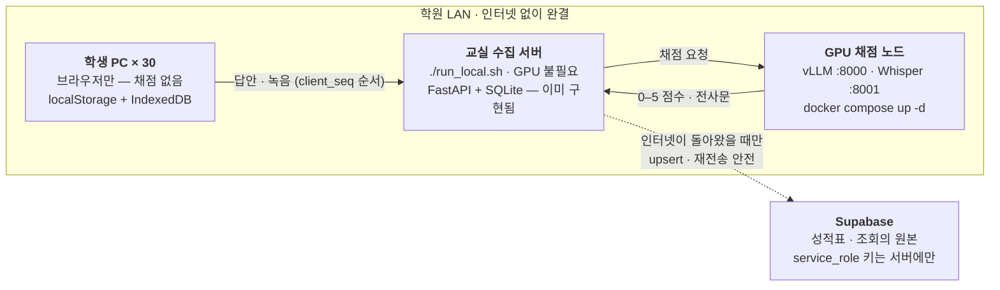

# 교실 서버 아키텍처

← [[offline-scoring-moc]] · 선택지 맥락은 [[scoring-options#04 · 캠퍼스 사설망]]

> [!abstract] 한 줄 요약
> 서버는 두 대다. 그런데 **한 대가 비어 있다.**

## 답안 한 건이 지나가는 길



점선 사각형 안이 시험장이다. **응시·수집·채점이 전부 그 안에서 끝나고, 인터넷은 오직 마지막 점선 화살표 하나에만 필요하다.**

## 두 대를 헷갈리면 안 된다

04번을 “GPU 사는 일”로만 읽으면 순서를 놓친다. **앞의 한 대가 없으면 뒤의 한 대는 받을 답안이 없다.**

### A · 교실 수집 서버 — 필수, GPU 불필요

학생 PC 30대가 `http://192.168.0.10:8000` 으로 붙는다. **이미 있는 FastAPI 앱이 그대로 이 서버다** — `./run_local.sh` 가 `APP_MODE=local`(SQLite) 로 `0.0.0.0` 에 바인딩한다. `start-mac.command` 의 파이썬 정적 서버는 이것의 1인용·읽기 전용 버전이라 답안을 받지 못한다.

### B · GPU 채점 노드 — 선택, 04번 그 자체

`serving/docker-compose.yml` 에 이미 다 적혀 있다. `docker compose up -d` 하나로 Gemma(vLLM, :8000)와 Whisper 전사(:8001)가 뜬다.

> [!note] `HF_HUB_OFFLINE=1` 인 이유
> 모델은 디스크에 미리 깐다. **정전 후 재부팅이 허브를 찾아가면 콜드 스타트가 그대로 멈춘다.** A와 같은 기계여도 되고 분리해도 된다.

처리량은 걱정하지 않아도 된다 — GPU 1대가 월 599M 출력 토큰을 처리하는데 실수요는 78M이다. **학생 수가 지금의 8배쯤 되어야 대수가 문제가 된다.**

## 실제로 비어 있는 자리는 어디인가

> [!success] 교실 수집 서버는 이미 있다
> `/api/attempts/{id}/state · answers · media · events · submit` 은 **`app/routers/attempts.py` 에 전부 구현돼 있다.** `upsert_answers(..., client_seq=)` 까지 들어 있다.
> `./run_local.sh` 가 `APP_MODE=local` + SQLite + `--host 0.0.0.0` 으로 띄우므로, **교실 노트북에서 그대로 실행하면 그게 곧 A 서버다.**
> (`sg2/api/` 는 별개다 — Vercel 위의 AI 채점용 Node 함수 셋. 여기에 attempts 가 없는 건 정상이다.)

남은 공백은 셋뿐이다.

| 공백 | 어디 | 왜 필요한가 |
|---|---|---|
| 클라이언트 배선 | `sg2/` | `SG_SYNC.configure()` 를 **아무도 호출하지 않는다.** 아웃박스는 쌓이는데 서버 주소가 비어 있어 영원히 안 나간다 |
| Supabase 업로더 | 교실 서버 | 2 → 3 단계가 없다. `app/` 어디에도 supabase 참조가 없다 |
| 로컬 LLM 주소 | `app/config.py` | `llm.py` 는 anthropic / openai 만 안다. vLLM 은 OpenAI 호환이므로 **base_url 하나만 뚫으면 된다** |

오프라인 우선 큐 · 지수 백오프 · “실패해도 시험은 멈추지 않는다”(F12)는 클라이언트에 이미 다 들어 있다.

## 진실은 한 번에 한 곳에만 있다

학생 기기가 Supabase에 직접 쓰게 하면 안 된다. 단계마다 “지금 무엇이 원본인가”가 분명해야 복구가 가능하다.

| 단계 | 어디에 | 무엇이 담기나 | 이때의 원본 |
|:---:|---|---|---|
| 1 | 학생 브라우저 | localStorage에 답안·이벤트·아웃박스, IndexedDB에 녹음 Blob | **응시 중** |
| 2 | 교실 서버 | SQLite 한 파일. 30명분이 모이고 채점 큐가 여기서 돈다 | **시험 종료 ~ 복귀** |
| 3 | Supabase | 성적표·조회가 읽는 최종본. 쓰기는 교실 서버만 | **복귀 이후** |

## 동기화가 끊겨도 다시 돌리면 된다

```
upsert on (attempt_id, question_key) · client_seq 로 역전만 차단
```

`exam-sync.js` 주석이 이미 못 박아 둔 계약이다. 중복 전송은 무해하고, 늦게 도착한 옛 답안이 새 답안을 덮어쓰지 못한다.

**같은 규칙을 2 → 3 단계(교실 서버 → Supabase)에 그대로 복사하면 된다.** 그러면 업로드가 중간에 끊겨도 **처음부터 다시 돌리는 것이 언제나 안전한 복구 절차**가 된다 — 어디까지 갔는지 세어볼 필요가 없다.

## 오프라인이라서 생기는 함정 셋

> [!warning] attempt_id 는 서버가 발급한다 — 클라이언트가 지어내면 안 된다
> `create_attempt` 가 돌려주는 `attempt_id` 는 **정수 PK** 다. 30대가 각자 지어내면 반드시 겹친다.
> 즉 **시험 시작 시점에는 교실 서버가 반드시 떠 있어야 한다.** 회선이 끊겨도 되는 건 그 이후다.
> 서버 없이 시작해야 하는 시나리오라면 클라이언트 UUID + 서버측 매핑 테이블이 따로 필요하다 — 지금 설계 밖이다.

> [!warning] 시각은 서버가 찍는다
> 학생 PC 시계는 못 믿는다. 몇 분씩 틀어진 기기가 섞이면 응시 기록의 앞뒤가 뒤집힌다.

> [!warning] 녹음은 따로 올린다
> 답안 JSON을 먼저 가볍게, 오디오는 뒤에 천천히. 녹음 하나가 막혀서 점수 전체가 밀리면 안 된다.

## 관련 파일

- `studyground/sg2/assets/exam-sync.js` — 아웃박스 · 백오프 · 엔드포인트 계약(220–226행)
- `studyground/sg2/assets/exam-store.js` — localStorage / IndexedDB 지속성
- `smeag-local-ai/serving/docker-compose.yml` — vLLM · Whisper · Kokoro 노드 구성
- `smeag-local-ai/serving/campus.env` — `SMEAG_LLM_URL` 등 캠퍼스별 설정
