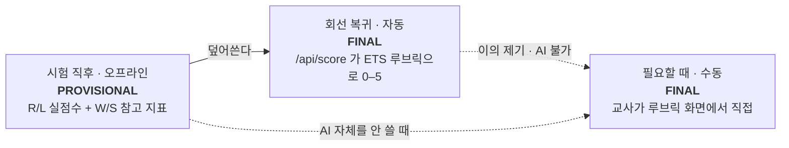

# 오프라인 채점 — 지도

> [!abstract] 한 줄 요약
> 객관식은 이미 오프라인으로 끝난다. 문제는 **라이팅 2문항 + 스피킹 4문항** — 지금은 클라우드 LLM에 전적으로 매여 있다.

## 이 묶음의 노트

| 노트 | 답하는 질문 |
|---|---|
| [[scoring-options]] | 인터넷도 AI도 없을 때 채점을 어떻게 하나 — 네 가지 길 |
| [[campus-architecture]] | 서버를 세운다는 게 무슨 뜻인가 · 30대의 답안이 Supabase까지 닿는 경로 |
| [[onprem-gpu-roi]] | GPU를 사는 게 경제적으로 맞나 (결론: 비용 논리로는 아니다) |

## 현재 상태

| 영역 | 인터넷 없이 | AI 없이 | 근거 |
|---|:---:|:---:|---|
| Reading | ✅ | ✅ | 문제·정답이 `set9.js` 에 번들 |
| Listening | ✅ | ✅ | 오디오 91개 25 MB 사전 캐시 |
| Writing | ❌ | ❌ | `api/score.js` → 클라우드 LLM 호출 |
| Speaking | ❌ | ❌ | 전사 + 채점 모두 서버 의존 |

> [!warning] 문서가 약속한 기능이 없다
> `README-OFFLINE.md` 73행: *"오프라인에서는 번들된 실제 오디오와 규칙 기반 채점으로 대체됩니다."*
> 그런데 **구현된 규칙 기반 채점기는 코드에 존재하지 않는다.** 지금 오프라인으로 시험을 치르면 라이팅·스피킹 답안은 저장만 되고 점수는 비어 있다.
> 어떤 선택지를 고르든 이 문장부터 참으로 만들어야 한다.

## 결정

**[[scoring-options#01 · 지연 채점|01번]] + [[scoring-options#03 · 규칙 기반|03번]] 을 먼저, [[scoring-options#02 · 교사 루브릭|02번]] 은 백업으로.**

목표는 학생이 시험장을 나설 때 **빈 성적표를 받지 않게** 하는 것이다. 확정 점수는 나중에 덮어쓰면 된다.



성적표에 `provisional` 플래그 하나만 추가하면 세 단계가 모두 같은 화면을 쓴다.

## 채점 모델 라우팅 (2026-08-11 확정)

같은 LLM 을 네 스킬에 똑같이 쓰지 않는다. **판단이 필요한 곳에만 큰 모델을 쓴다.**

| 스킬 | 모델 | 왜 |
|---|---|---|
| Writing · Speaking | **Codex** (호스팅) | 사람의 판단에 준하는 채점. ETS 루브릭 0–5 를 매긴다 |
| Reading · Listening | **Gemma 4 E2B** (캠퍼스 LAN) | 정답지로 채점이 이미 끝나 있다. LLM 은 리뷰 코멘트만 쓴다 |

둘 다 OpenAI 호환 엔드포인트라 호출부는 하나다(`_openai_compatible`).
라우트는 실패하면 기존 프로바이더 체인이 이어받는다 — **캠퍼스 GPU 가 죽어도 채점은 멈추지 않는다.**

```bash
CODEX_MODEL=gpt-5-codex                     # 비면 라우팅 꺼짐 = 기존 동작
GEMMA_MODEL=google/gemma-4-e2b-it
GEMMA_BASE_URL=http://127.0.0.1:8000/v1     # 안 주면 OPENAI_BASE_URL 을 물려받는다
# CODEX_BASE_URL 은 비워 둔다 — Codex 는 호스팅이고, 그게 이 분리의 요지다
```

> [!note] 이 표가 [[onprem-gpu-roi]] 의 결론과 맞물린다
> ROI 계산에서 비용을 실제로 줄이는 지렛대는 GPU 가 아니라 `human_review_rate` 였다.
> R/L 코멘트를 값싼 로컬 모델로 내리는 건 그 지렛대가 아니라 **추론비 자체**를 줄이는 쪽이다.

## 다음 할 일

- [x] **클라이언트 배선** — `sg2/assets/exam-sync-boot.js`. `exam-runtime.html` 이 `exam-sync.js` 를 로드조차 하지 않던 것도 같이 고침
- [x] **Supabase 업로더** — `tools/sync_to_supabase.py` + `supabase/offline_import.sql`
- [x] `OPENAI_BASE_URL` — 캠퍼스 vLLM 연결. `local` 모드에서도 LLM 이 열리게 `llm_enabled` 완화
- [x] **스킬별 모델 라우팅** — 위 표 참조
- [ ] `sg_process_imports()` 정규화 본문 — Supabase 대상 스키마 확정 후
- [ ] 리스닝 · 라이팅 섹션 — **Codex 담당**
- [ ] 성적표 `provisional` 플래그 추가
- [ ] 규칙 기반 지표 계산기 (브라우저 내, 전사 불필요)
- [ ] 교사 루브릭 채점 화면 (오프라인 전용)

> [!note] 서버 API는 이미 있다
> `/api/attempts/*` 는 `app/routers/attempts.py` 에 전부 구현돼 있다. 앞서 “받는 코드가 없다”고 적었던 건 `sg2/api/`(Vercel AI 채점 함수)만 보고 내린 오판이다.

## 관련 파일

- `studyground/sg2/api/score.js` — 클라우드 AI 채점 진입점
- `studyground/sg2/api/_rubric_toefl.js` — ETS 0–5 루브릭 원문
- `studyground/sg2/assets/exam-sync.js` — 오프라인 답안 동기화
- `studyground/sg2/README-OFFLINE.md` — 73행의 미구현 약속
- `smeag-local-ai/` — 사설망 서빙 · QWK 검증 · ROI 모델
